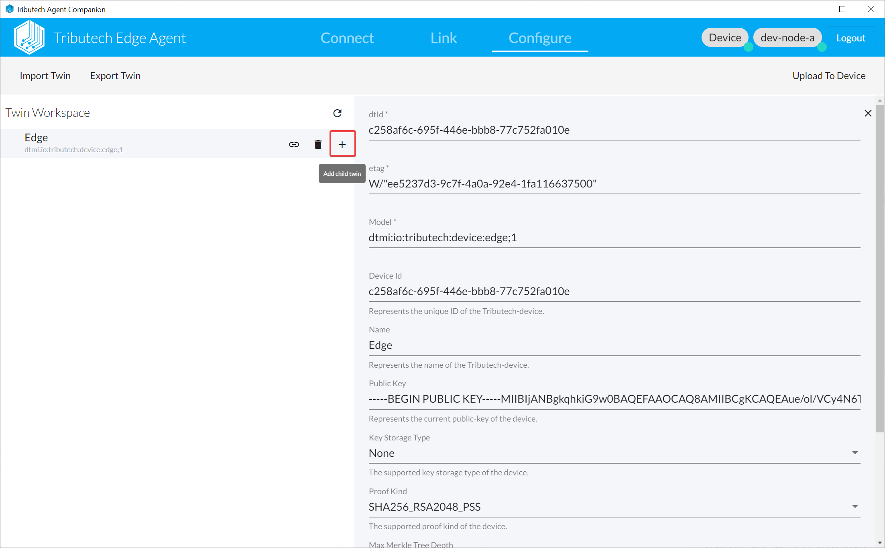
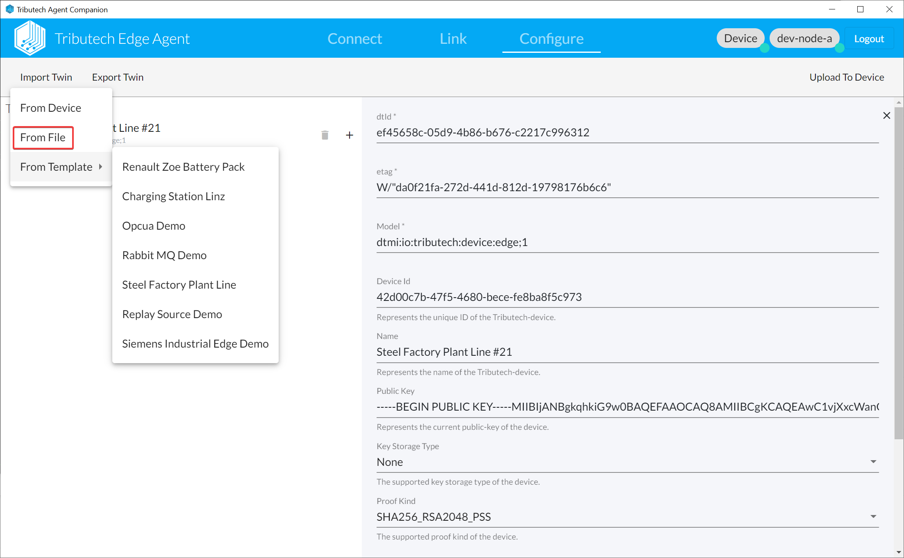
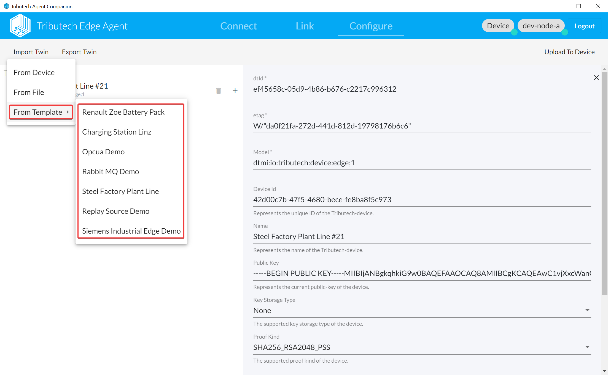
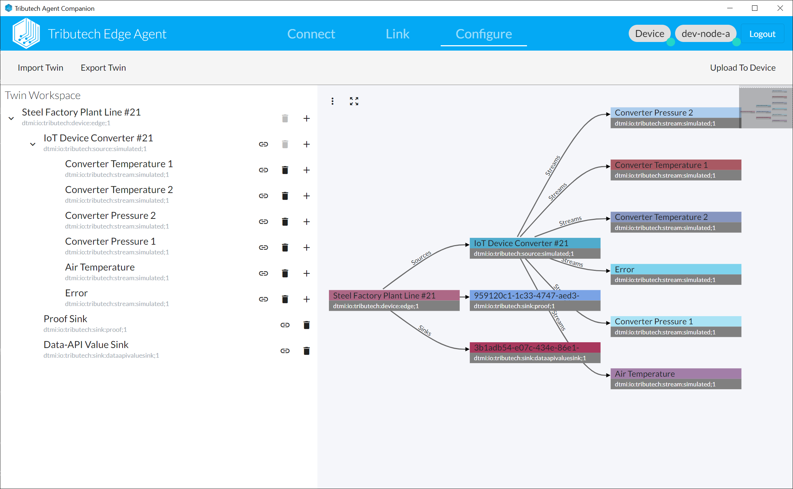
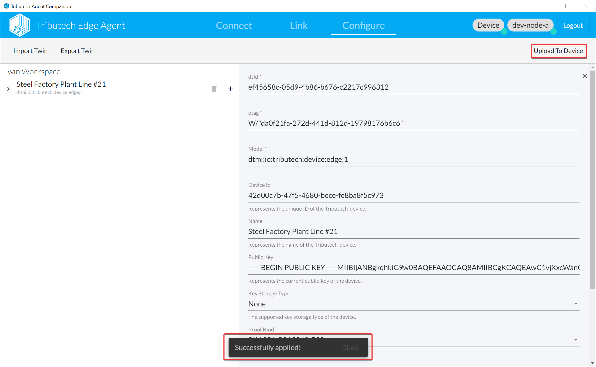

- The twin builder in the Agent Companion allows you to easily create a twin configuration e.g. for your DSK Edge Agent.
  
- You can also import a existing twin configuration defined with [Digital Twins Definition Language (DTDL) Version 2](https://github.com/Azure/opendigitaltwins-dtdl/blob/master/DTDL/v2/dtdlv2.md).  
  Maybe you want to take a look at https://github.com/tributech-solutions/data-asset-twin.
  
- Or use one of our pre-defined templates providing some demos for different use cases.
  
- Sample for twin configuration created with the twin builder.
  
- When you are finished with the twin configuration you need to upload it to the DSK Edge Agent and DSK Node. Pleas verify that it was successfully uploaded (snackbar should appear).
  
