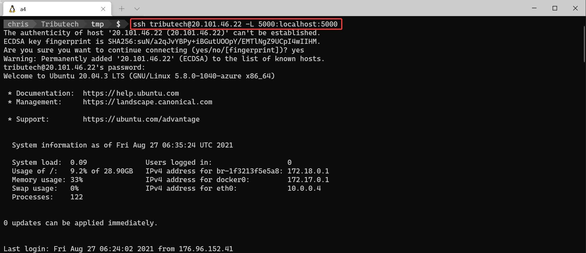
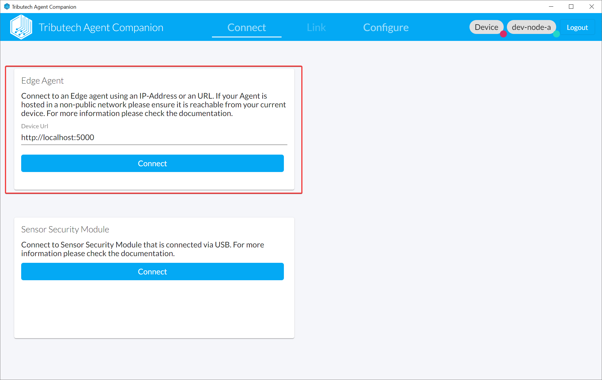

- We need to be able to connect to the API of the DSK Edge Agent to link & configure it with the Agent Companion.  
  Our recommended option is to open an SSH connection to the deployed virtual machine of the DSK Edge Agent with an SSH tunnel/port forwarding for the remote port of the API forwarding it to an local port on your localhost.

```bash
ssh <vm-user>@<vm-ip> -L <local-port>:localhost:5000
# e.g.
ssh tributech@20.86.158.183 -L 5000:localhost:5000
```



- After the SSH connection with the tunnel/port forwarding is established we ca connect to the DSK Edge Agent with the Agent-Companion.  
  (e.g. `http://localhost:5000`)
  
