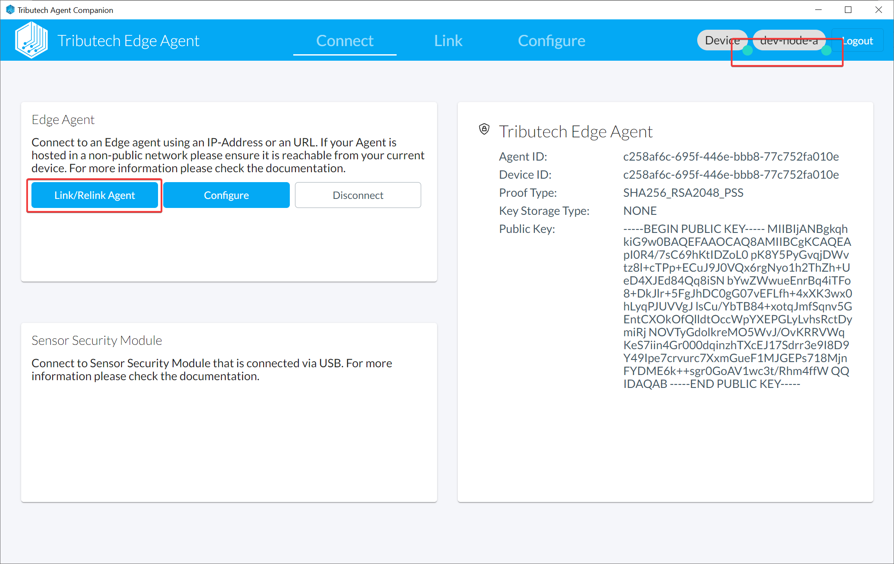
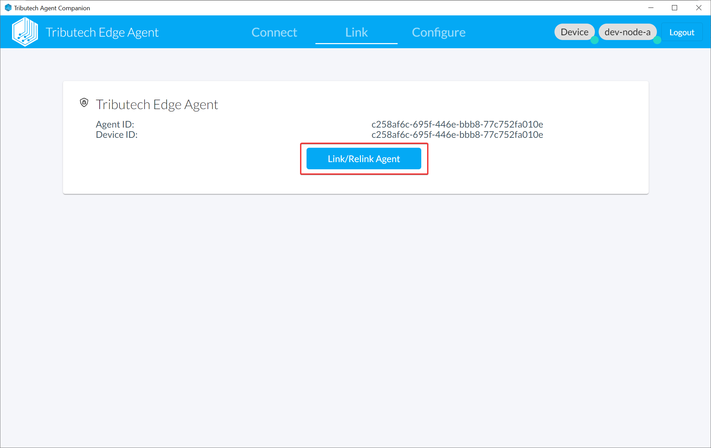
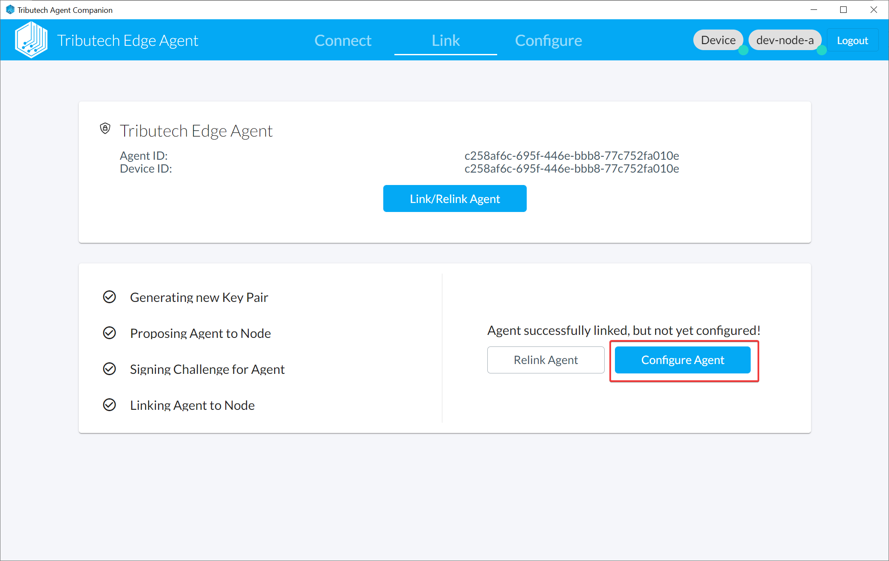
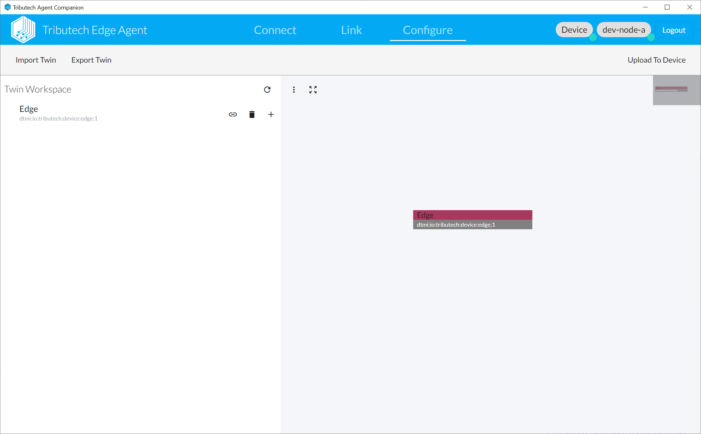

* By linking the DSK Edge Agent all metadata for the agent is created on the DSK Node and we establish the trust between the parties.
We need to be logged in to the desired target Node and connected to the DSK Edge Agent (indicated by the green signs on the top right).

* Click on Link/Relink Agent

* The next step after linking is to configure the DSK Edge Agent

* The DSK Edge Agent can now be configured based on twins with our twin builder.
