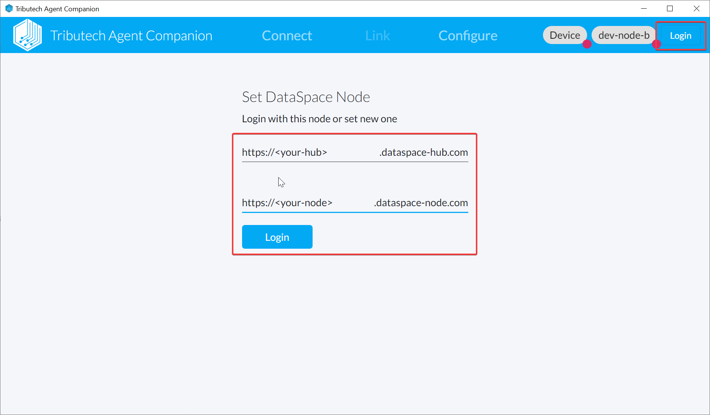
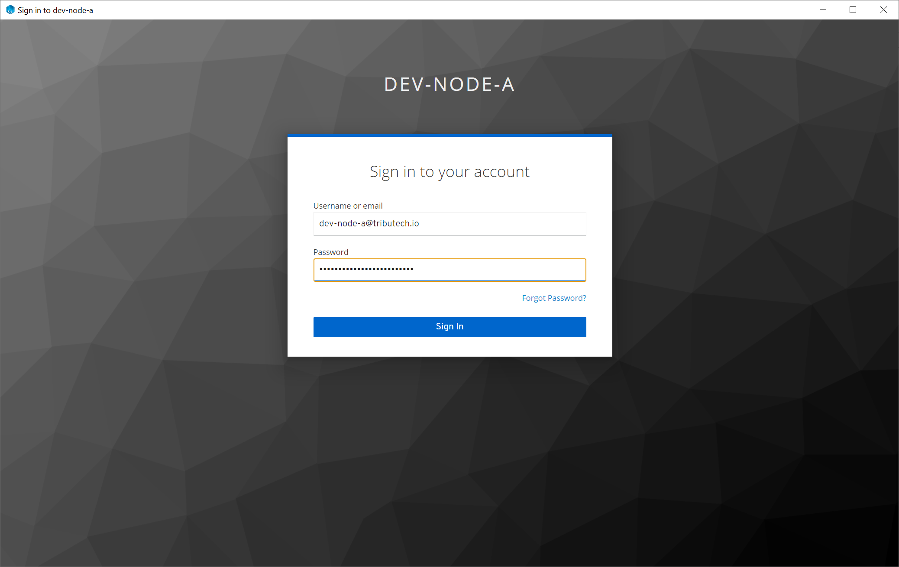
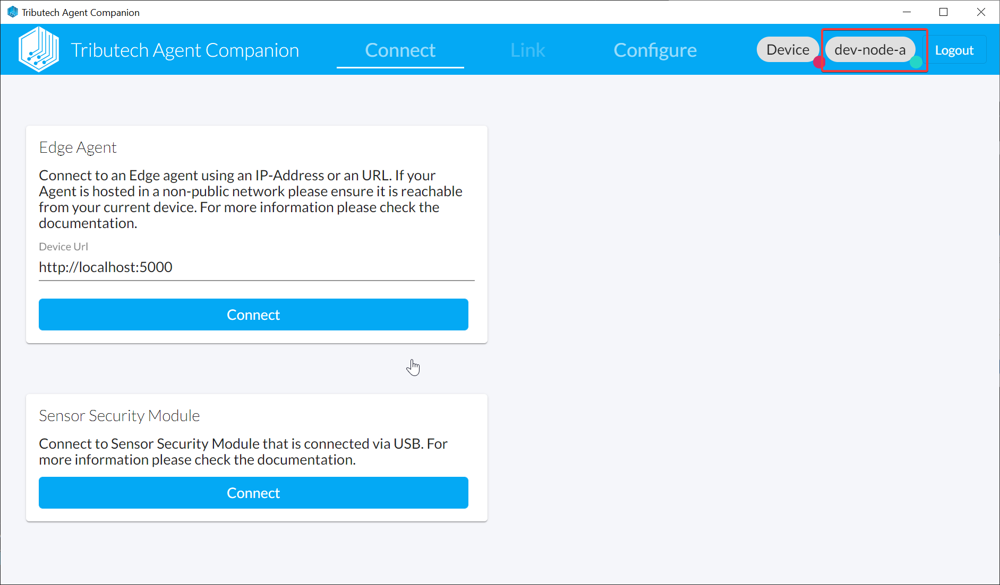

- Click Login (top right corner).
- Enter the name/domain of your DSK Hub and DSK Node and click Login (below).  
  (The provided information defines to which DSK Node an DSK Agent will be connected during the linking process.)
  
- A window with the login page of the authentication server will pop-up where you can sign in with your personal user account of your DSK Node.
  
- The window will be closed on successful login and the Agent Companion will be connected to the DSK Node (indicated by the green sign on top right at the DSK Node name).
  
