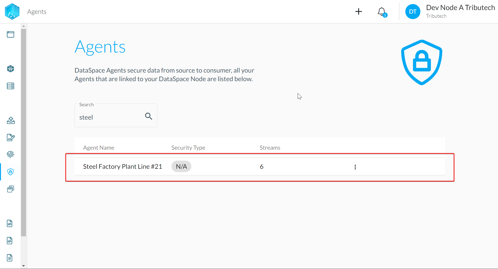
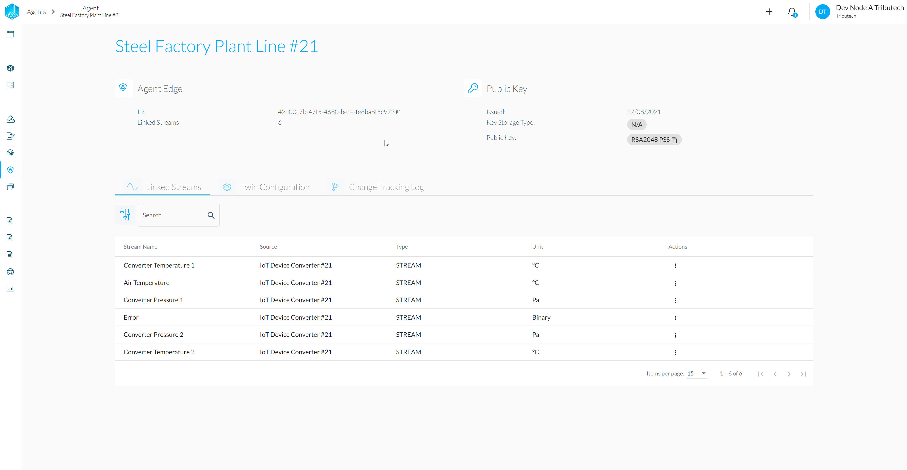
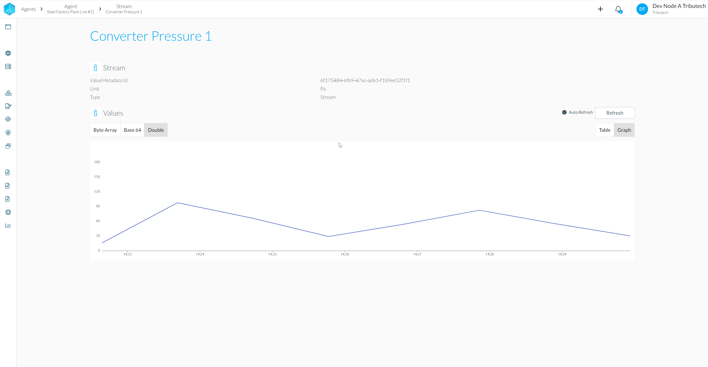
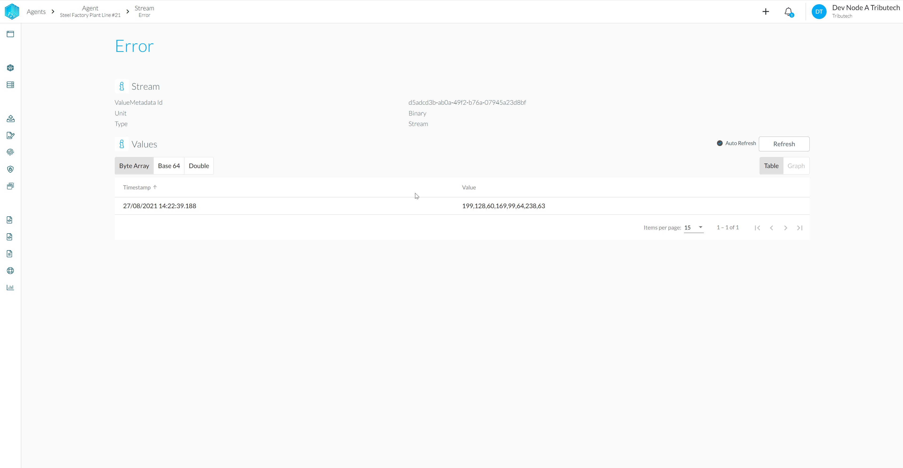

- The linked agent should be listed under _Agents_.
  
- The streams should be available according to the twin configuration.
  
- Availability of (recent) data for streams can be verified.
  
  
