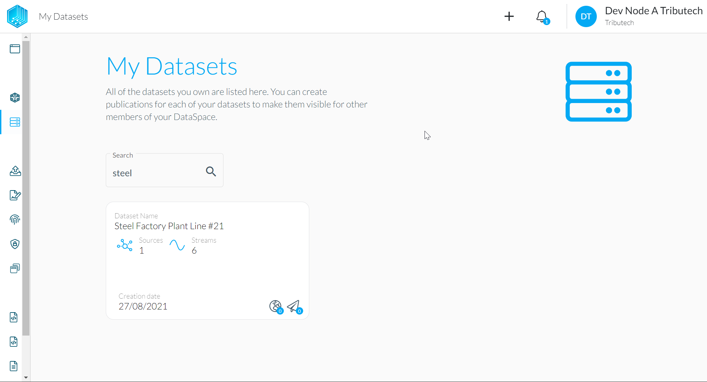
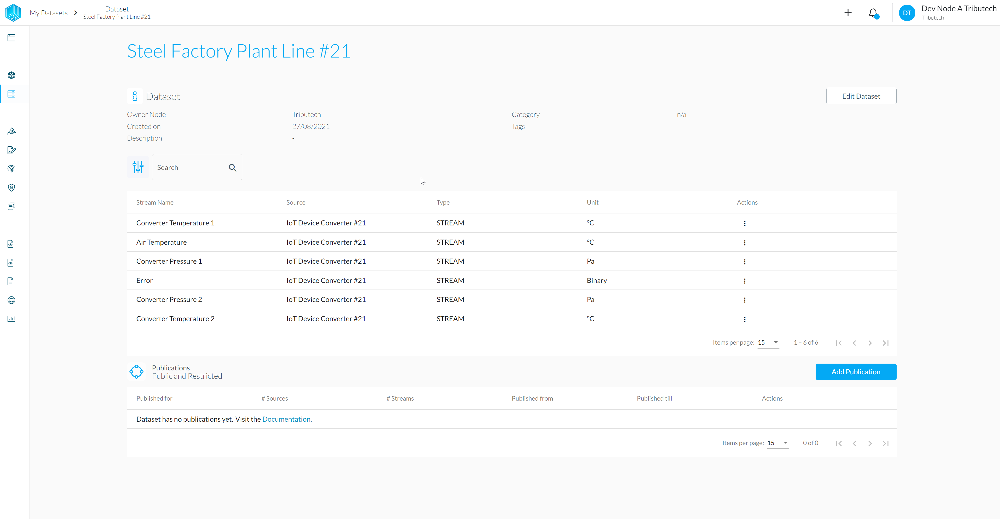
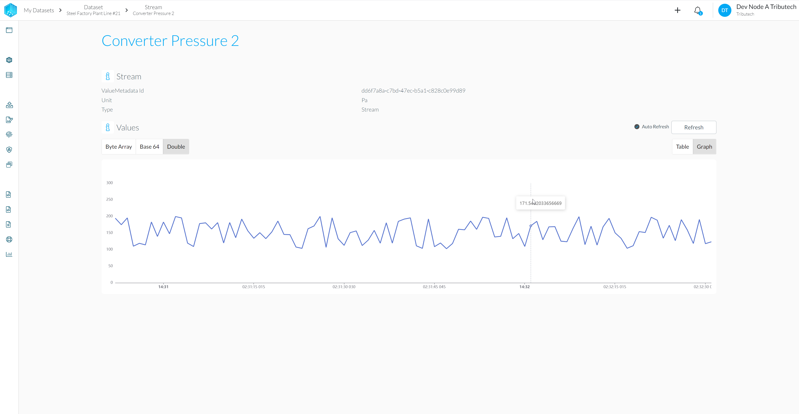
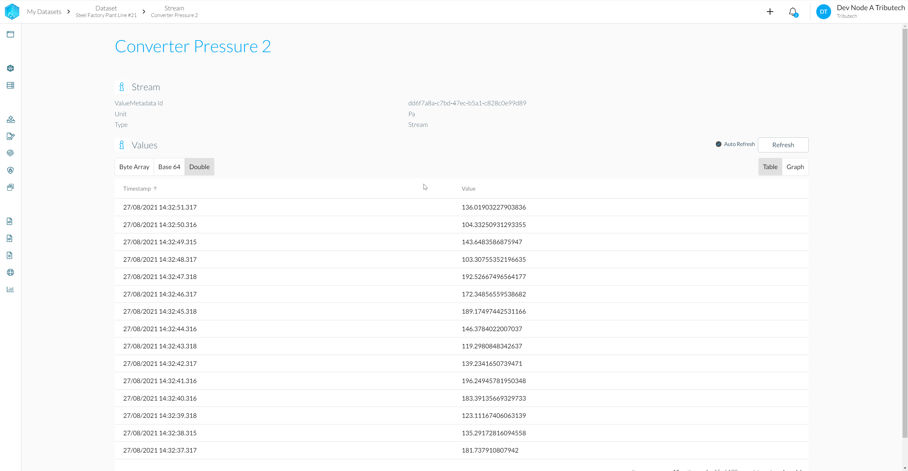

* A auto-generated dataset for the Agent should be present under *My Datasets*

* With streams according to the twin configuration of the Agent.

* Availability of (recent) data for streams can be verified.
    
    