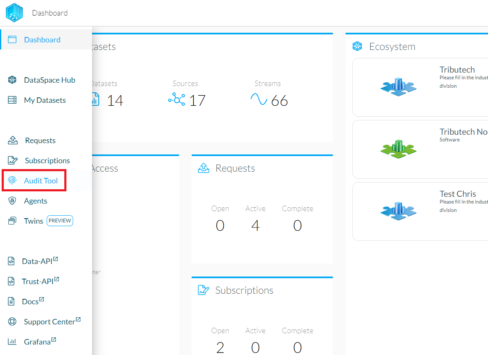
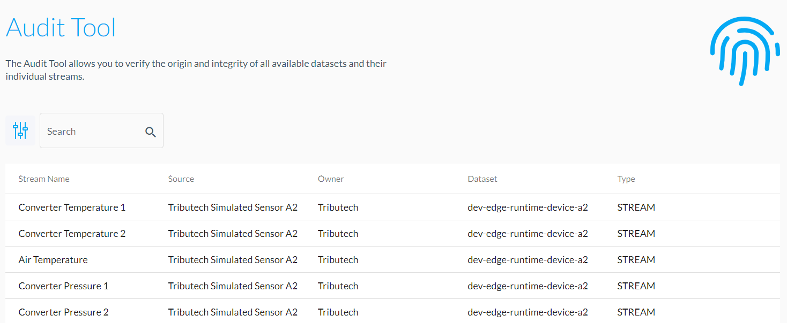
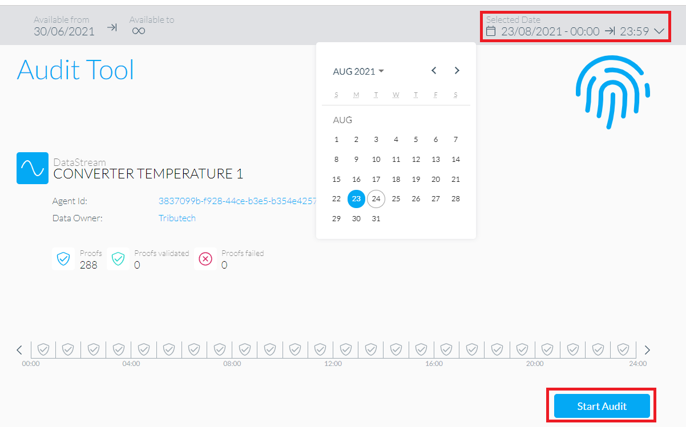
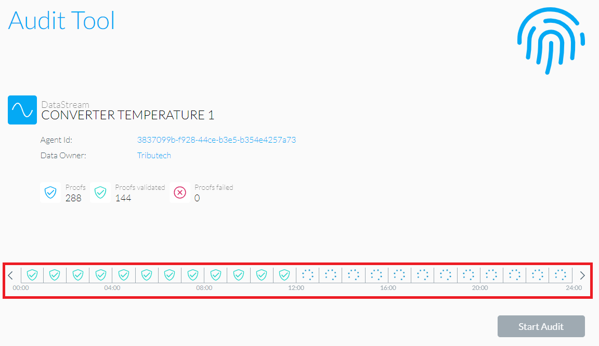
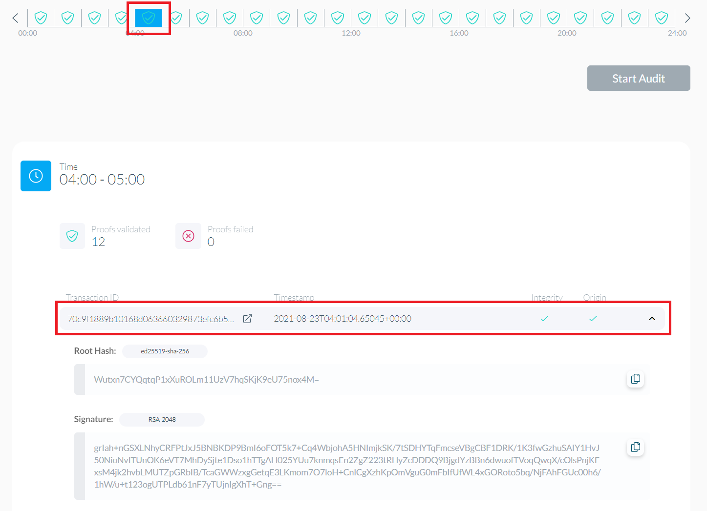
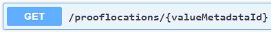
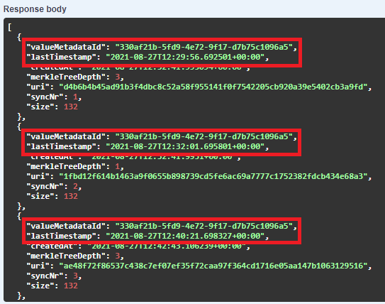
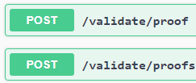
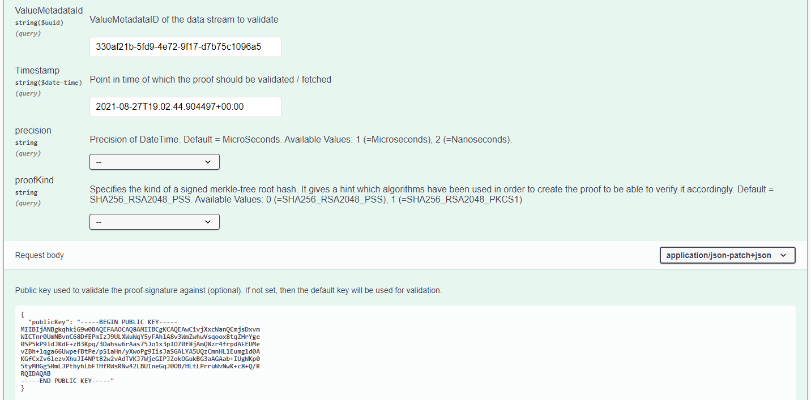
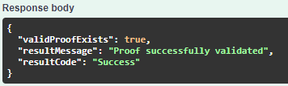

# Audit Tool

To ensure data authenticity and data integrity, every data entry has to have a proof that can be verified. To verify proofs for a data stream, head to the "Audit Tool" at the DSK Node sidebar.

The Audit Tool gives an overview of all the available streams. Select a stream in order to open up a detailed view.

In order to start a proof verification process, select a date of interest and click "Start Audit".

The tool will then go through all available proofs for the selected timespan and verify them.

Additional information, like the Root Hash or the Signature, can be viewed by clicking the proof icon and selecting one of its transactions.

# Automated/bulk verification

To do automated and/or bulk verification, direct access to [the Data-API and the Trust-API](./api.md) is required.  
For simplicity, the following section is centered around a single data stream. Repeat the steps for all the data streams that need to be verified.  
While the section can be followed manually, we stronly recommend to execute the steps in an application using our .

## Get proof locations

On the Data-API, request the proof locations for the data stream that is being audited with the `/prooflocations/{valueMetadataId}` endpoint, which only requires the data stream ID.  

The response will then list all the prooflocations which include the timestamps required to do a validation.  

## Validate proofs

Next, on the Trust-API, validate the proofs with either the `/validate/proof` endpoint for a single proof or `/validate/proofs` endpoint for bulk validation.  

Pass the data stream ID and the timestamp according to the previous prooflocation response.  
The public key has to be provided in case the proof was created externally. For proofs that were directly inserted by the Trust-API endpoint, delete the "publicKey" field from the message body to instead use the default public key available on the Trust-API.

Evaluate the response to check if the validation was successful.  

