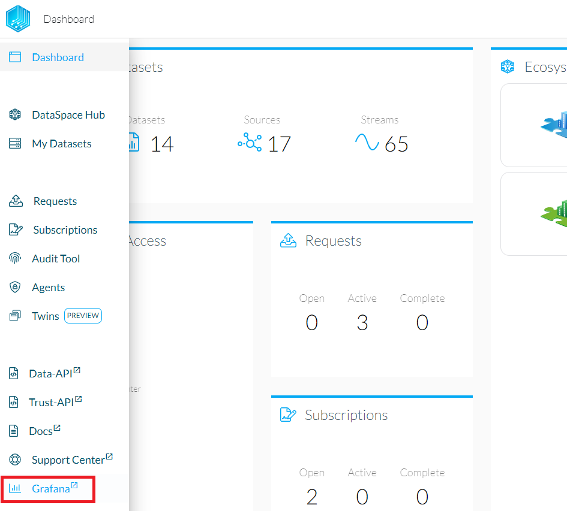
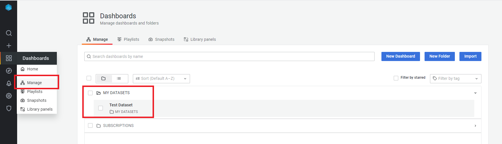
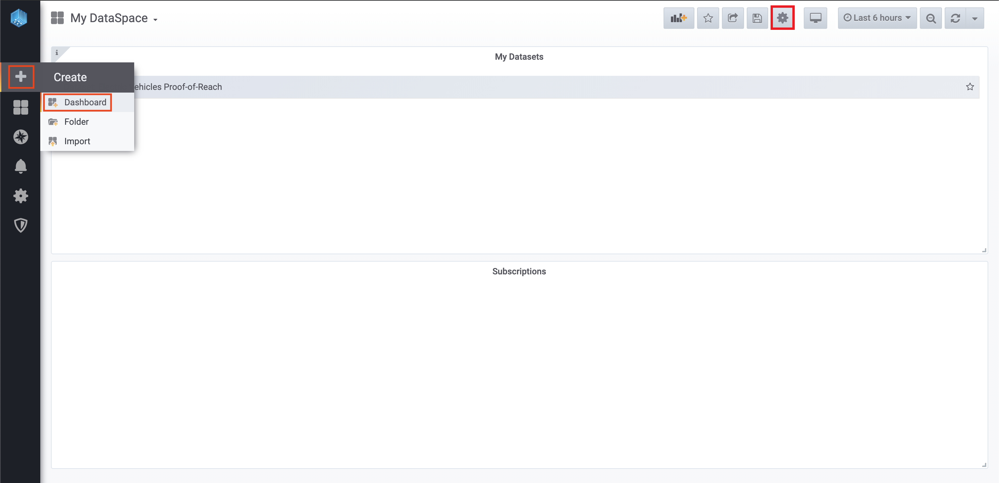
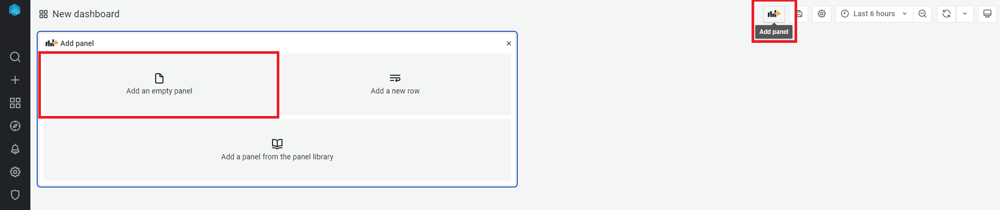
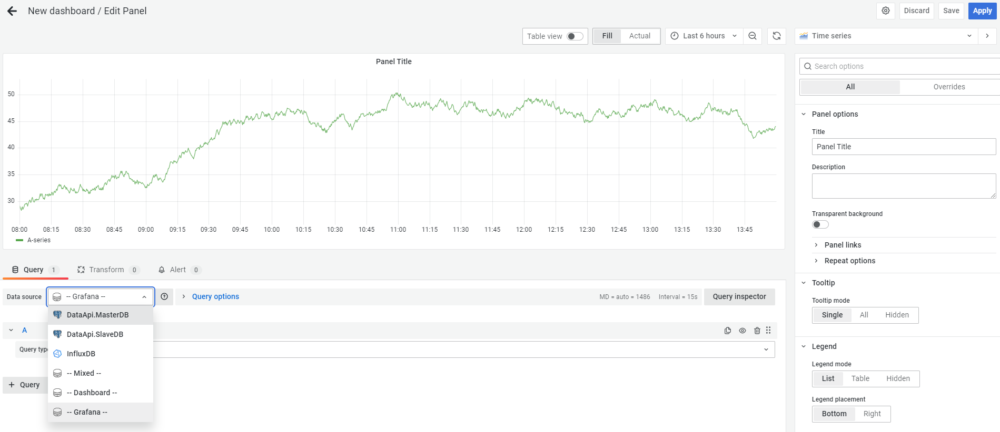
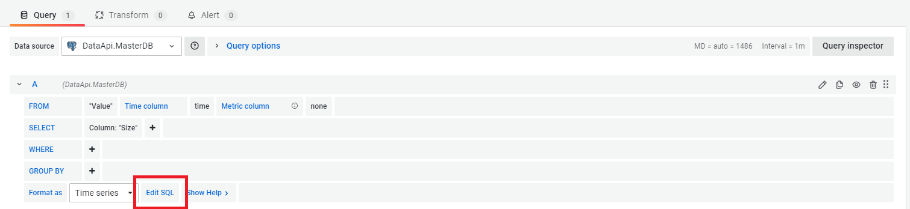
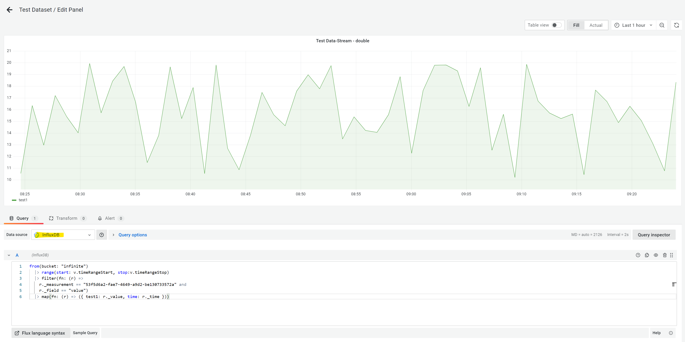
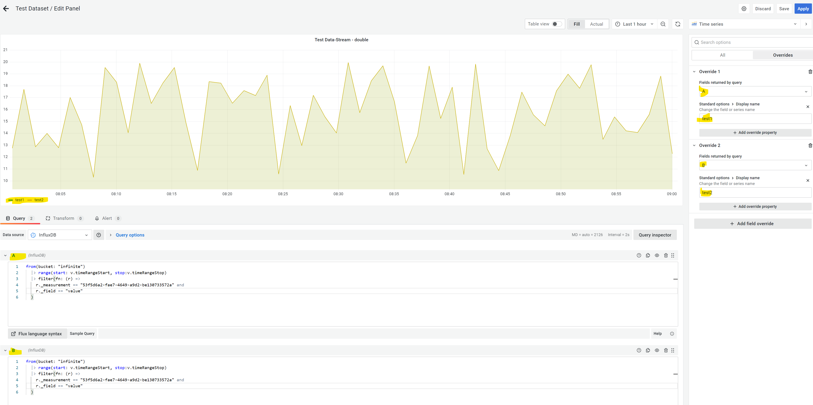

# Consume Data via Grafana Dashboards

In this guide you will learn how you can consume Datasets via the built in Grafana dashboards of your DataSpace Node.

### Prerequisites

The prerequisits for consuming data via the integrated Dashboards are, that a Dataset must be available at your node. <br />

This could be in one of two ways:

- You are **Data Provider**: You own some Datasets and have your own data on your node (Provider DB)
- You are **Data Consumer**: You have been granted a Subscription to a Dataset and the data is already synchronised to your node (Consumer DB)

### Node Dashboard Basics

You can easily navigate to your node dashboard by clicking the "Grafana" menu entry in the side menu of your DataSpace Admin App.
For authentication, use the same username and password that you use for authentication when accessing the DataSpace Admin App.



The dashboarding system is built on the open source technology [**Grafana**](https://grafana.com/). It comes with pre-configured data sources for the in your DataSpace Node integrated Postgre SQL databases.

The structure of dashboards is based on the same logic as in the interface of your DataSpace Node:

- **Dashboards: My Datasets** / Provider DB - contains owned Datasets that are connected to your DataSpace Node.
- **Dashboards: Subscriptions** / Consumer DB - contains subscriptions to Datasets from other members of your Ecosystem.

## Visualize your data

The following steps will let you set up a panel for a "double" typed data set. This will require the UUID (ValueMetadataId) of your selected data stream.  
If you just want to see an example in action, head to "Dashboards->Manage" and select "MY DATASETS->Test Dataset".


**1. Add a new Dashboard -** Click the "+" button and click on the "Dashboard" menu item to create a new Dashboard. Then click on the settings symbol to get to the Dashboard settings of the just created Dashboard, as shown below:



**2. Add a new panel by clicking the "Add panel" button -** Select "Add an empty panel" to create a new panel on the dashboard.


**3. Select a data source for the panel -** Depending on what data set should be used, select

- "DataApi.MasterDB" if you are the provider of the data set
- "DataApi.SlaveDB" if you are the consumer of the data set



**4. Query the data source -** Switch to the raw SQL editor by clicking the "Edit SQL" button.


Copy the following SQL code and replace the placeholder of "ValueMetadataId" with the UUID of your stream:

```SQL
SELECT
  "Timestamp" AS "time",
  get_bytea_to_double("Values", 0) AS "double" -- for double values
  -- get_bytea_to_single("Values", 0) AS "float" -- for float values
FROM "Value"
WHERE
  $__timeFilter("Timestamp") AND
  "ValueMetadataId" = 'replace_with_your_own'
ORDER BY 1
```

Optionally, you can now rename the rows / panels to your liking or just play around with your brand new dashboard!

## Visualize InfluxDB data
First, similar to SQL queries, the data source (InfluxDB) has to be selected.  


Afterwards, a query for the data has to be supplied. Check out the examples below or go to the official [influx documentation](https://docs.influxdata.com/influxdb/v2.2/query-data/get-started/) to find out more.
### Basic query
```
from(bucket: "infinite")
  |> range(start: v.timeRangeStart, stop:v.timeRangeStop)
  |> filter(fn: (r) =>
    r._measurement == "53f5d6a2-fae7-4649-a9d2-be130733572a" and
    r._field == "value"
)
```

### Query and rename result column (option 1)
```
from(bucket: "infinite")
  |> range(start: v.timeRangeStart, stop:v.timeRangeStop)
  |> filter(fn: (r) =>
    r._measurement == "53f5d6a2-fae7-4649-a9d2-be130733572a" and
    r._field == "value")
  |> keep(columns: ["_time", "_value"])
  |> rename(columns: {_value: "test1"})
```

### Query and rename result column (option 2)
```
from(bucket: "infinite")
  |> range(start: v.timeRangeStart, stop:v.timeRangeStop)
  |> filter(fn: (r) =>
    r._measurement == "53f5d6a2-fae7-4649-a9d2-be130733572a" and
    r._field == "value")
  |> map(fn: (r) => ({ test1: r._value, time: r._time }))
```

### Rename result column with overrides (option 3)
Another method to rename a column is to click on "Overrides" on the righthand side of the screen and set the name(s) there.
