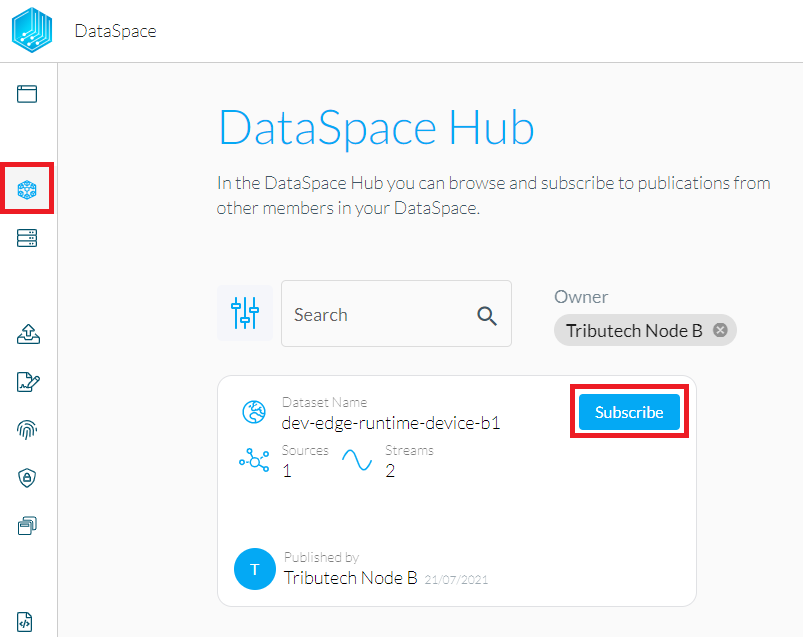
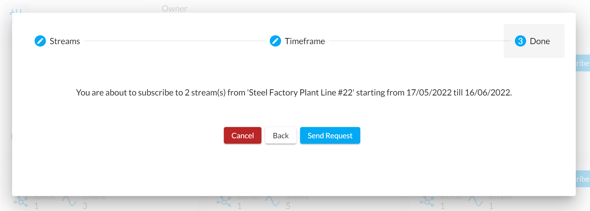
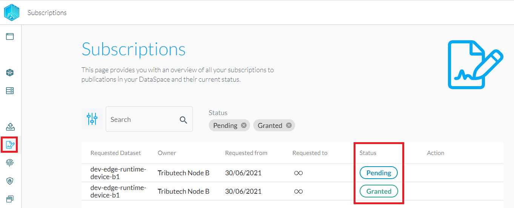
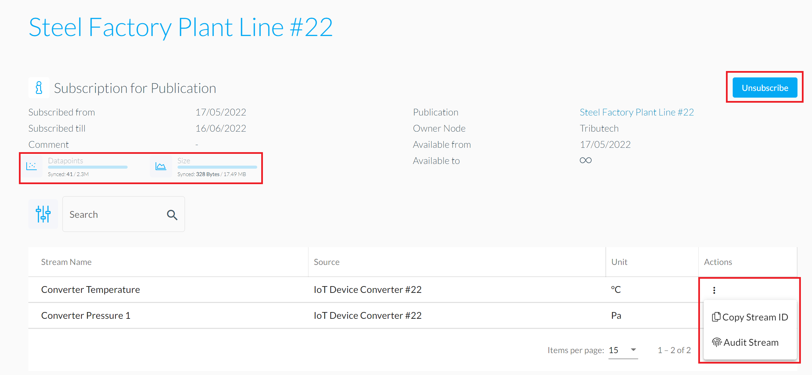
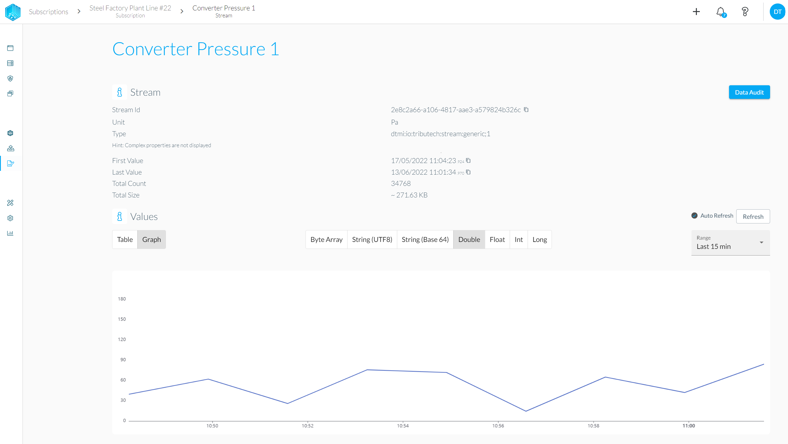
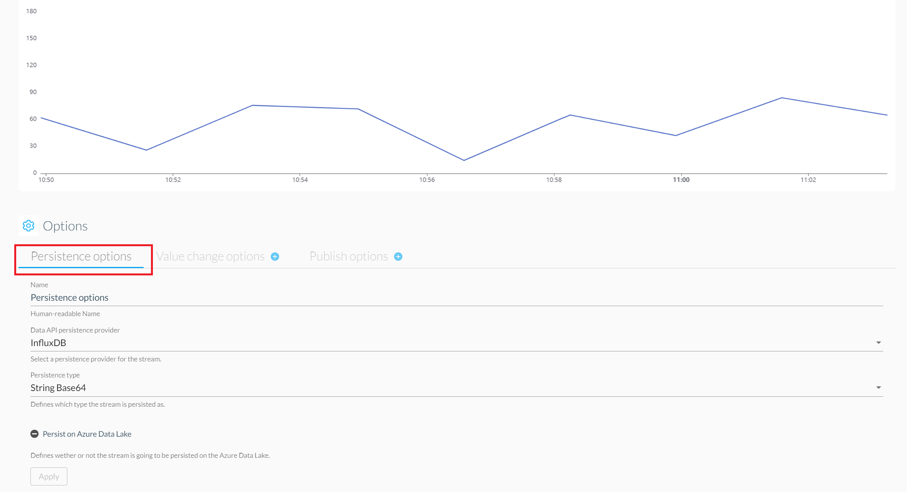

After a Dataset has been [**published**](../provide_data/sharedata/publish.md), it can be subscribed to by others in order to synchronize and access the available datapoints.

## Send subscription request

If you want to subscribed to a published dataset, head over to the node dashboard and select "Broker" on the sidebar. Select the desired publication and click on "Subscribe".

In the next steps, you'll have to select the data streams and the timeframe of interest before confirming the subscription request.

## Subscription status

Under "Subscriptions" the request should now be visible with the status "Pending".  
After confirmation of the Dataset publisher, the status will change to "Granted" and the Node will start to sync the Dataset content to be consumed by the applications.

## Dataset content

Clicking on the subscription opens up the details. Click the "Actions" menu and select "Copy Stream ID" to get the stream's unique ID which can be used in applications to consume the data. This section also allows to "Unsubscribe" from the Dataset.

Select on one of the available streams of a dataset in order to get more detail and options for the specific stream. Our [**Stream Explorer**](streamexplorer.md) visualizes supported datatypes which allows a quick verification of the synced data right from the user interface.

:::info
Unless the default setting for data persistence (PostgreSQL) was used by the data owner, it is required to adapt the persistence options for synced streams accordingly!
:::

 Changing the data persistence setting can easily be done right at the bottom of the stream visualization. Make sure to set the data persistence according to your data provider's settings, otherwise the sync process might not be able to proceed and the data can't get visualized!

