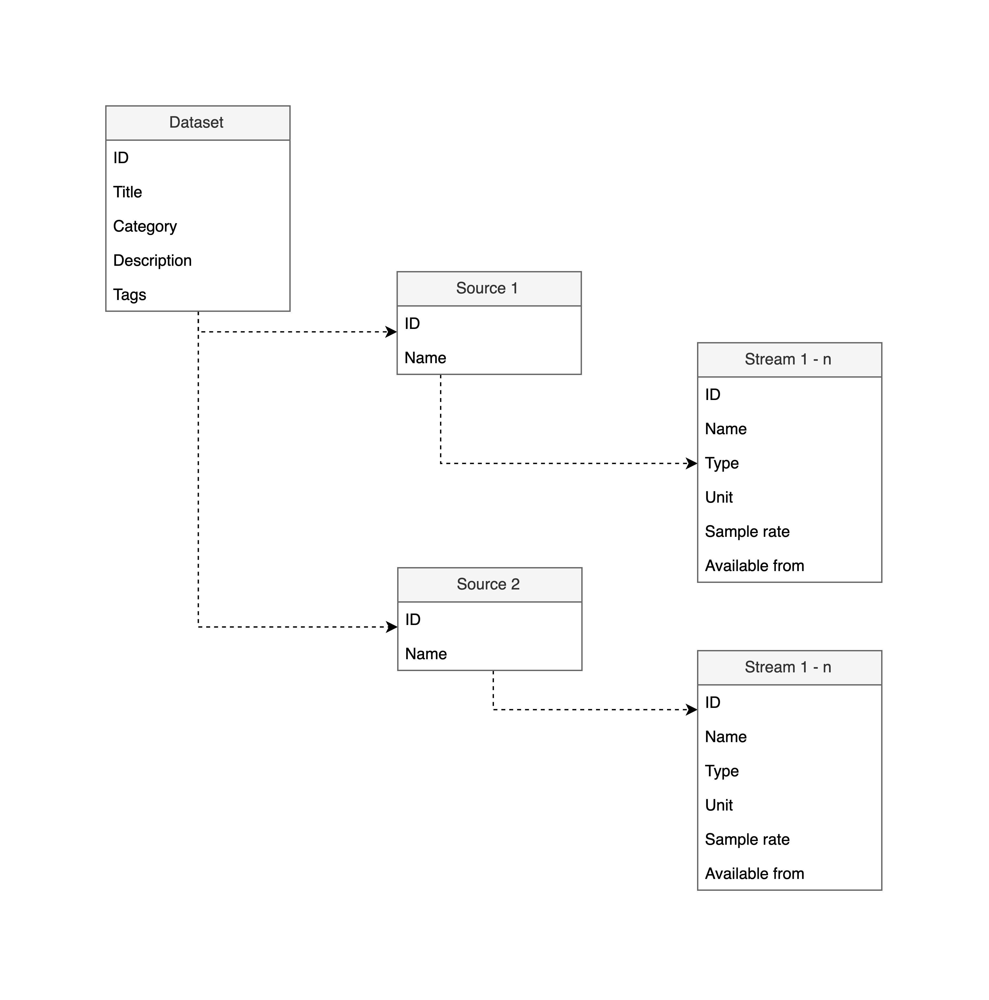
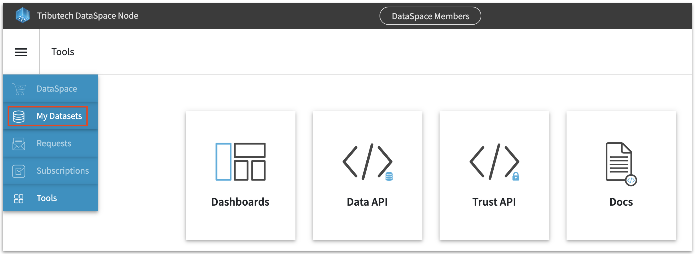
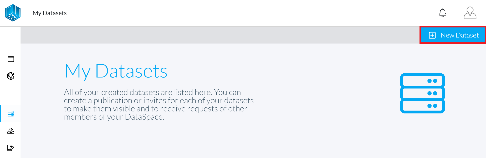
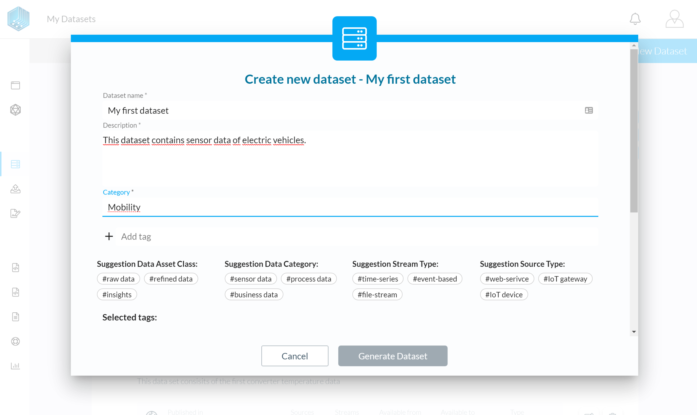
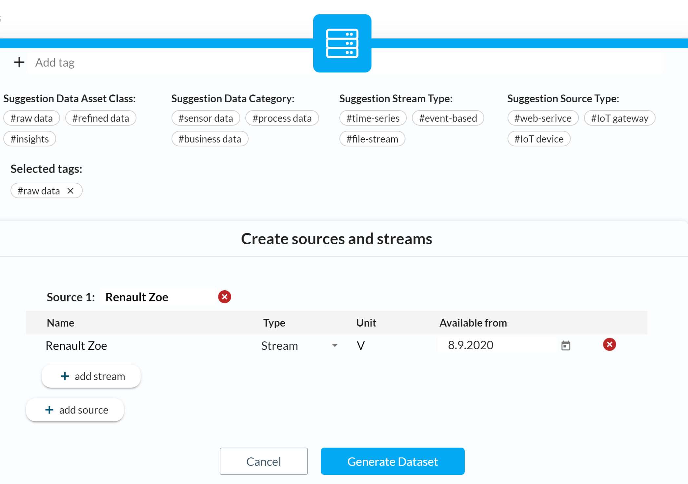
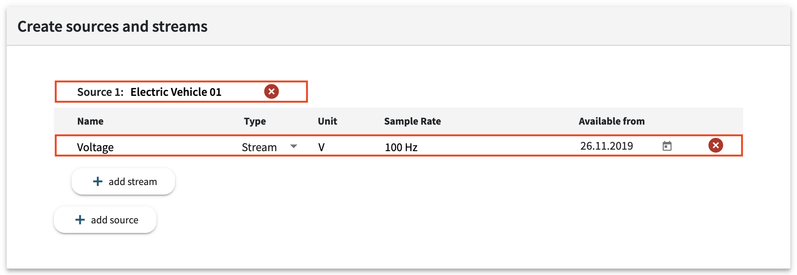

# Create a Dataset guide

In this guide you will learn how-to create a new Dataset via the built in Dataset editor in the admin web-interface of your DataSpace Node. This guide covers the following topics:

- [What is a Dataset?](/guides/guide-create-dataset/#what-is-a-dataset)
- [The structure of Datasets](/guides/guide-create-dataset/#the-structure-of-datasets)
- [Create a Dataset](/guides/guide-create-dataset/#create-a-dataset)
    - [Title](/guides/guide-create-dataset/#title)
    - [Category](/guides/guide-create-dataset/#category)
    - [Description](/guides/guide-create-dataset/#description)
    - [Tags](/guides/guide-create-dataset/#tags)
    - [Sources](/guides/guide-create-dataset/#sources)
    - [Streams](/guides/guide-create-dataset/#streams)
- [Next step: connect your data](/guides/guide-create-dataset/#next-step-connect-your-data)

## What is a Dataset?

A Dataset can consist of any combination of data sources and streams. Descriptive metadata and a unique identifier for each stream in a DataSpace represents these Datasets.

A data stream in a Dataset is not limited to a specific type or format. Data streams are structured as key-value pairs, where the key represents the time-stamp of a certain value. So your Dataset can include, for example, time-series sensor data streams from your IoT devices or EDI-documents from your ERP system.

## The structure of Datasets

Datasets have a generic tree structure to support any combination of data sources and streams.

## Create a Dataset

To be able to connect data streams and sources to your DataSpace Node, the first step is to create the metadata that describes your data.

**1 Login -** Go to the admin interface of your DataSpace Node  "https://your-dataspace-node-ip-or-url"

**2 Navigate -** Navigate to "My Datasets"

**3 Add a new Dataset -** Click the "+ New Dataset" button on the right upper corner

**4 Create your Dataset -** Fill in your metadata and create a Dataset

### Dataset name

Include a title that describes your Dataset and that is useful for other relevant users, for example: "Sensor data Renault Zoe 1".

### Category

Enter a category description that match to your Dataset like, for example: "Mobility", "Manufacturing" or "Steel Devision".

### Description

Enter a short description that outlines which sources & streams your Dataset contains and what's the purpose of it is. For example, a description might look like this:

>This Dataset provides sensor telemetry data of electric vehicles, that is collected via an OBD2 tracking solution. The research project Proof-of-Reach provides this data from different electric vehicles. Anyone interested can request this Dataset, please submit a short description of your use-case.

### Tags

Enter tags that match to your Dataset and that provide additional useful information to other users. You can add as many tags as you like, there are also predefined tags you can select via the interface.

### Sources

A data sources describes the location or endpoint where your data comes from. A data source could be for example an IoT Device, a server, a software service or a 3rd party solution.

The definition of a data source is up to you. We recommend you to choose a description and structure that is also traceable for other users.

### Streams

Now you can add data streams to each source and fill in the metadata.

The following table provides an example and description of the different metadata fields:

| Field         | Desciption          | Required              |Example              |
| :---          |    :----            |    :----              |    :----            |
| Name |Name of the data stream| yes | Voltage |
| Type | Type stream (produces continuous data) or event (produces only data if e.g. a certain state changes) | yes | Stream |
| Unit | The physical unit of your data stream | no | [V] |
| Sample rate | The frequency of how often data is produced or updated | no | 10 Hz / min / h |
| Available from | The date since a data stream is available - **please make sure that you fill in the correct date** because also the sync process depends on that date | yes | 13.04.2019 |

## Next step: connect your data

In this guide, you created the metadata for a Dataset with data sources and streams. To learn more about how you can connect your data, continue to the guide for the [data source integration](/guides/guide-integrate-data-source).
