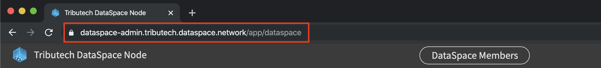
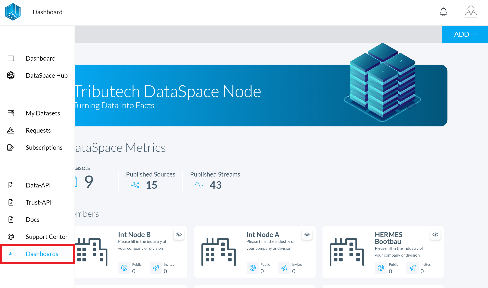
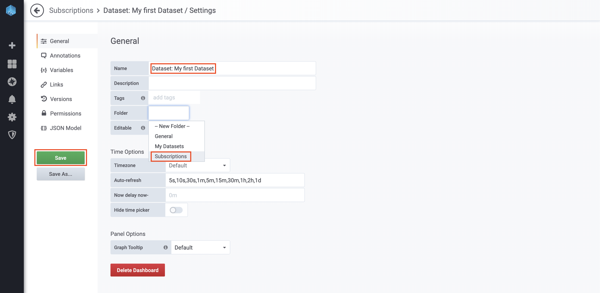
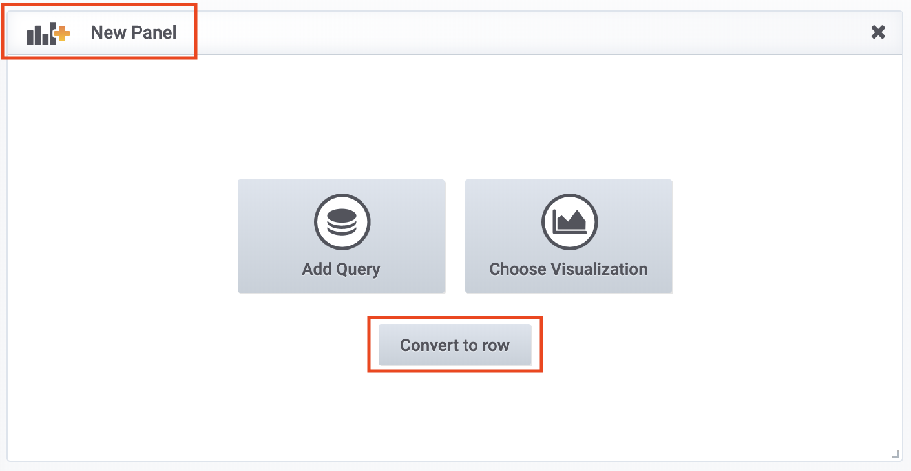
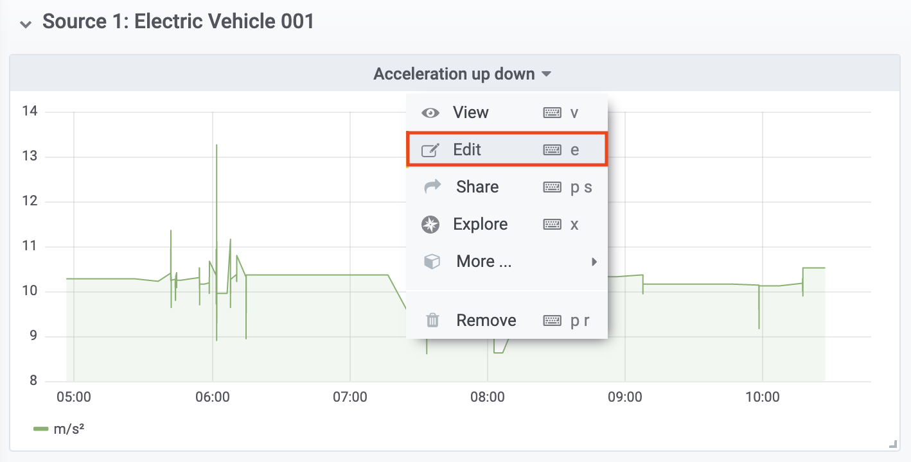
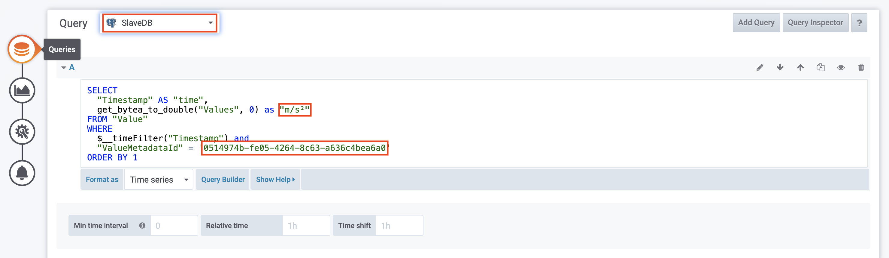

# Consume data via dashbaords guide

In this guide you will learn how you can consume your own datasets and subscriptions via the built in dashboarding system of your DataSpace Node. This guide covers the following topics:

- [Prerequisites](/guides/guide-data-via-dashboards/#prerequisites)
- [Dashboard structure & topology](/guides/guide-data-via-dashboards/#dashboard-structure-topology)
- [Create a Dashboard](/guides/guide-data-via-dashboards/#create-a-dashboard)
- [Next step: consume data via APIs](/guides/guide-data-via-dashboards/#next-step-consume-data-via-apis)

## Prerequisites

The prerequisits for consuming data from a subscription via the integrated dashboarding are the following:

- A granted subscription to a dataset (you are also able to visualize your own datasets)
- Data existists on owner side within the selected time-frame (Master DB)
- Data is allready synchronised on the consumer side (Slave DB)

## Dashboard structure & topology

The dashboarding system is built on the open source technology <a href="https://grafana.com/" target="_blank">Grafana</a>. It comes with pre-configured data sources for the in your DataSpace Node integrated Postgre SQL master/slave databases.

The structure of dashboards is based on the same logic as in the interface of your DataSpace Node:

- **Dashboards: My Datasets** / Master DB - contains owned datasets that are connected to your DataSpace Node
- **Dashboards: Subscriptions** / Slave DB - contains subscriptions to datasets from other mebers of your ecosystem

## Create a Dashboard

To visualize your data via the dashboarding system the only thing you have to do is to dublicate the pre-configured template, paste a code snipet and paste the UUID of your slected data stream.

**1. Login -** Go to the admin interface of your DataSpace Node  "https://your-dataspace-node-ip-or-url"



**2. Navigate -** Navigate to "Tools" and click on the "Dashboards" icon



**3. Add a new Dashboard -** Click the "+" button and click on the "Dashboard" field to create a new dashboard


**4. Dashboard Settings -** Click on the settings symbol, **enter a name** for your dashboard (it is recommond to use the same name as in the admin interface), select the folder **subscriptions** and **save** your changes



**5. Copy existing Dashboard -** Navigate to an existing dashboard and click on the "copy" button


**6. Add a new Dashboard Row -** Navigate to your previous created dashboard folder in **subscriptions/your-folders-name**, click on the **add panel** button and click on **convert to row**



**7. Rewname Row -** Rename the created row with the data source name and click on the **Update** button


**8. Edit Panel -** Click on the **edit** button of the dashboard panel



**9. Repalce UUID -** Replace the exisiting UUID with the UUID of your selected stream (see subscriptoions in your admin interface), replace the **unit**,select the **SlaveDB** and save your changes



**SQL Query:**

```SQL
SELECT
  "Timestamp" AS "time",
  get_bytea_to_double("Values", 0) as "m/s²"
FROM "Value"
WHERE
  $__timeFilter("Timestamp") and
  "ValueMetadataId" = '0514974b-fe05-4264-8c63-a636c4bea6a0'
ORDER BY 1
```

## Next step: consume data via APIs

In this guide, you have learned how to set up a new panel for your data stream via the built-in dashboarding system. To learn more about how you can use data of your subscription via the APIs, continue with the guide [Data via APIs](/guides/guide-data-via-apis).
