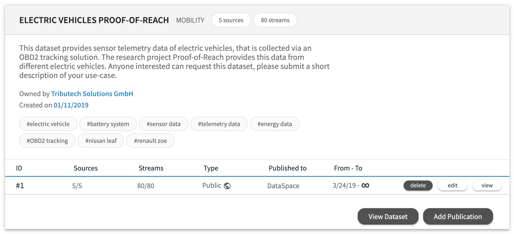
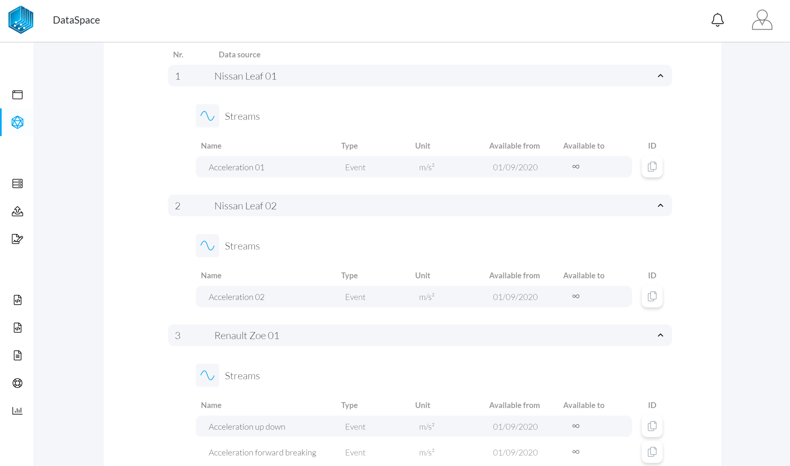
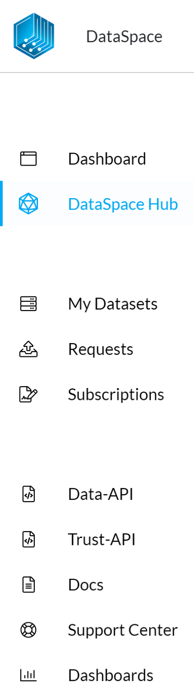

# Integrate a data source guide

In this guide you will learn how-to integrate a new data source via the built in APIs of your DataSpace Node. This guide covers the following topics:

- [Prerequisites](/guides/guide-integrate-data-source/#prerequisites)
- [Options for the data integration](/guides/guide-integrate-data-source/#options-for-the-data-integration)
    - [Integration via Trust API](/guides/guide-integrate-data-source/#integration-via-trust-api)
    - [Integration via Data API](/guides/guide-integrate-data-source/#integration-via-data-api)
- [Further support for connecting data](/guides/guide-integrate-data-source/#further-support-connecting-data)
    - [External data storage support](/guides/guide-integrate-data-source/#external-data-storage-support)
    - [Preview: Plugable connectors & data conversion pipelines](/guides/guide-integrate-data-source/#preview-plugable-connectors-data-conversion-pipelines)
- [Next step: publish a dataset](/guides/guide-integrate-data-source/#next-step-publish-a-dataset)

## Prerequisites

Bevor you can connect data sources, you have to create the metadata for a dataset. If you haven't already created one, follow the instructions of the [Create a Dataset](/guides/guide-integrate-data-source/#prerequisits) guide.

Once you created a dataset, you can click on the button **View Dataset** to show all the sources and streams that it contains:

For every data stream of a dataset, a **UUID** is automatically created. This generated UUID (<a href="https://en.wikipedia.org/wiki/Universally_unique_identifier" target="_blank">Universally unique identifier</a>) provides a globally unique identifier and the reference for a data stream across all stakeholders in a DataSpace Ecosystem. You can **copy this UUID to your clipboard** if you click on the copy symbol on the right side of each data stream:

Now you are prepared to move forward and to **connect your data** to the generated UIDs streams.

## Options for the data integration

Every DataSpace Node, provides interfaces to integrate different types of data and to integrate DataSpace Agents. If you navigate to **Tools section** you should see the following applications:

### Integration via Trust API

The Trust API provides the interface to store signed hashes of DataSpace Agents and/or to store values by using the Trust API's built in Agent (the recommond way to integrate server-side data sources). Every method requires the **UUID** of a data stream.

Navigate to the Trust API via the "Tools" section of your DataSpace Node or you can follow this link to our demo instance: <a href="https://trust-layer-api.azuretrial-node-a.dataspace-node.com/" target="_blank">Trust API</a>

### Integration via Data API

The Data API provides the interface to store or consume values according to an **UUID** of an data stream.

Navigate to the Data API via the "Tools" section of your DataSpace Node or you can follow this link to our demo instance: <a href="https://data-api.azuretrial-node-a.dataspace-node.com/" target="_blank">Data API</a>

## Further support for connecting data

The data management of different data sources beyond the boundaries of a company is one of our main focus areas. Therefore our aim is to continuously expand and improve the capabilities for connecting all the different kinds of data sources.

### External data storage support

For providing an ready to use solution, every DataSpace Node is shipped with an integrated master/slave storage solution based on Postgres SQL databases. If you want to use your own storage solution, please contact our [Customer Advisory Team](mailto:customer-advisory@tributech.io) for further information and support.

### Preview: Plugable connectors & data conversion pipelines

Two really exciting upcoming features are pluggable connectors and data conversion pipelines.

**Pluggable connectors** are simplifying the way of managing and maintaining the connection between different data sources and your DataSpace Node. This simplifies the handling of data sources and their different types of protocols, standards, and semantics. Now, sources like IoT services, storage systems, ERP systems, business applications and 3rd party services can be combined easily.

**Data conversion pipelines** allows users to configure a pipeline with one or multible data transformation steps by configuring the required conversion steps between the data provider service and the data consumer service.

If you want to join the preview program or learn more about this upcoming feature, please contact our [Customer Advisory Team](mailto:customer-advisory@tributech.io).

## Next step: publish a dataset

In this guide, you have learned how data sources can be integrated into your DataSpace Node. To learn more about the differnt publishing options for a dataset, continue to the guide [publish a dataset](/guides/guide-publish-dataset).
