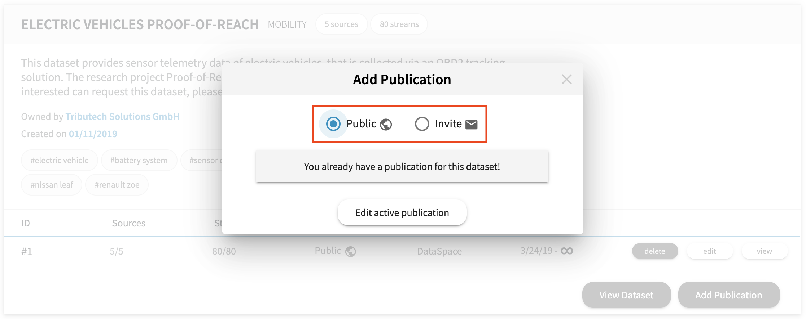
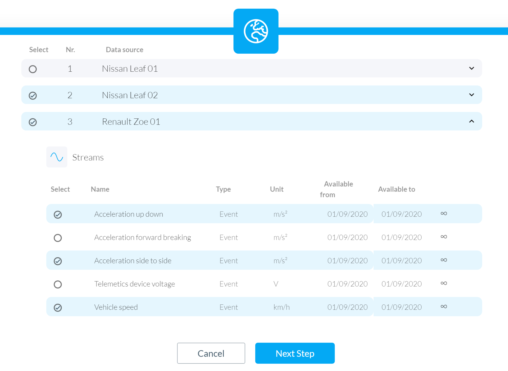
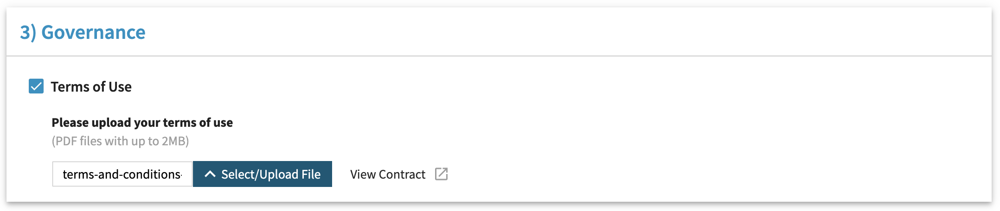
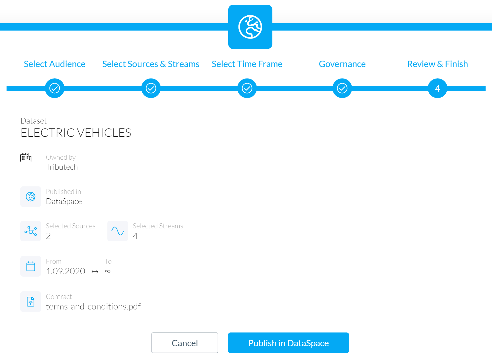

# Publish a Dataset guide

In this guide you will learn how to publish a Dataset via the admin web-interface of your DataSpace Node. This guide covers the following topics:

- [Prerequisites](/guides/guide-publish-dataset/#prerequisites)
- [Publishing options](/guides/guide-publish-dataset/#publishing-options)
    - [Publication](/guides/guide-publish-dataset/#publication)
    - [Invite](/guides/guide-publish-dataset/#invite)
- [Create a publication](/guides/guide-publish-dataset/#create-a-publication)
    - [Select sources and streams](/guides/guide-publish-dataset/#select-sources-and-streams)
    - [Select a time-frame](/guides/guide-publish-dataset/#select-a-time-frame)
    - [Select a contract](/guides/guide-publish-dataset/#select-a-contract)
    - [Publish your Dataset](/guides/guide-publish-dataset/#publish-your-dataset)
- [Edit an existing Publication](/guides/guide-publish-dataset/#edit-an-existing-publication)
- [Remove an existing Publication](/guides/guide-publish-dataset/#remove-an-existing-publication)
- [Next step: send a request](/guides/guide-publish-dataset/#next-step-send-a-request)

## Prerequisites

The prerequisits for publisching a Dataset are:

- Metadata for a Dataset existst according to the instructions of the [Create a Dataset](/guides/guide-integrate-data-source/#prerequisits) guide.
- Data sources are connected according to the instructions of the [Integrate a Data Source](/guides/guide-integrate-data-source/#prerequisits) guide.

## Publishing Options

Publishing a Dataset means that you make the descriptive metadata visible for other members of your DataSpace Ecosystem, so they can request access to your Datasets and subscribe to them if you grant access. If you want to publish a Dataset you have two different options:

- **Create a Publication**
- **Create an invite**

### Publication

If you create a **Publication** the descriptive metadata of the selected streams and sources are visible for all members of your DataSpace Ecosystem.

### Invite

If you create an **invite** the descriptive metadata of the selected streams and sources are only visible for the invited members of your DataSpace Ecosystem.

## Create a Publication

**1 Login -** Go to the admin interface of your DataSpace Node  "https://your-dataspace-node-ip-or-url"

**2 Navigate -** Navigate to "My Datasets"

**3 Add Publication -** Select one of your Datasets and click on "Add Publication" for the selected Dataset

**4 Select -** Select "Public" (visible for all mebmers) or "Invite" (for selected members)

### Select sources and streams

Select the sources and streams you want to share. As you see in the example you can selectively choose which streams you want to publish. If you choose a data source you can select which streams of the data source you want to publish.

### Select a time-frame

Select a time-frame for your Publication or invite. This time-frame sets the period for possible subscribers that they can request. The real consumable time-frame depends on the availability of each stream. The available date for each stream is defined by the metadata field "Available from" that is set at the initial metadata generation.

### Select a contract

If you also want to include some governance, you have the possibility to upload a contract that contains the terms of use that must be agreed upon as part of the Request process. Select the checkbox and upload a PDF file containing your terms of use.

### Publish your Dataset

Before completing the publishing process, please review your selection. After you publish a Dataset, it will be visible for other members (depending on the publishing option) in your DataSpace Ecosystem. After submission, other members can send a Request if they want to consume your data.

## Next step: Send a Request

In this guide, you have learned the difference between Publications and invites, how to publish a Dataset and how to modify existing entries. To learn more about requesting a Dataset, continue to the guide [request a Dataset](/guides/guide-request-dataset).
