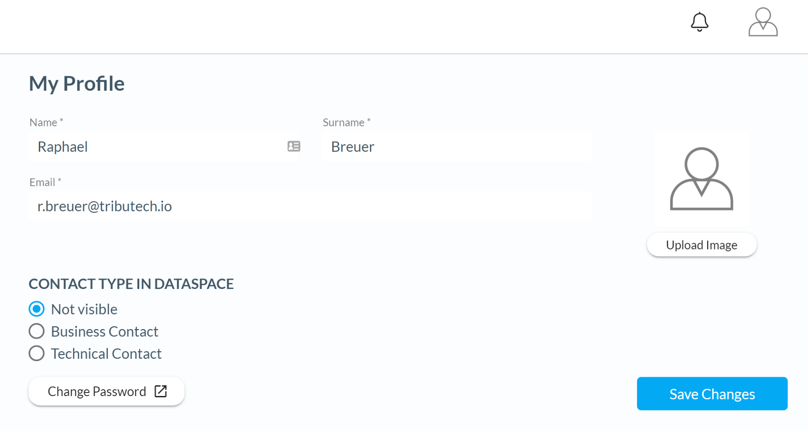

# User management guide

In this guide you will learn how you can manage users via the built in Trust API of your DataSpace Node. This guide covers the following topics:

- [User profile](/guides/guide-user-management/#user-profile)
- [Node profile](/guides/guide-user-management/#node-profile)

## User profile

If you want to change your user profile go to the admin interface of your DataSpace Node, click on your **user icon** and navigate to the **administration menu**.

## Node profile

In the **administration menu** you can also edit the profile of your DataSpace Node. This profile is visible for all members of your DataSpace Ecosystem.

