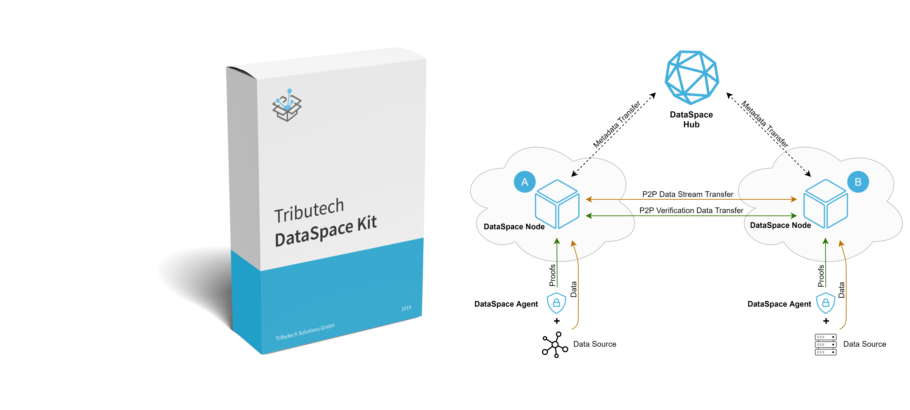

# Tributech DataSpace Kit Documentation

## Data exchange reinvented - Secure. Traceable. Trusted.

The Tributech DataSpace Kit enables companies to secure and share data cross-company or cross-process in a selective, tamperproof way while maintaining data sovereignty. This data could be sensor, process or business data. The included trust layer and distributed ledger technology make sure, that the data can be trusted and no one manipulated the data.

If you want to learn more about use-cases for your business, visit our <a href="https://www.tributech.io/use-cases/" target="_blank">website</a>, visit our <a href="https://www.tributech.io/blog/" target="_blank">blog</a> or contact our [Customer Advisory Team](mailto:customer-advisory@tributech.io) that helps you to get started.

## Need an orientation to get started?

- Read the [terminology](general/terminology.md) to understand specific terms
- Read the [DataSpace Kit explained](architecture/dataspace-kit-explained.md) section to get a general understanding of the technology
- Read the [system topology](architecture/system-topology.md) to understand the topology of the system and its components
- Read the [user guidelines](guides/guide-create-dataset.md) to learn more about the features and capabilities of the DataSpace Kit

## Setup Instructions

- [Setup a DataSpace Node](setup-instructions/setup-node.md)
- [Setup a DataSpace Agent](setup-instructions/setup-agent.md)
- [Setup a DataSpace Ecosystem](setup-instructions/setup-dataspace.md)
