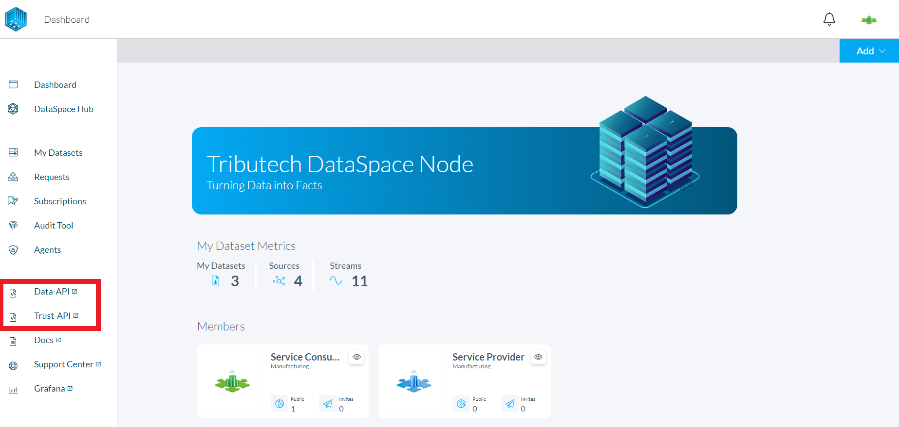

# Swagger UI Authorization

### Navigate to the Swagger UI

You can easily navigate to the Swagger UI of the API you are interested in through the DataSpace Admin App by clicking on the link in the sidebar menu:

### Authorization at the Swagger UI

Next you have to authorize yourself for usage of the Swagger UI. First open the authorization dialog:

You will need the **client_ID** and **client_secret** which you can find in the DataSpace Admin App as shown below:

Insert those values in the Authorization dialog input fields, toggle the Checkbox for the scopes and click the Authorize button:

