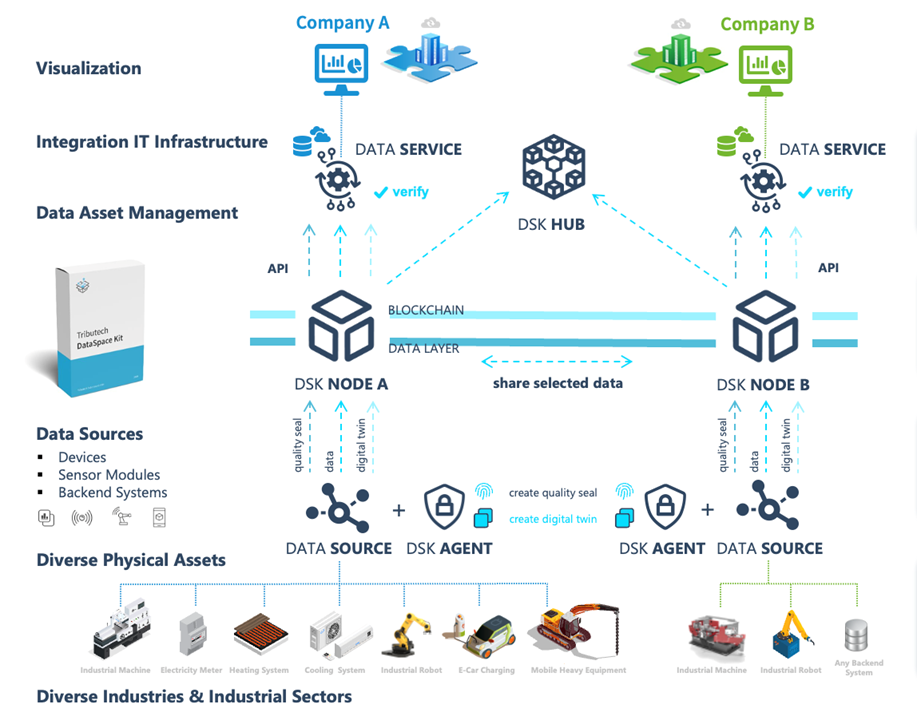
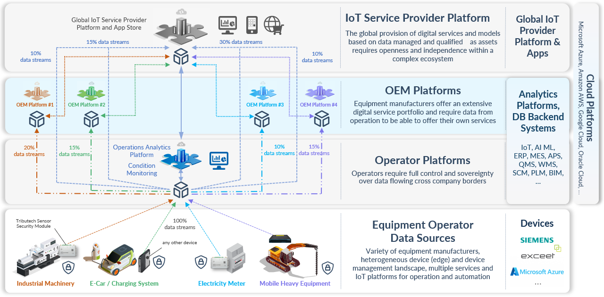

# Data Ecosystems & Dataspaces

Our mission at Tributech, is to build secure and trusted data ecosystems, that empower organizations to achieve more together. To overcome challenges like missing trust, sovereignty and interoperability of traditional data management solutions, we have built the Tributech DataSpace Kit, an enterprise solution for creating dataspaces.

The DataSpace Kit (DSK) provides all the building blocks to create dataspaces where data providers and data consumers can share selected data streams in a secure and trustworthy way. The following illustration provides an overview of a data ecosystem where two participants (company A and B) share selected data between their data platforms by using the DataSpace Kit.

## Create a data ecosystem

As shown in the image above, the DataSpace Kit provides the building blocks for you to create a dataspace. In the following section we provide a high-level description of how it works.

The DSK Hub is the metadata broker for a dataspace and each dataspace maintains its own hub. The DSK Nodes are deployed into a cloud, hybrid, or on-premises platform of each participant (e.g. a company or a department) and represent the connector and middleware required to participate in a dataspace.

Data providers can connect their data sources to the DSK Node via APIs, data pipelines or DSK Agents. Connected data sources are described and contextualized through digital twins and indexed in private or public data asset catalogs. For each data point or package, data quality seals are created to provide trust, traceability and auditability to potential data consumers.

Data providers and consumers can manage their data assets through the integrated web portal of their DSK Node. The DSK Hub is used as a metadata broker to agree on so called "data contracts" that define which data should be shared with whom and under which conditions. Based on the data contract's conditions, data is streamed peer-to-peer between the DSK Nodes while data quality seals, used as proofs for data integrity and authenticity, can be verified and audited by data consumers at any given time.

Today, there are already multiple dataspaces in place that are used by our customers to monetize data and digital services within their value chain and ecosystems. Tributech also provides a playground dataspace where interested parties can try out their use-cases and services.

## Extend your data ecosystem

A dataspace can be scaled in multiple dimensions, the dimension of your devices and data sources, the dimension of your use cases and digital services and the dimension of your supply and value chains. Due to the great modularity, supported standards and open interfaces, the DataSpace Kit helps you to shorten time-to-volume in launching new digital services and business models. Especially, when you need to integrate into heterogeneous IoT and cloud system landscapes or you need to support stakeholders with a low digitalization maturity (e.g. SMEs). The graphic below outlines an example where operators, OEMs and service providers use the DataSpace Kit to share data and insights for different use-cases and in multiple dimensions of their value chain.

