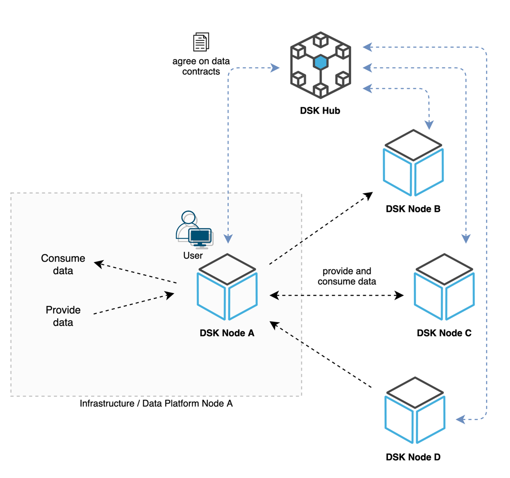
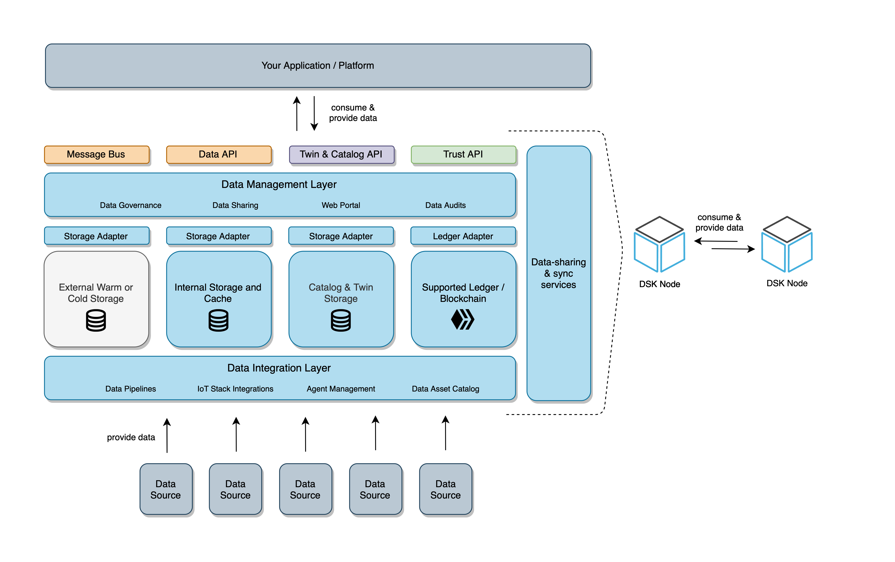
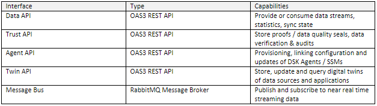
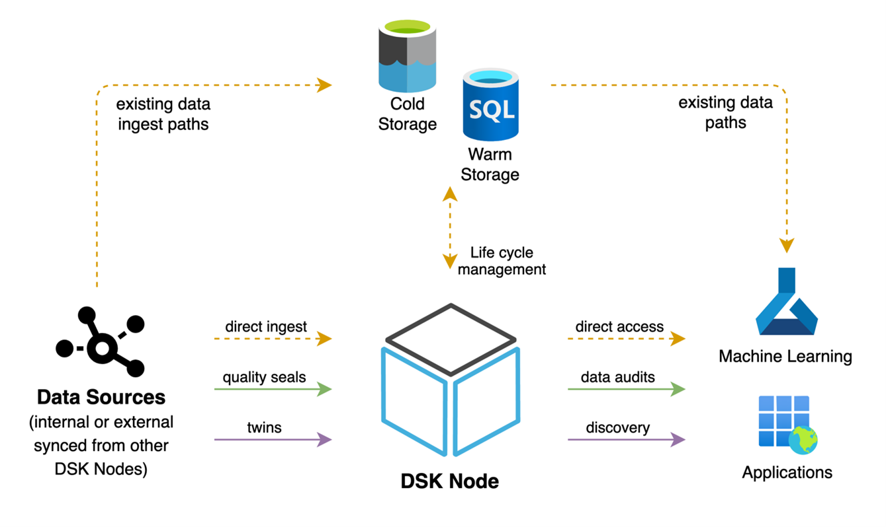

# Node Architecture 

In this section, we go into more detail regarding the DSK Node architecture and services to give you a better understanding of the system and the concepts behind it. 

The DSK Node offers a middleware for data providers and consumers to exchange data directly (peer-to-peer) between their cloud, hybrid or on-premises infrastructures. To initiate the data exchange, data providers and consumers agree on data contracts that specify the data sharing conditions via the metadata broker (DSK Hub).  

## Data Management Architecture 

As described in the definition of data assets, the DSK Node provides a middleware to manage data streams, self-descriptions (twins) and data quality seals between platforms of data providers and consumers. The following figure provides a simplified view of different storage layers and interfaces that are available on each DSK Node. 

## API Interfaces 

To integrate data sources and/or consume data streams, the DSK Node offers REST APIs based on the OAS3 specification, the following table provides an overview of the available interfaces. 

API clients are available as C# client on GitHub and NuGet. In addition, clients can be generated in any programming language based on the OAS3 specification. 

- [GitHub Repo](https://github.com/tributech-solutions/tributech-dsk-api-clients) 
- [NuGet Packages](https://www.nuget.org/profiles/Tributech)

## Data and Life Cycle Management 

To manage data between hot, warm and cold data paths, the DSK offers flexible data and lifecycle management. Each DSK Node represents a data management instance and includes two different kinds of internal database technologies, PostgreSQL and InfluxDB, for storing and caching data.

Hot data is categorized as freshly ingested data which is not necessarily persisted on the DSK Node or somewhere else. Hot data will be retrieved from a message-bus. The Data-API publishes data on the message bus.  

Warm data is categorized as persisted data on a DSK Node which can have a defined retention period (e.g. permanent, 3 months, …). Warm data will be retrieved via calls towards the Data-API. 

Cold data is categorized as data that is transferred to external storage systems (e.g. Azure Data Lake), to use cost effective and saleable storage systems for long-term data analysis. Based on the configuration (which can be set for each data stream) the DSK Node prepares, transforms and packages data to supported cold storage formats (e.g. Parquet) and continuously transfers data to the target system via a cold storage adapter. 

## Trust Layer 

Each DataSpace Ecosystem includes a blockchain-based trust layer to store data quality seals that are generated by the Trust-API or DSK Agents. The trust layer provides an immutable storage (based on the underlying consensus mechanism), that allows data consumers to verify data quality seals cross-system or cross-company. Each DSK Node includes an instance of this trust layer. 

Data consumers can use the Trust API or Audit Tool (part of the DSK Node web portal) to perform a data audit and verify the integrity and authenticity of consumed data points.