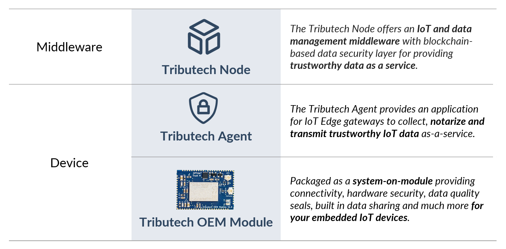
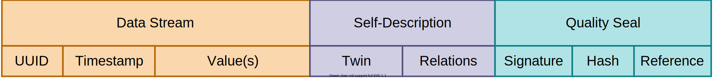

Welcome to our official documentation page!

At Tribuech we offer a solution for trustworthy data as a service by providing a data management middleware and an IoT stack that includes a novel security layer to notarize data between source and consumer. Our core components consist of a Tributech Node and the Tributech Agent Edge or Embedded in form of our Tributech OEM Module.

## Tributech Node

The Tributech Node acts as connector and middleware for data providers and data consumers.

Data providers can connect their data sources by using open API interfaces, data pipelines or Tributech Agents (edge or embedded). The included intelligent cache and storage layer allows users to easily manage the data between warm and cold storage paths as well as accessing audit trails and well-structured metadata for each data assets. Connected data sources are described and contextualized through digital twins and indexed in private or public data catalogs. For each data point or package, data quality seals are created to provide trust, traceability and auditability to potential data consumers.

Data consumers can access and analyze shared data by using the open API interfaces, data pipelines or the integrated visualization and dashboarding capabilities. In addition, data consumers can verify and audit the data quality seals of shared data via API or web portal, before they use it in their applications or take business-critical actions.

## Tributech Agent

The Tributech Agent is an application for edge and embedded IoT devices that can easily be integrated into any IoT platform stack.

The core features of the Tributech Agent are the standardized contextualization and data management via digital twins as well as the creation of data quality seals for providing trust, traceability and auditability of data streams. The Agent also includes connectivity to the blockchain-based trust layer to store data quality seals as well as connectivity to the data layer of Tributech Nodes or other IoT middleware solutions in-between.

Data providers can use the Tributech Agent to easily connect different green- or brownfield IoT solutions to their Tributech Nodes and extend IoT data sources with required contextualization via digital twins and auditability via data quality seals.

## Tributech OEM Module
The Tributech OEM Module for smart and connected products, providing a competitive foundation for your IoT application. It includes connectivity for NB-IoT and LTE-M standard and unique features such as digital-twin-based configuration & data management, high-end hardware security, blockchain-based data verification & audits and built-in data sharing. 

The Tributech OEM module is packaged as a system-on-module (SoM) to allow an easy integration into the hardware design of embedded devices. Furthermore we offe it in form of an Arduino Shield for easy prototyping.

Find out more about our [**Tributech OEM Module**](../oem_module/overview.md)

## Definition of Data Assets

In general, we differentiate between three different types of data that are managed by Tributech's services.

Our services are built to integrate, qualify and manage any kind of data assets between data providers and data consumers. Data assets are defined by three elements: data streams (e.g. time-series data of a sensor or a document from an ERP system), a self-description of the data asset’s properties and a data quality seal that provides cross-system data verification and audit capabilities.

### Data Streams

This type of data contains the runtime data of connected data sources that is owned by data providers. It may contain intellectual property and is in general classified as sensitive data within the Tributech technology stack. This data is always stored or cached within the data layer of a Tributech Node. By default, this data never leaves the data owners/providers system. It requires the so-called “data contract” that defines the data sharing conditions, and if granted by the owner, data gets synced peer-to-peer between the data provider and consumer.

### Self-description

Each data stream that is processed by Tributech's services includes a self-description, consisting of a twin describing the data asset’s properties and relations to represent a hierarchy or dependencies. The self-descriptions are based on the open DTDL (Digital Twin Definition Language) standard and managed by our users through public and private data catalogs.

### Quality Seals

To enable the verification of data integrity and authenticity between a data source and a data consumer across different infrastructures/systems, our software provides a blockchain-based trust layer to store verifiable data quality seals, also called proofs. For each (raw) datapoint or set of datapoints (depending on the configuration), a signed SHA 256 root hash is created and stored on-chain within a Node. Each quality seal includes a reference pointing to the raw data that is stored off-chain in the data layer of a Tributech Node or an external storage system.

Data consumers can use the Trust API or Audit Tool (included in the Node's web portal) to perform a data audit and verify the integrity and authenticity of consumed data points.

## Quick Links
* Head over to our [**Setup Section**](../setup/overview.md) to get a better understanding of our core components and available deployment options.

* See [**Provide Data**](../provide_data/overview.md) if you want to learn more about the different integration and data management options.

* [**Consume Data**](../consume_data/overview.md) provides insights about different options to consume, visualize and audit data.

* Check out [**Verify Data**](../verify_data/overview.md) if you want to find out more about our built-in data verification and the available data audit options.

* [**Tributech OEM Module**](../oem_module/overview.md) for embedded IoT devices.

<!---
## Open-Source Projects

At Tributech, we are contributing to the open-source community and projects in the area of dataspaces, blockchain & distributed ledger technologies, digital twin technologies and more. Below we reference our most important open-source projects.

- [**DataSpace Kit API Clients**](https://github.com/tributech-solutions/tributech-dsk-api-clients)
- [**Data Asset Twins**](https://github.com/tributech-solutions/data-asset-twin)

If you like what we’re working on, we’d appreciate your support in form of a star on [**GitHub**](https://github.com/tributech-solutions).
-->

