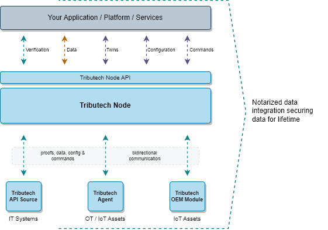

Welcome to our official documentation page!

At Tributech we make enterprise-level data security and interoperability accessible for everyone by providing a data management middleware and an IoT stack including a novel security layer for data notarization. Our technology works as a data processor/layer that can be incorporated into edge & embedded devices, heterogeneous infrastructures, data platforms, and data services, so your data can be trusted at any point of its lifecycle. 

Our core components consist of the **Tributech Node** and a **Tributech Agent** which is available for edge gateways or packed as a system-on module for your embedded IoT devices:

## Tributech Node

Providing a high secure data integration and management solution for cloud, IoT and on-premise data platforms. Our middleware, the Tributech Node, allows our customers to integrate and share their data in a unified, sovereign and trustworthy manner.

Our Data Notarization service allows Node users to verify and audit fingerprints of their data via API or web portal, before they use it in their applications, share it with other data platforms or take business-critical actions. Other applications or business platforms can easily be integrated via the Node's powerful [**REST API**](../tributech_node/API_integration.md).

The Tributech Node is available as Software-as-a-Service offering or as Platform-as-a-Service for any public or private cloud.S

## Tributech Agent

An application for IoT Edge gateways to collect, notarize and transmit trustworthy IoT data. It facilitates the simple integration of any data source and supports multiple industry standard protocols out-of-the-box.

The Tributech Agent handles the data transmission to our middleware, the Tributech Node. Together with the original data, each agent transmits digital data fingerprints, which contain information about data integrity, origin and condition.

It is available as a docker application bundle and runs on any Linux-based operation system which makes it soutable for numerous edge gateways already on the market.

Our agent provides bult-in support for the following data sources:

| Source    | Info                                                                                         |
| --------- | ---------------------------------------------------------------------------------------------  |
| MQTT      | To provide data through an MQTT message bus, follow the [**MQTT Source Guide**](../tributech_agent/sources/mqtt_source.md).  |
| Beckhoff ADS | To provide data through an Beckhoff ADS PLC Server, check out the [**ADS Source Guide**](../tributech_agent/sources/ads_source.md).    |
| OPC-UA    | For an OPC-UA conform interface, check out the [**OPC-UA Source Guide**](../tributech_agent/sources/opcua_source.md).       |
| Simulated Source | To provide generated test data, a [**Simulated Source**](../tributech_agent/sources/simulated_source.md) can be used.        |

## Tributech OEM Module

The Tributech OEM Module for smart and connected products, providing a competitive foundation for your IoT application. It includes connectivity for NB-IoT and LTE-M standard and unique features such as digital-twin-based configuration & data management, high-end hardware security, blockchain-based data verification & audits and built-in data sharing.

The Tributech OEM module is packaged as a system-on-module (SoM) to allow an easy integration into the hardware design of embedded devices. Furthermore we offe it in form of an Arduino Shield for easy prototyping.

Find out more about our [**Tributech OEM Module**](../oem_module/overview.md)

## Read next

- [**Tributech Node**](../tributech_node/overview.md)

- [**Tributech Agent**](../tributech_agent/overview.md)

- [**Tributech OEM Module**](../oem_module/overview.md) for embedded IoT devices.

- Check out [**Quick Start**](../tributech_agent/quickstart.md) for the easiest way to test our platform.

