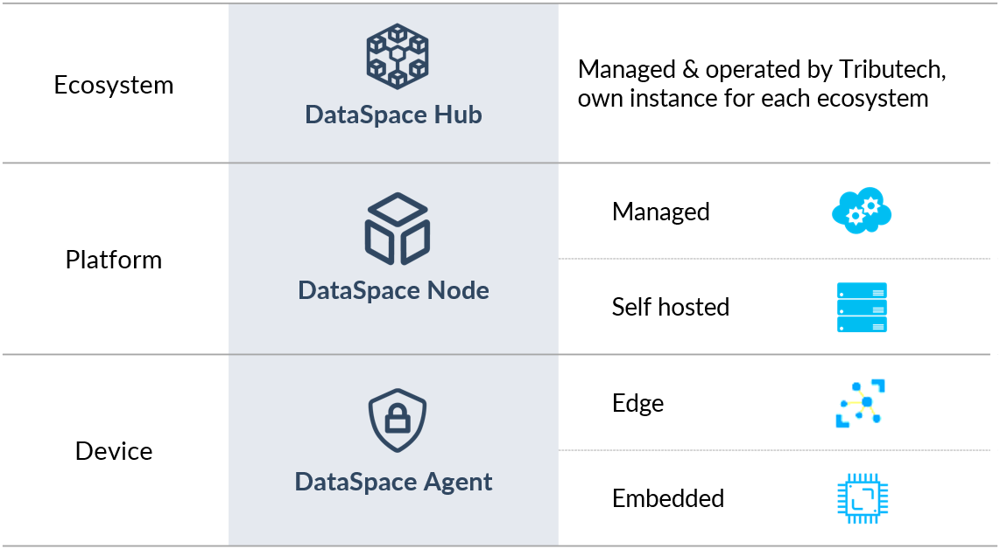
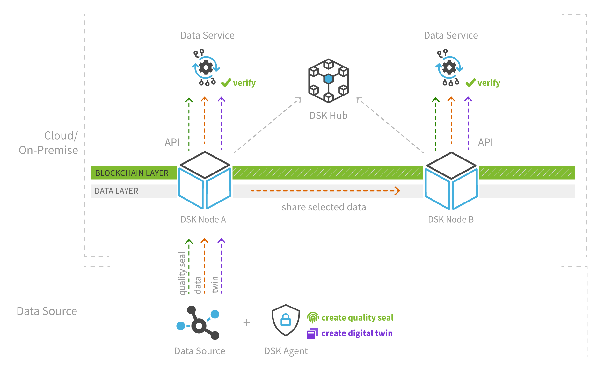

# Overview DataSpace Kit

In this part we provide an overview of the Tributech DataSpace Kit components, architecture and key aspects of the technology. The three fundamental components for the DSK are the DataSpace Hub, the DataSpace Node and the DataSpace Agent. An overview of the DSK components is presented below.

## Architecture Overview

With these building blocks, organizations can set up dataspaces, consisting of a DSK Hub that acts as metadata broker and DSK Nodes providing data management middleware for data providers and consumers. Data sources can be connected to DSK Nodes through open API interfaces, data pipelines and DSK Agents.

The high-level architecture below shows how the DSK components form a dataspace communicate with each other.

## DataSpace Hub

The DSK Hub acts as a metadata broker and clearinghouse between data providers and data consumers within a dataspace. Users can publish metadata into public and private data catalogs and agree on data contracts that define what data should be shared with whom and under which conditions. These data contracts define for example: a selection of data streams (e.g. the datapoints temperature and pressure of a machine), the timeframe (e.g. from one month in the past to an open end in the future) and a legal contract for data usage terms which are attached by the data provider.

Note that the Hub does not hold any data itself, thus guaranteeing the data sovereignty of the node owners. We are also continuously working on increasing the decentralization of the system’s metadata and identity management to eliminate the necessity of the hub in the mid-term future, while always keeping an eye on enterprise readiness and usability.

## DataSpace Node

The DSK Node acts as connector and middleware that allows data providers and data consumers to participate in dataspaces.

Data providers can connect their data sources by using open API interfaces, data pipelines or DSK Agents. The included intelligent cache and storage layer allows users to easily manage the data between warm and cold storage paths as well as accessing audit trails and well-structured metadata for each data assets. Connected data sources are described and contextualized through digital twins and indexed in private or public data catalogs. For each data point or package, data quality seals are created to provide trust, traceability and auditability to potential data consumers.

Data consumers can access and analyze shared data by using the open API interfaces, data pipelines or the integrated visualization and dashboarding capabilities. In addition, data consumers can verify and audit the data quality seals of shared data via API or web portal, before they use it in their applications or take business-critical actions.

## DataSpace Agent

The DSK Agent is an application for edge and embedded IoT devices that can easily be integrated into any IoT platform stack.

The core features of the DSK Agent are the standardized contextualization and data management via digital twins as well as the creation of data quality seals for providing trust, traceability and auditability of data streams. The Agent also includes connectivity to the blockchain-based trust layer to store data quality seals as well as connectivity to the data layer of DSK Nodes or other IoT middleware solutions in-between (e.g. Azure IoT Hub).

Data providers can use the DSK Agent to easily connect different green- or brownfield IoT solutions to their DSK Nodes and extend IoT data sources with required contextualization via digital twins and auditability via data quality seals.

## Definition of Data Assets

In general, we differentiate between three different types of data that are managed by DSK services. You already heard about them in previous parts of this documentation but let us go into more detail now.

The DSK is built to integrate, qualify and manage any kind of data assets between data providers and data consumers. Data assets in the DSK are defined by three elements: data streams (e.g. time-series data of a sensor or a document from an ERP system), a self-description of the data asset’s properties and a data quality seal that provides cross-system data verification and audit capabilities.

### Data Streams

This type of data contains the runtime data of connected data sources that is owned by data providers. It may contain intellectual property and is in general classified as sensitive data within the DSK technology stack. This data is always stored or cached within the data layer of a DSK Node. By default, this data never leaves the data owners/providers system. It requires the so-called “data contract” that defines the data sharing conditions, and if granted by the owner, data gets synced peer-to-peer between the data provider and consumer.

### Self-description

Each data stream that is processed by the DSK includes a self-description, consisting of a twin describing the data asset’s properties and relations to represent a hierarchy or dependencies. The self-descriptions are based on the open DTDL (Digital Twin Definition Language) standard and managed by DSK users through public and private data catalogs.

### Quality Seals

To enable the verification of data integrity and authenticity between a data source and a data consumer across different infrastructures/systems, the DSK provides a blockchain-based trust layer to store verifiable data quality seals, also called proofs. For each (raw) datapoint or set of datapoints (depending on the configuration), a signed SHA 256 root hash is created and stored on-chain within a DSK Node. Each quality seal includes a reference pointing to the raw data that is stored off-chain in the data layer of a DSK Node or an external storage system.

Data consumers can use the Trust API or Audit Tool (included in the DSK Node web portal) to perform a data audit and verify the integrity and authenticity of consumed data points.
