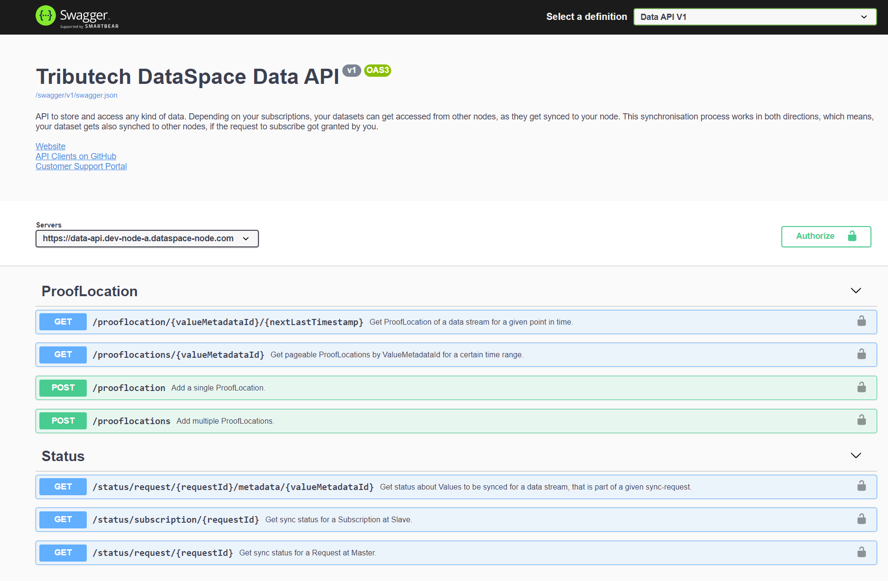
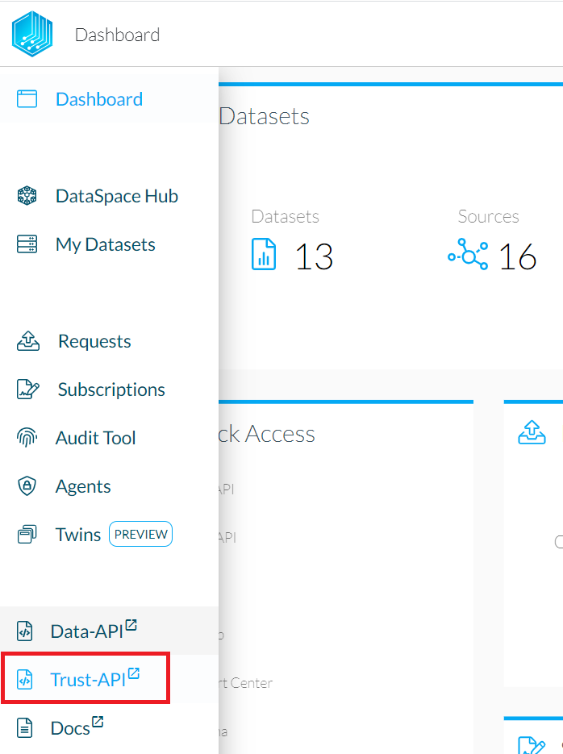
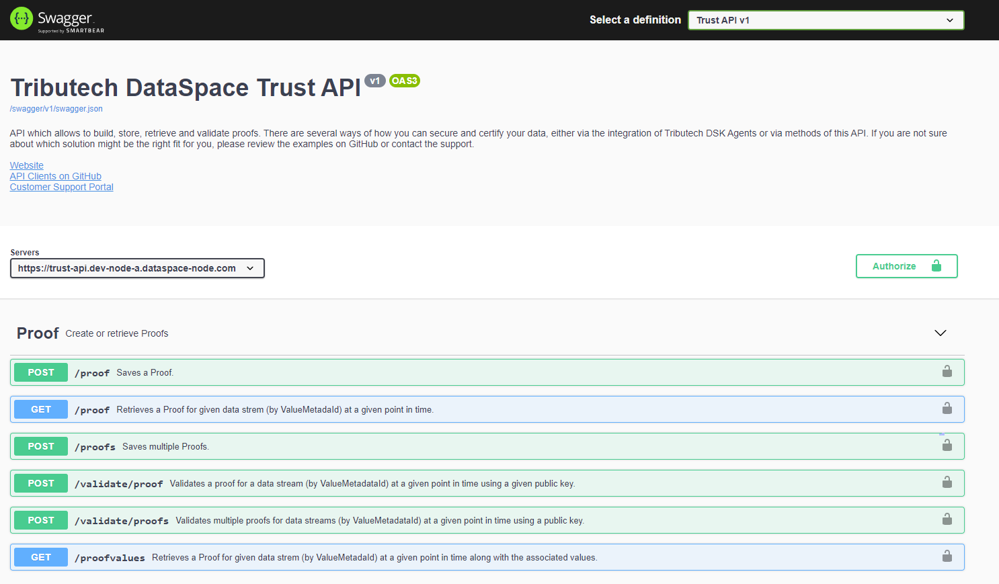
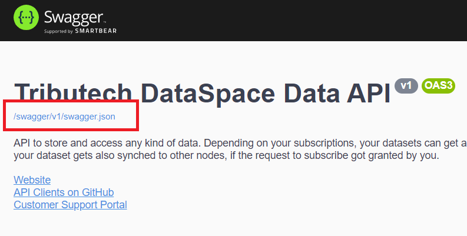
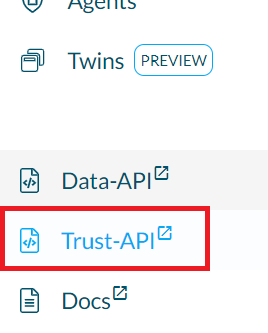
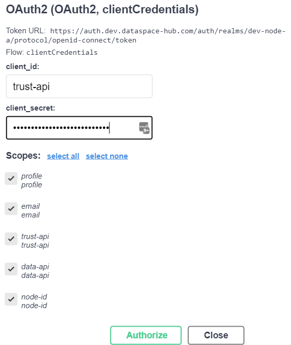
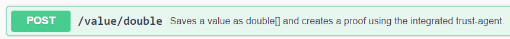
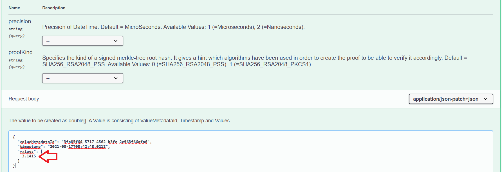
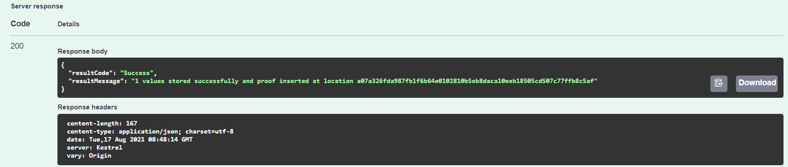

# REST API

The Tributech DataSpace Kit provides two REST APIs:

- Data-API
- Trust-API

The image below shows you how the APIs are integrated into the dataspace kit.

In short, the Data-API is used for values whereas the Trust-API is used for proofs. Proofs are required in order to verify the validity and consistency of data. The Trust-API also offers some endpoints which integrate the Data-API.

---

## Data-API Specifications
Data-API calls and specifications can be found by clicking the "Data-API" tab on the node dashboard.

The page gives an overview of the available calls and actions.

## Trust-API Specifications
The Trust-API specifications can also be found on the node dashboard.

The page provides an overview of the available calls and actions.

## Clients
For both APIs, the "OpenAPI" (Swagger) specifications can be found in the top left, which can be used to generate a clients for the APIs.

If C# is the programming language of choice, our already prepared clients can be found here: **https://github.com/tributech-solutions/tributech-dsk-api-clients**

---

### Use Case Examples
_The following use cases should help to understand when to use which API._

#### Store values
**Unless the proofs are created directly on an external device** (e.g. DataSpace Agent Edge), the **Trust-API** should be used to store values and automatically create and persist the respective proofs. The `/value` and `/values` HTTP POST endpoints of the Trust-API can be used to do so.

**If however the proofs are created separately**, then the `/value` and `/values` HTTP POST endpoints of the **Data-API** can be used to only store values - the proofs are then stored manually through the `/proof` and `/proofs` HTTP POST endpoints of the Trust-API.

#### Get values
The **Data-API** provides various `/values` HTTP GET endpoints to fetch values.
Values can also be retrieved together with the respective proof through the `/proofvalues` HTTP GET endpoint of the Trust-API.

_Note: The Data-API also handles the syncing of values between DataSpace Nodes (as far as approved through the parties). The status for this syncing process is available through the Status endpoints of the Data-API._

#### Store proofs
The **Trust-API** `/proof` and `/proofs` HTTP POST endpoints can be used to store proofs.

_Note: Each proof is stored tamperproof within the Distributed Ledger (Blockchain) across the Tributech DataSpace network. Consequently, each proof is assigned a unique TransactionId - which can be used to fetch the proof from the Ledger. This endpoint to retrieve the proof from the Blockchain is called ProofLocation and can be accessed through the available endpoints in the Data-API._

#### Get proofs
Proofs can be fetched through the `/proof` HTTP GET endpoint of the **Trust-API**. A proof can also be retrieved together with the assigned values through the `/proofvalues` HTTP GET endpoint of the Trust-API.

#### Validate proofs
A proof can be validated through the `/validate/proof` HTTP POST endpoint of the **Trust-API**.

---

### Step-by-Step Example: **Store a Double Value with Proof**
1. On your node dashboard: Access your profile on the top right and head to "Administration->API Keys" to find your Trust-API client secret. Copy it.  
   
2. Head to the Trust-API specification page.  
   
3. Click the "Authorize" button and paste the Trust-API client secret.  
     
   
4. Scroll down and select the "POST/value/double" endpoint.  
   
5. Click "Try it out" and replace the value in the message body with your own value.  
   
6. Make sure that the server response with a "success" status.  
   
