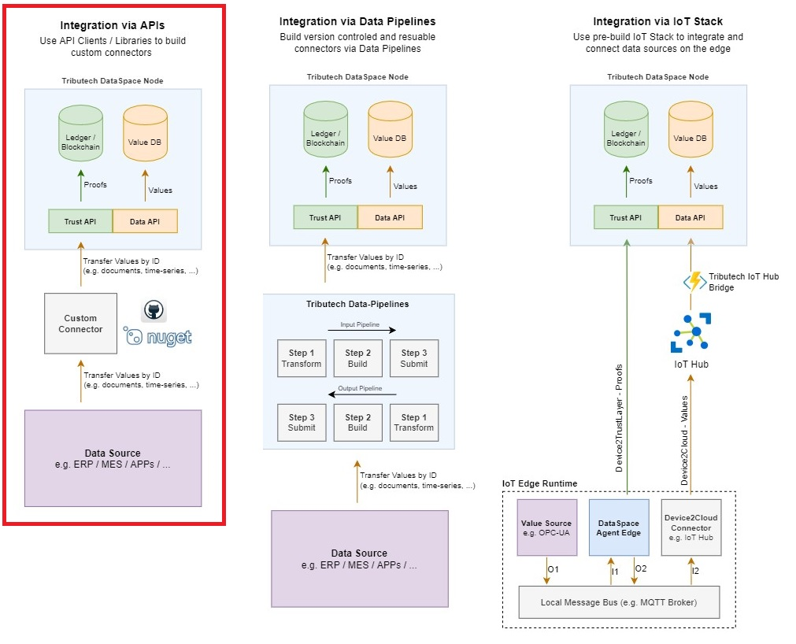
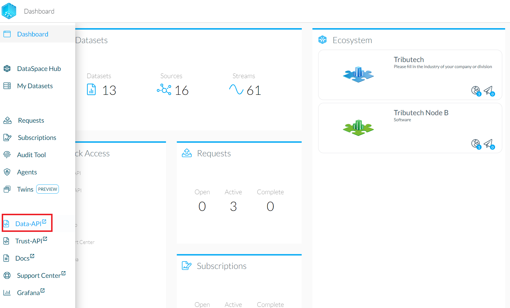

# REST

The Tributech DataSpace Kit provides two REST APIs:

- Data Api
- Trust Api

The image below shows you how the APIs are integrated into the dataspace kit.

**In short, the Data Api is used for values whereas the Trust Api is used for proofs. Proofs are required in order to verify the validity and consistency of data. The Trust Api also offers some endpoints which integrate the Data Api.**

---

## Data-API specifications
Data-API calls and specifications can be found by clicking the "Data-API" tab on the node dashboard.

The page gives an overview of the available calls and actions.

## Trust-API specifications
The Trust-API specifications can also be found on the node dashboard.

The page gives an overview of the available calls and actions.

## Clients

For both APIs, the "Open API" (Swagger) specifications can be found in the top left, which can be used to generate a clients for the APIs.

If C# is the programming language of choice, our already prepared clients can be found here: https://github.com/tributech-solutions/tributech-dsk-api-clients

### Use case examples

_A few cases which should help to understand when to use which Api are explained following._

#### Store values

**Unless the proofs are created directly on an external device** (e.g. DataSpace Agent Edge), the **Trust Api** should be used to store values and automatically create and persist the respective proofs. The `/value` and `/values` HTTP POST endpoints of the Trust Api can be used to do so.

**If however the proofs are created separately**, then the `/value` and `/values` HTTP POST endpoints of the **Data Api** can be used to only store values - the proofs are then stored manually through the `/proof` and `/proofs` HTTP POST endpoints of the Trust Api.

#### Get values

The **Data Api** provides various `/values` HTTP GET endpoints to fetch values.
Values can also be retrieved together with the respective proof through the `/proofvalues` HTTP GET endpoint of the Trust Api.

_Note: The Data Api also handles the syncing of values between DataSpace Nodes (as far as approved through the parties). The status for this syncing process is available through the Status endpoints of the Data Api._

#### Store proofs

The **Trust Api** `/proof` and `/proofs` HTTP POST endpoints can be used to store proofs.

_Note: Each proof is stored tamperproof within the Distributed Ledger (Blockchain) across the Tributech DataSpace network. Consequently, each proof is assigned a unique TransactionId - which can be used to fetch the proof from the Ledger. This endpoint to retrieve the proof from the Blockchain is called ProofLocation and can be accessed through the available endpoints in the DataApi._

#### Get proofs

Proofs can be fetched through the `/proof` HTTP GET endpoint of the **Trust Api**. A proof can also be retrieved together with the assigned values through the `/proofvalues` HTTP GET endpoint of the Trust Api.

#### Validate proofs

A proof can be validated through the `/validate/proof` HTTP POST endpoint of the **Trust Api**.

---

