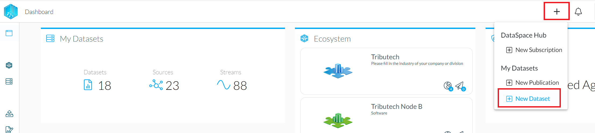
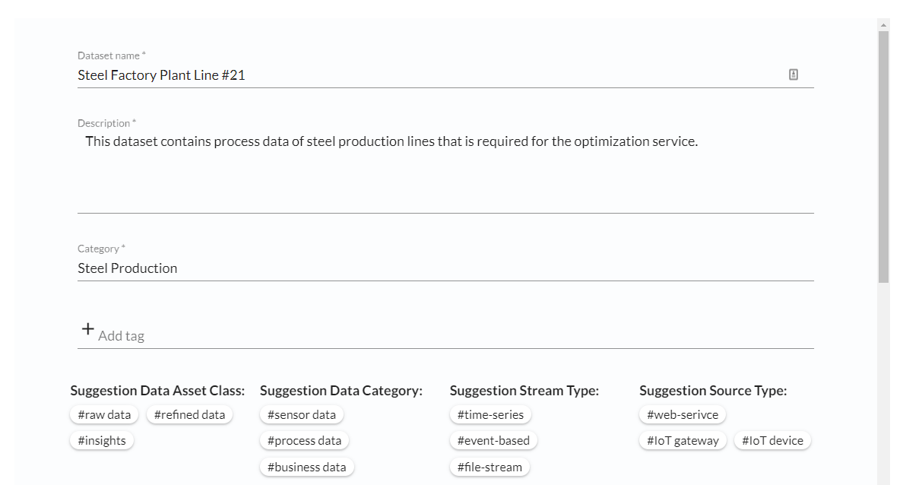
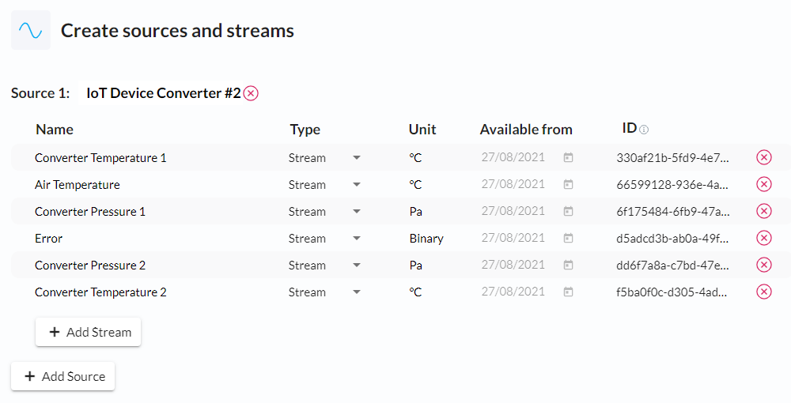
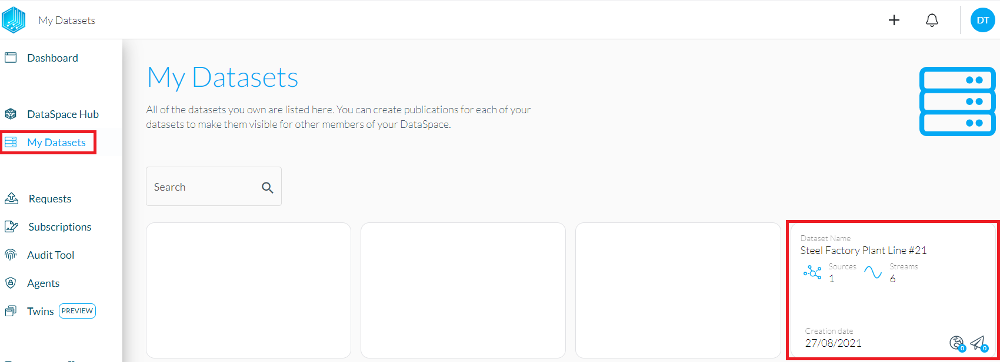

Datasets are a collection of data streams, tags and descriptions which you can publish in order to share the dataset with other users of the Dataspace.

# Create a Dataset

To create a Dataset, connect to your node, click the "+" symbol and select "New Dataset".

Fill in the required information and add tags, which will be shown to data consumers during the subscription process.

Add however many data sources and streams/events are needed for the use case. The IDs are required to publish data so write them down or come back to the Dataset whenever they are needed.

Once you are done, hit "Generate Dataset" to finish the creation process. The Dataset should now be visible in "My Datasets".
