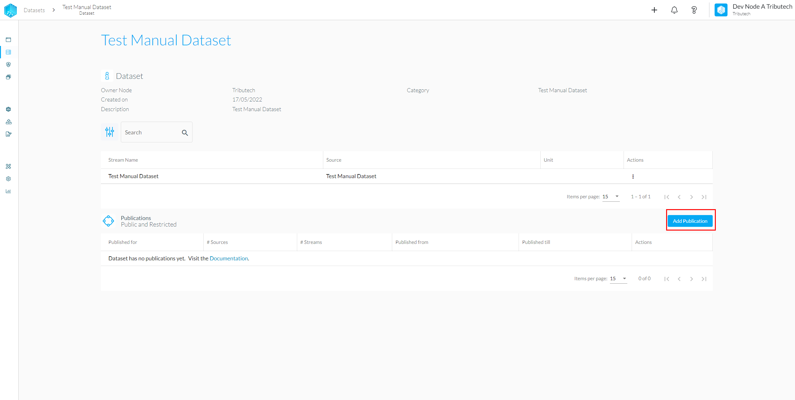

Datasets are a collection of data streams, tags and descriptions which can be published in order to share the dataset and its content with other users of the Dataspace.

## Kinds of Datasets

In the DSA we differentiate between two kinds of datasets, when linking and configuring a device an _automatically generated dataset_ will be created. When data is inserted manually using our API integration we also have the possibility to explicitly create a dataset.

- **Autogenerated/Synced** Datasets will be updated whenever the configuration of a Agent changes
- **Manually** created Datasets need to be adapted whenever changes are necessary

### Synced Dataset

To create a synced Dataset please follow our [**DSA Agent Configuration Guide**](../../setup/agent_configuration.mdx). After applying the configuration to the device the dataset can be found within the "My Datasets" section of the DSA.

### Manual Dataset

To manually create a dataset please follow the [**Manual Dataset**](./manual_datasets.md) Guide. Once you are done the Dataset should now be visible in "My Datasets".

## Publish a Dataset

Publishing a Dataset makes a certain timeframe of the data available for selected data consumers in the Dataspace.  
In order to publish the Dataset, head once again to "My Datasets", select the Dataset you want to share and hit the "Add Publication" button. An in-depth explanation can be found in [**Publish Dataset**](./publish.md).

