The DSK Edge Agent service supports integration of external data sources using the [MQTT messaging protocol](https://mqtt.org/). 
Your MQTT client needs to connect to our MQTT message broker (`eclipse-mosquitto`) and publish MQTT messages with a specific payload format on one of our [pre-defined MQTT topics](#mqtt-predefined-topics) or using the [custom/configurable MQTT topics](#mqtt-custom-topics). The published message will be processed from our main DSK Edge Agent service (`dsk-agent`) and enriched to achieve data authenticity and integrity support.

Such an MQTT client could be any of your existing edge services or implemented specifically for the use case in your desired programming language and run as additional Docker sidecar container.

We recommend the configuration of the MQTT source based on twins which can be done with our [Agent Companion](../../setup/agent_companion) and is described in the subsequent chapters.

## Connect to the MQTT broker
By default the MQTT broker is only available within the [Docker bridge network](https://docs.docker.com/network/bridge/) `edge-net` with the service name `mosquitto-server` on port `1883`.  
Accordingly you need to either [connect](https://docs.docker.com/network/bridge/#connect-a-container-to-a-user-defined-bridge) your custom MQTT client running as Docker container to the `edge-net`  
or [publish/expose the port](https://docs.docker.com/config/containers/container-networking/#published-ports) of the MQTT broker on the host with a configuration like the following:
```yaml {6-7}
# MQTT broker/server
mosquitto-server:
  image: eclipse-mosquitto:1.6
  networks:
    - edge-net
  ports:
   - "127.0.0.1:1883:1883" # publish/expose port to host
```
which enable access on `localhost` with port `1883`.

In the default setup we do not use user/password authentication nor SSL/TLS since we are in a closed environment. If you want to refine this setup please talk to your contact person at Tributech or send an email to our [Customer Advisory Team](https://www.tributech.io/about-us/).

For testing purposes we can recommend tools like [MQTTX](https://mqttx.app/) or [MQTT Explorer](http://mqtt-explorer.com/).  
If the port was published to the host as described above we can connect with such tools and post test messages (as used in the subsequent samples). 
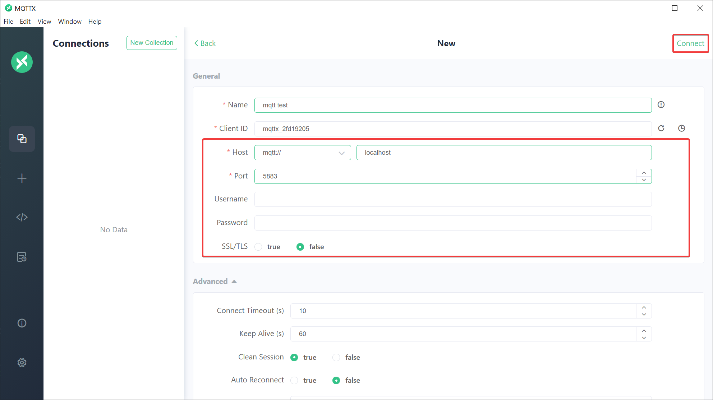
Register for the wildcard topic `#` to see all messages.
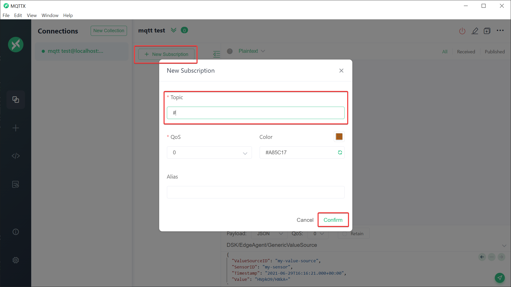

If you are connecting to your agent via SSH and are using SSH tunneling/port-forwarding you might want to additionally forward traffic for the MQTT broker port `1883` for testing purposes so that you can connect from your local machine.

```bash
ssh <vm-user>@<vm-ip> -L 5000:localhost:5000 -L 1883:localhost:1883
# e.g.
ssh tributech@20.86.158.183 -L 5000:localhost:5000 -L 1883:localhost:1883
```
Otherwise you need to ensure that the port `1883` is accessible on the edge device (firewall rules). 

## Custom/configurable MQTT topics {#mqtt-custom-topics}

You can configure a custom MQTT topic for a stream on which the main DSK Edge Agent service will listen and process all MQTT messages published at the MQTT broker.

The mapping of MQTT message to the value for the stream works like the following:
- `ValueMetadataId`: All MQTT messages matching the *MQTT custom topic* will be created as value with *ValueMetadataID* of the stream.
- `Timestamp`: Current time of the edge-device when the topic gets read by the DSK Edge Agent.
- `Values`: The payload in raw-bytes representing the value (see [Data encoding](#data-encoding)).

Configure:
* Open the [Agent Companion](../../setup/agent_companion), [login](../../setup/agent_companion#agent-companion-login) to the DSK Node and [connect](../../setup/agent_companion#agent-companion-connect) with the DKS Edge Agent
* Add MQTT Source
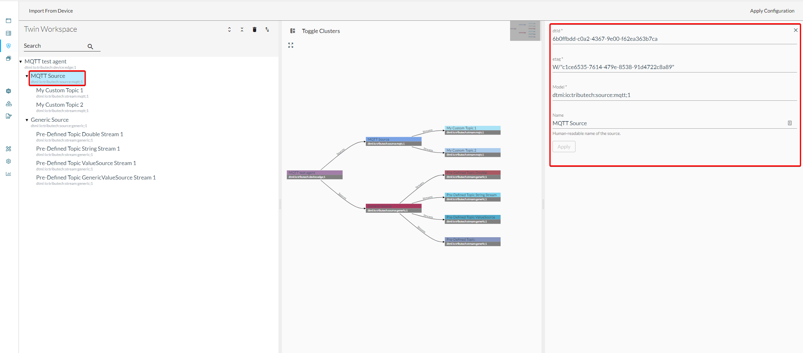
* Add MQTT Stream(s)  
 *MQTT custom topic* must follow the [MQTT specification](http://docs.oasis-open.org/mqtt/mqtt/v3.1.1/os/mqtt-v3.1.1-os.html#_Toc398718106) and the same topic can not be used for multiple streams.  
 *Data Encoding* defines the actual value type (since provided as raw-bytes in the message).
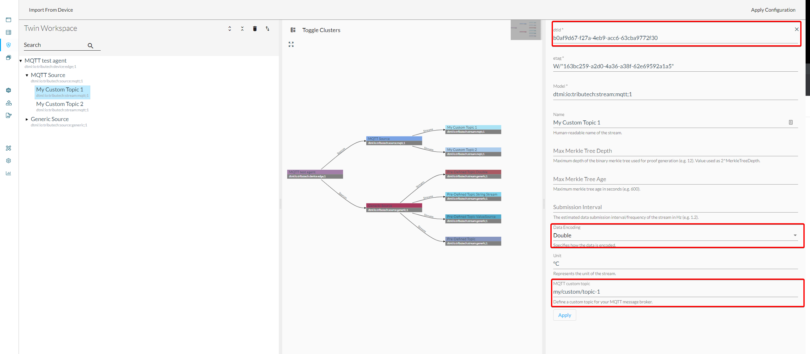
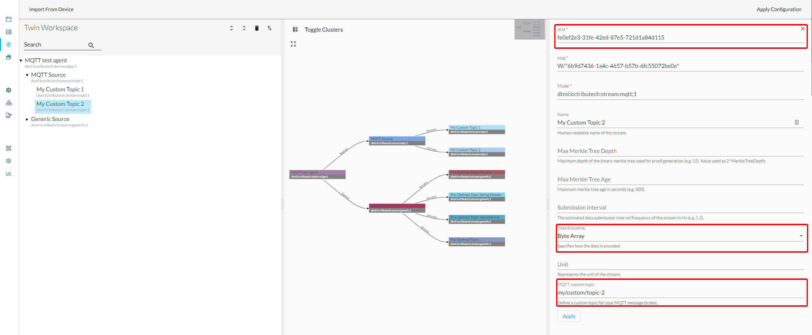
* Upload To Device

Test and verify:
* Publish MQTT message for configured topic
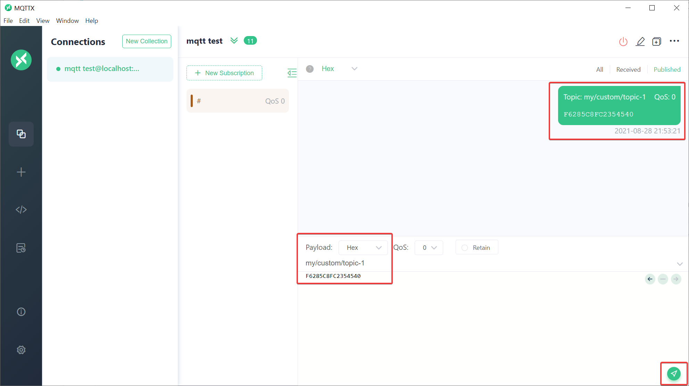
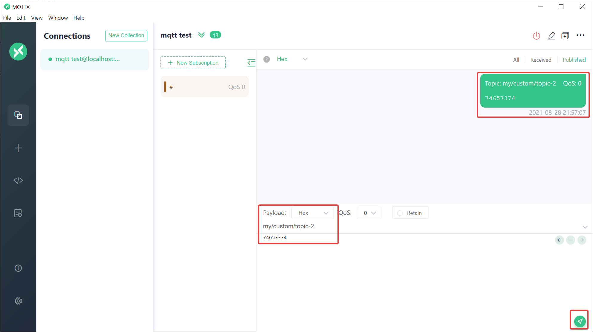
* Verify value for published message in DataSpace-Admin at Streams of Agent
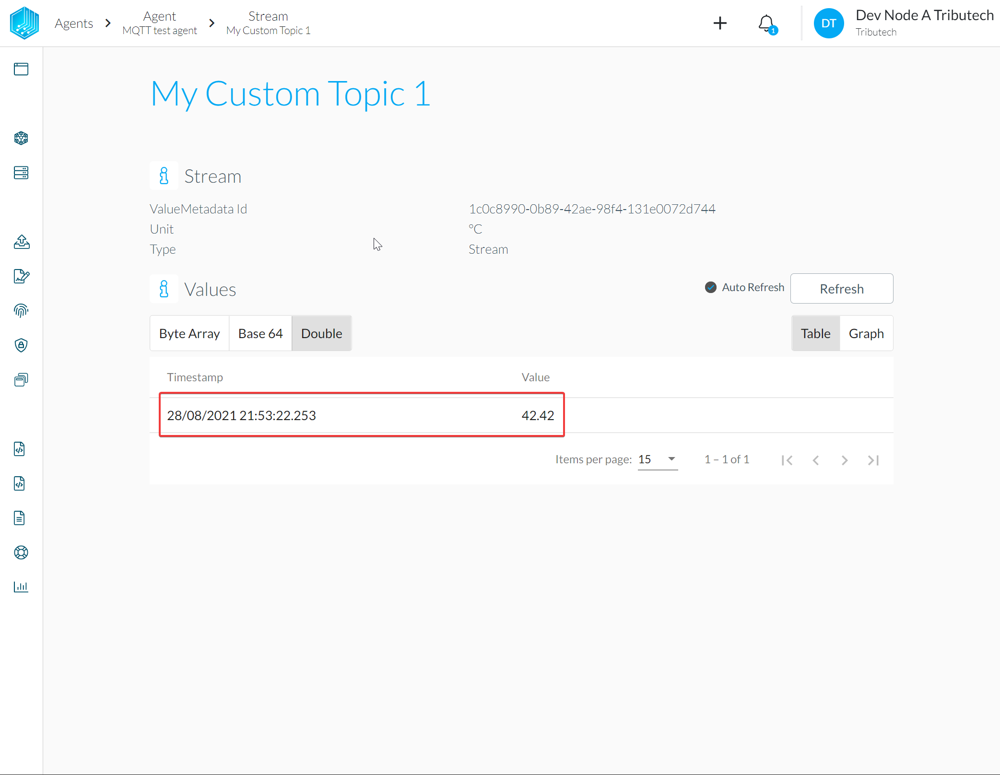
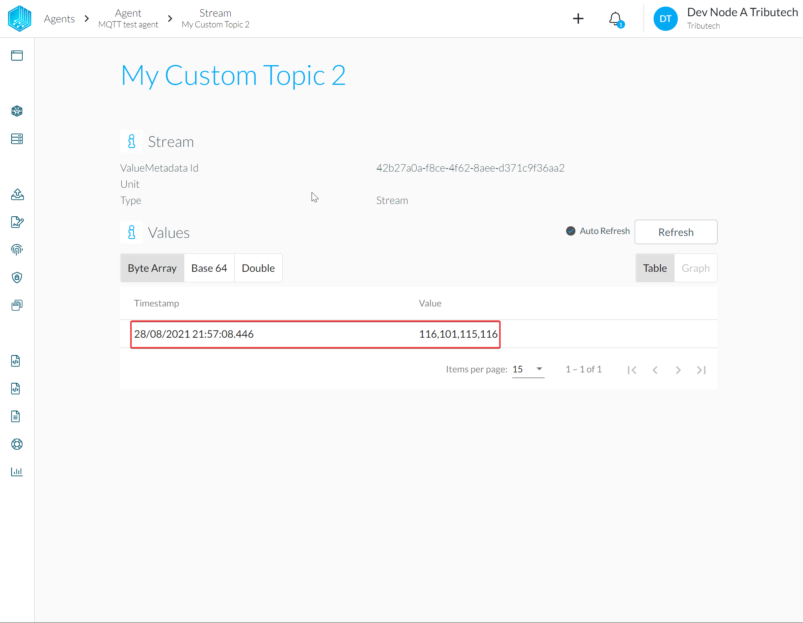

## Predefined MQTT topics {#mqtt-predefined-topics}

The DSK Edge Agent has certain predefined MQTT topics he is listening on. If we publish MQTT messages in the required format on such topics they are automatically processed and converted into values for streams.  
For representation as twins in the configuration we use *Generic Source* and *Generic Stream*.

### Double topic
TOPIC: `DSK/EdgeAgent/Double/<ValueMetadataId>`

For publishing of floating point number values represented as [double](https://docs.microsoft.com/en-us/dotnet/csharp/language-reference/builtin-types/floating-point-numeric-types).

The mapping of MQTT message to the value for the stream works like the following:
- `ValueMetadataId`: Taken from `ValueMetadataId` placeholder inside the topic.
- `Timestamp`:  Current time of the edge-device when the topic gets read by the DSK Edge Agent.
- `Values`: The payload in raw-bytes of an little-endian-encoded 64-bit [IEEE 754](https://en.wikipedia.org/wiki/Double-precision_floating-point_format) floating point number (see [Data encoding](#data-encoding)).

Configure:
* Open the [Agent Companion](../../setup/agent_companion), [login](../../setup/agent_companion#agent-companion-login) to the DSK Node and [connect](../../setup/agent_companion#agent-companion-connect) with the DKS Edge Agent
* Add Generic Source
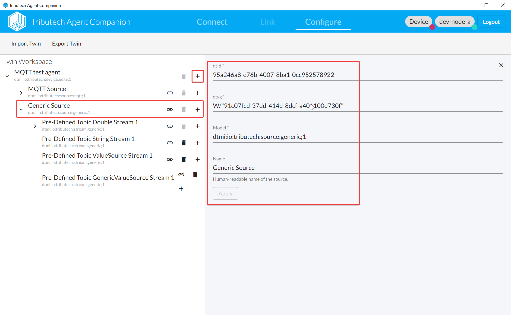
* Add Generic Stream(s) and use `ValueMetadataId` that will be used in the topic  
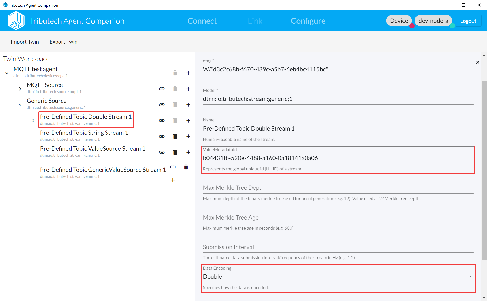
* Upload To Device

### String topic
TOPIC: `DSK/EdgeAgent/String/<ValueMetadataId>`

For publishing of UTF-8 encoded strings.

The mapping of MQTT message to the value for the stream works like the following:
- `ValueMetadataId`: Taken from `ValueMetadataId` placeholder inside the topic.
- `Timestamp`:  Current time of the edge-device when the topic gets read by the DSK Edge Agent.
- `Values`: The payload in raw-bytes of an UTF8-encoded string (see [Data encoding](#data-encoding)).

Configure:
* Open the [Agent Companion](../../setup/agent_companion), [login](../../setup/agent_companion#agent-companion-login) to the DSK Node and [connect](../../setup/agent_companion#agent-companion-connect) with the DKS Edge Agent
* Add Generic Source

* Add Generic Stream(s) and use `ValueMetadataId` that will be used in the topic  
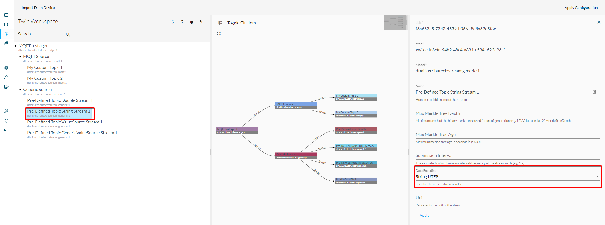
* Upload To Device

### ValueSource topic
TOPIC: `DSK/EdgeAgent/ValueSource`

For publishing of various typed values with custom timestamp and ValueMetadataId (UUID).

The payload provided for the topic needs to be a UTF8-encoded string which represents a JSON-object as shown in the following example:
```json
{
  "DataStreamID": "8235326b-6f43-4402-8bdf-bcfbd0999b70",   // ValueMetadataId of the stream
  "Timestamp": "2020-01-01T00:00:01+00:00",                 // Timestamp for the value
  "Value": "MTIzNDU2"                                       // Base64-encoded raw-bytes of the actual value
}
```

The mapping of MQTT message to the value for the stream works like the following:
- `ValueMetadataId`: `DataStreamID` from the JSON-object. Currently there is no check that a matching stream exist we however recommend to create a *Generic Stream* for each published `DataStreamID` for easier management.
- `Timestamp`: `Timestamp` from the JSON-object.
- `Values`: `Value` from the JSON-object as Base64-encoded raw-bytes of the actual value (see [Data encoding](#data-encoding)).

Configure:
* Open the [Agent Companion](../../setup/agent_companion), [login](../../setup/agent_companion#agent-companion-login) to the DSK Node and [connect](../../setup/agent_companion#agent-companion-connect) with the DKS Edge Agent
* Add Generic Source

* Add Generic Stream(s) with `ValueMetadataId` matching the `DataStreamID` in the message
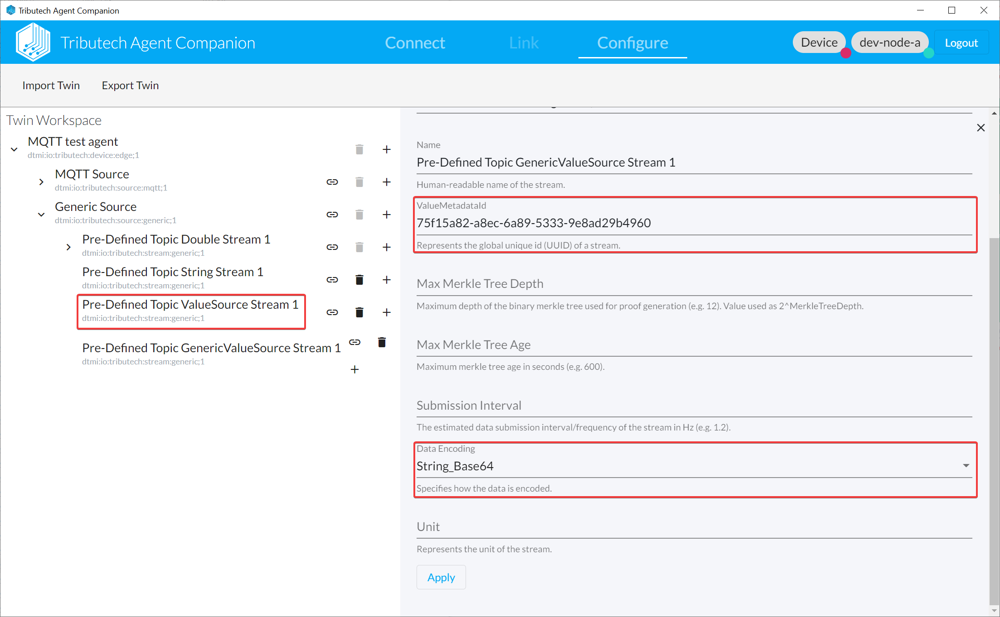
* Upload To Device

Test and verify:
* Publish MQTT message on topic
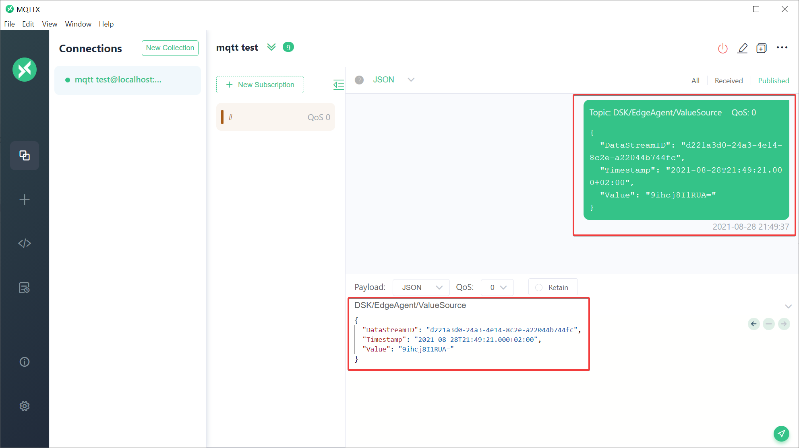
* Verify value for published message in DataSpace-Admin at Streams of Agent
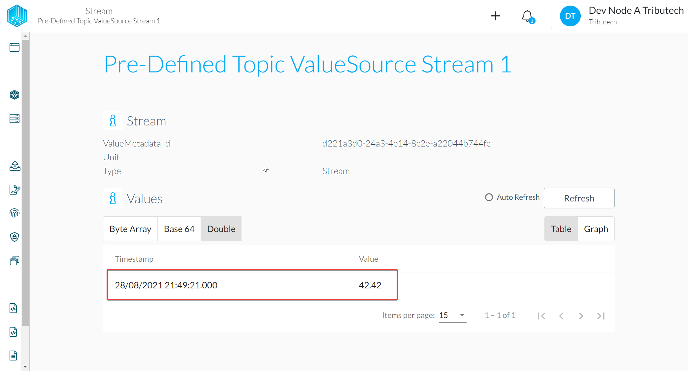


### GenericValueSource topic
TOPIC: `DSK/EdgeAgent/GenericValueSource`

For publishing of various typed values with custom timestamp and ValueMetadataId derived from custom identifiers.

The payload provided for the topic needs to be a UTF8-encoded string which represents a JSON-object as shown in the following example:
```json
{
  "ValueSourceID": "Machine1",              // ID of the source
  "SensorID": "OperatingIndicator",         // ID of the sensor
  "Timestamp": "2020-01-01T00:00:01+00:00", // Timestamp for the value
  "Value": "MTIzNDU2"                       // Base64-encoded raw-bytes of the actual value
}
```

The mapping of MQTT message to the value for the stream works like the following:
- `ValueMetadataId`: Derived automatically in a deterministic manner based on `ValueSourceID` and `SensorID` from the JSON-object. Currently there is no check that a matching stream exist we however recommend to create a *Generic Stream* for each published `ValueSourceID` and `SensorID` combination for easier management.
- `Timestamp`: `Timestamp` from the JSON-object.
- `Values`: `Value` from the JSON-object as Base64-encoded raw-bytes of the actual value (see [Data encoding](#data-encoding)).

Configure:
* Open the [Agent Companion](../../setup/agent_companion), [login](../../setup/agent_companion#agent-companion-login) to the DSK Node and [connect](../../setup/agent_companion#agent-companion-connect) with the DKS Edge Agent
* Add Generic Source

* Add Generic Stream(s) and use `ValueMetadataId` derived from `ValueSourceID` and `SensorID`  
Can be derived using the following script https://dotnetfiddle.net/xp0Zig.
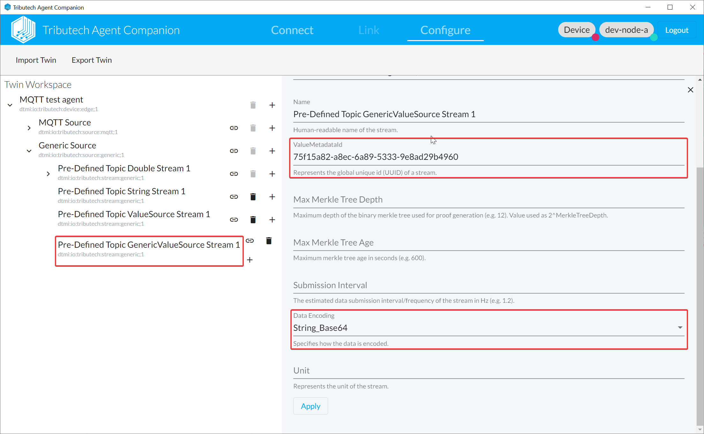
* Upload To Device

Test and verify:
* Publish MQTT message on topic
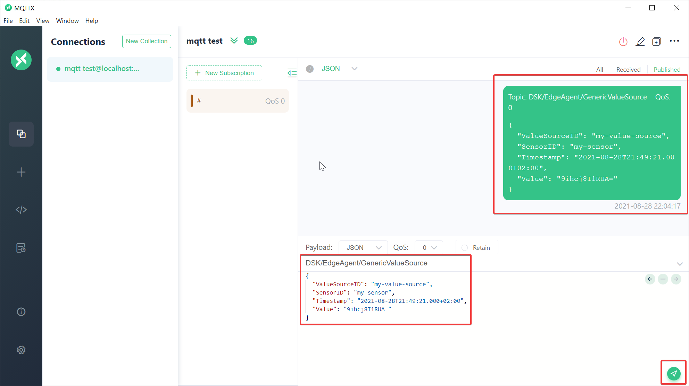
* Verify value for published message in DataSpace-Admin at Streams of Agent
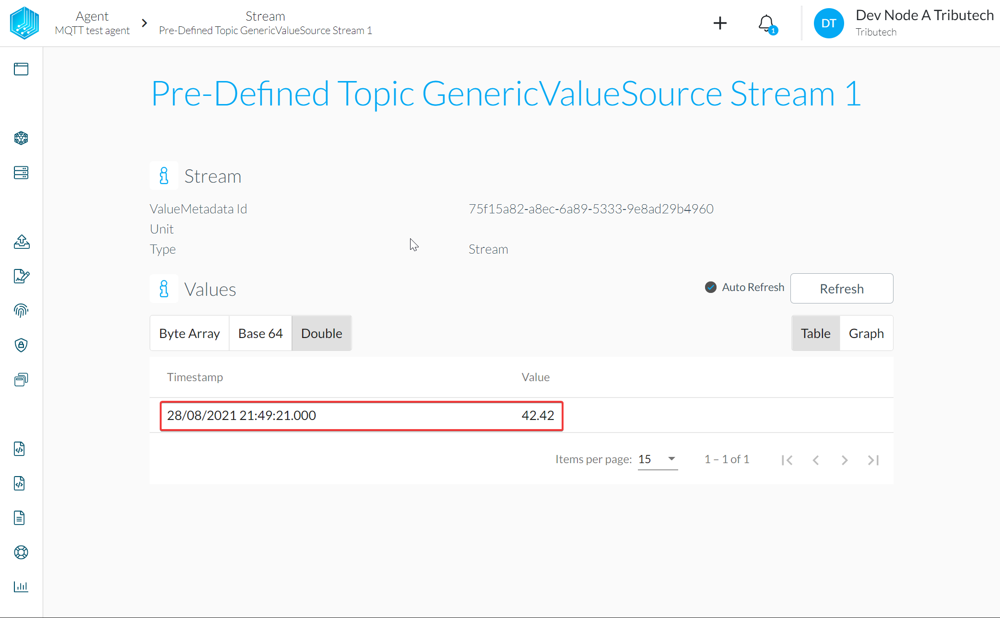

## Data encoding {#data-encoding}

For the data encoding and conversion to other formats we use the industry standards as e.g. implemented by the .NET framework (see e.g. [System.BitConverter](https://docs.microsoft.com/en-us/dotnet/api/system.bitconverter?view=net-5.0)).
The following sample program demonstrates conversions for various value types which might be handy. 

```csharp
using System;
                    
public class Program
{
  public static void Main()
  {
    const string formatter = "{0,-10}{1,10}{2,20}{3,15}{4,40}";
    
    // float
    float floatValue = 3.1415926535f;
    byte[] floatAsBytes = BitConverter.GetBytes(floatValue);
    string floatBase64 = Convert.ToBase64String(floatAsBytes, 0, floatAsBytes.Length);
    string floatHex = BitConverter.ToString(floatAsBytes).Replace("-","");
    float floatFromBytes = BitConverter.ToSingle(floatAsBytes);
    
    // double
    double doubleValue = 42.42d;
    byte[] doubleAsBytes = BitConverter.GetBytes(doubleValue);
    string doubleBase64 = Convert.ToBase64String(doubleAsBytes, 0, doubleAsBytes.Length);
    string doubleHex = BitConverter.ToString(doubleAsBytes).Replace("-","");
    double doubleFromBytes = BitConverter.ToDouble(doubleAsBytes);
    
    // int (aka int32)
    int intValue = 123;
    byte[] intAsBytes = BitConverter.GetBytes(intValue);
    string intBase64 = Convert.ToBase64String(intAsBytes, 0, intAsBytes.Length);
    string intHex = BitConverter.ToString(intAsBytes).Replace("-","");
    int intFromBytes = BitConverter.ToInt32(intAsBytes);
    
    // long (aka int64)
    long longValue = 9999;
    byte[] longAsBytes = BitConverter.GetBytes(longValue);
    string longBase64 = Convert.ToBase64String(longAsBytes, 0, longAsBytes.Length);
    string longHex = BitConverter.ToString(longAsBytes).Replace("-","");
    long longFromBytes = BitConverter.ToInt64(longAsBytes);
    
    // string
    string stringValue = "foo";
    byte[] stringAsBytes = System.Text.UTF8Encoding.UTF8.GetBytes(stringValue);
    string stringBase64 = Convert.ToBase64String(stringAsBytes, 0, stringAsBytes.Length);
    string stringHex = BitConverter.ToString(stringAsBytes).Replace("-","");
    string stringFromBytes = System.Text.UTF8Encoding.UTF8.GetString(stringAsBytes);
    
    // byte[]
    byte[] byteArray = new byte[]{ 0, 100, 120, 210, 255 };
    string byteArrayBase64 = Convert.ToBase64String(byteArray, 0, byteArray.Length);
    string byteArrayHex = BitConverter.ToString(byteArray).Replace("-","");
    
    // print 
    Console.WriteLine(formatter, "Type", "Value", "HEX", "Base64", "Bytes");
    Console.WriteLine(formatter, "float", floatValue, floatHex, floatBase64, $"[{string.Join(", ", floatAsBytes)}]");
    Console.WriteLine(formatter, "double", doubleValue, doubleHex, doubleBase64, $"[{string.Join(", ", doubleAsBytes)}]");
    Console.WriteLine(formatter, "int", intValue, intHex, intBase64, $"[{string.Join(", ", intAsBytes)}]");
    Console.WriteLine(formatter, "long", longValue, longHex, longBase64, $"[{string.Join(", ", longAsBytes)}]");
    Console.WriteLine(formatter, "string", stringValue, stringHex, stringBase64, $"[{string.Join(", ", stringAsBytes)}]");
    Console.WriteLine(formatter, "byte[]", "--", byteArrayHex, byteArrayBase64, $"[{string.Join(", ", byteArray)}]");
  }
}
```
The script can be run online at https://dotnetfiddle.net/5ggm0T.

Output:
```bash
Type           Value                 HEX         Base64                                   Bytes
float      3.1415927            DB0F4940       2w9JQA==                       [219, 15, 73, 64]
double         42.42    F6285C8FC2354540   9ihcj8I1RUA=     [246, 40, 92, 143, 194, 53, 69, 64]
int              123            7B000000       ewAAAA==                          [123, 0, 0, 0]
long            9999    0F27000000000000   DycAAAAAAAA=              [15, 39, 0, 0, 0, 0, 0, 0]
string           foo              666F6F           Zm9v                         [102, 111, 111]
byte[]            --          006478D2FF       AGR40v8=                 [0, 100, 120, 210, 255]
```


