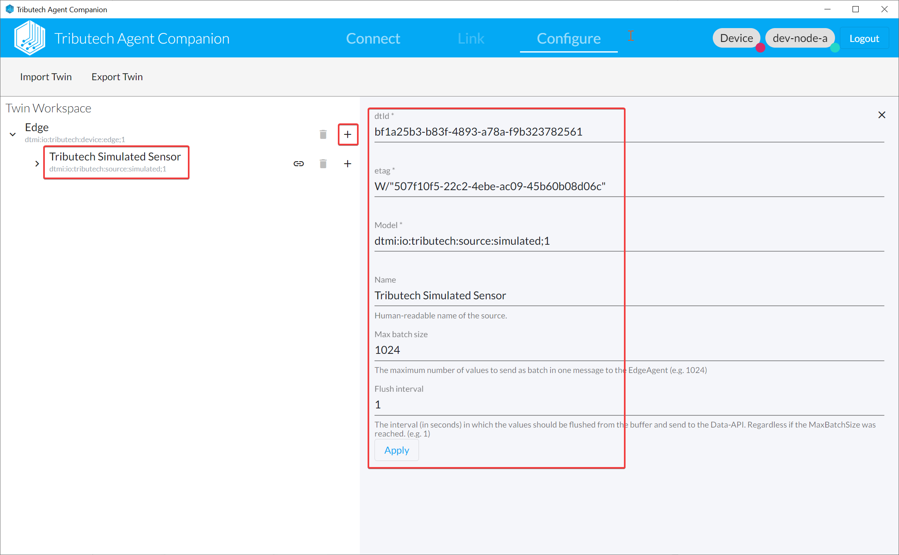
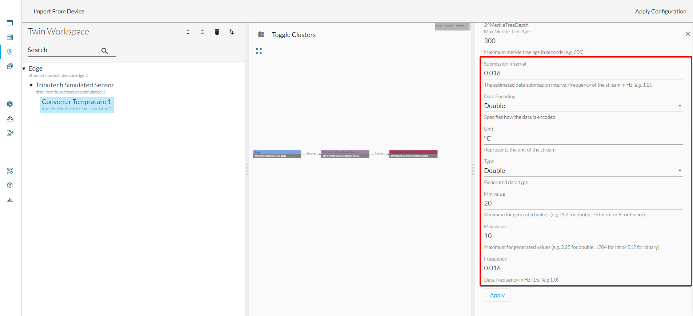

The DSK Simulated Sensor/Source allows to simulate a data source on the edge side for testing purposes. The generated data for the streams is transmitted to the DSK Edge Agent service (`dsk-agent`) via our MQTT broker.  
If the [DSK Simulated Sensor/Source (`simulated-sensor`)](../../setup/agent/sources/simulated) is deployed along with our DSK Edge Agent services it can be configured based on twins with our [Agent Companion](../../setup/agent_companion) as described in the following:

* Open the [Agent Companion](../../setup/agent_companion), [login](../../setup/agent_companion#agent-companion-login) to the DSK Node and [connect](../../setup/agent_companion#agent-companion-connect) with the DKS Edge Agent
* Add Simulated Source

* Add Simulated Stream(s)  
Various parameters for the simulated stream can be adapted but important are the *Type* which defines the actual generated value type and the *Frequency* which the amount of generated data.

* Upload To Device
