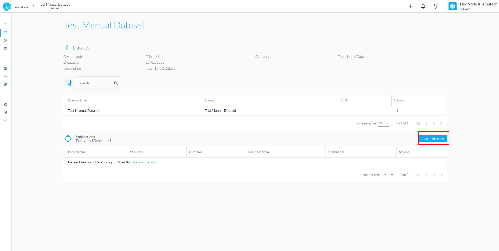
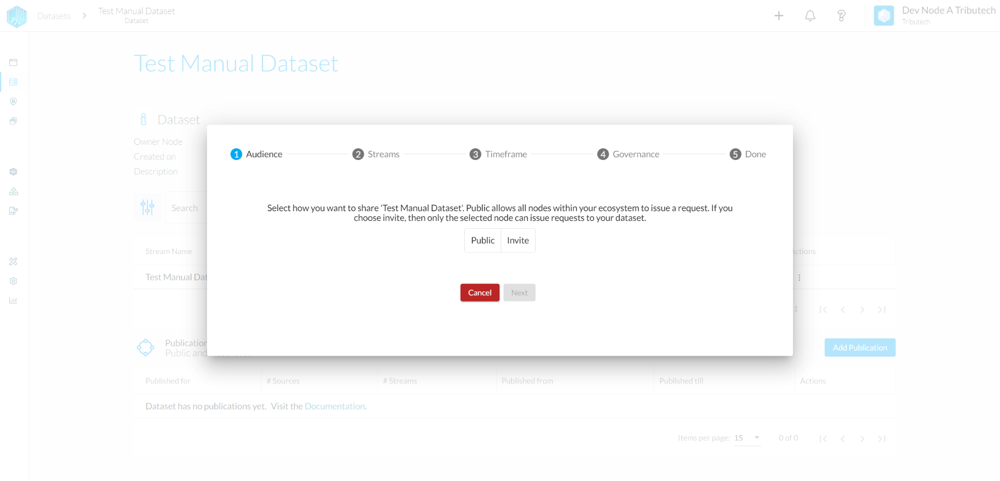
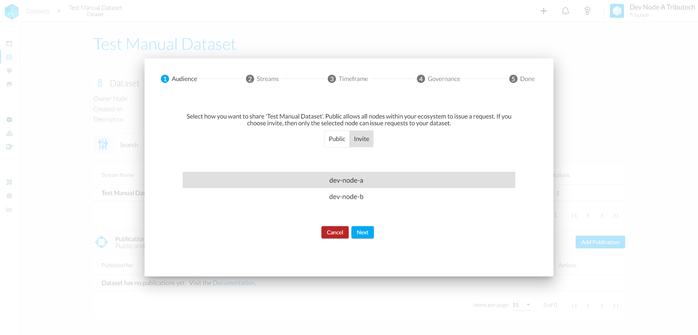
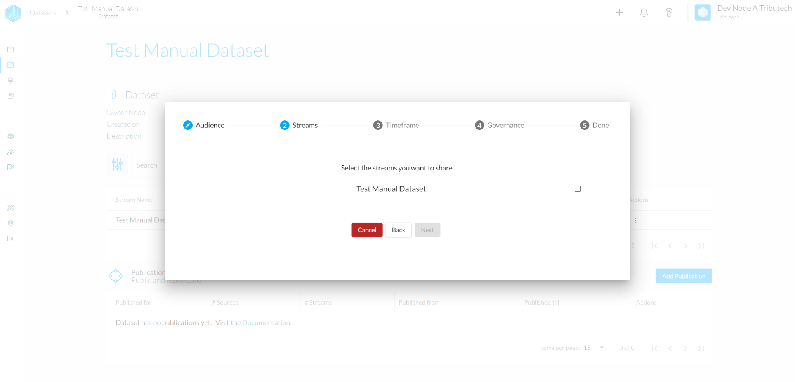
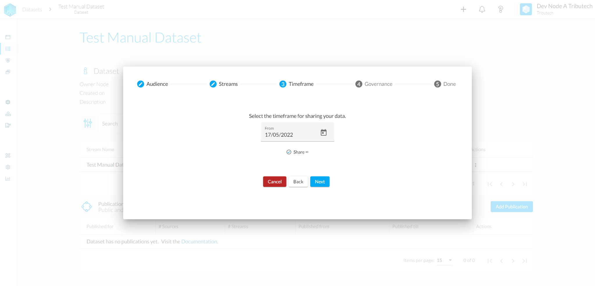
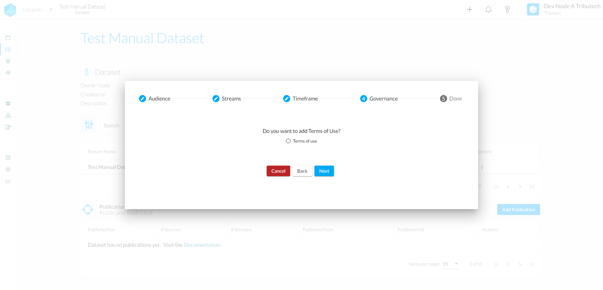
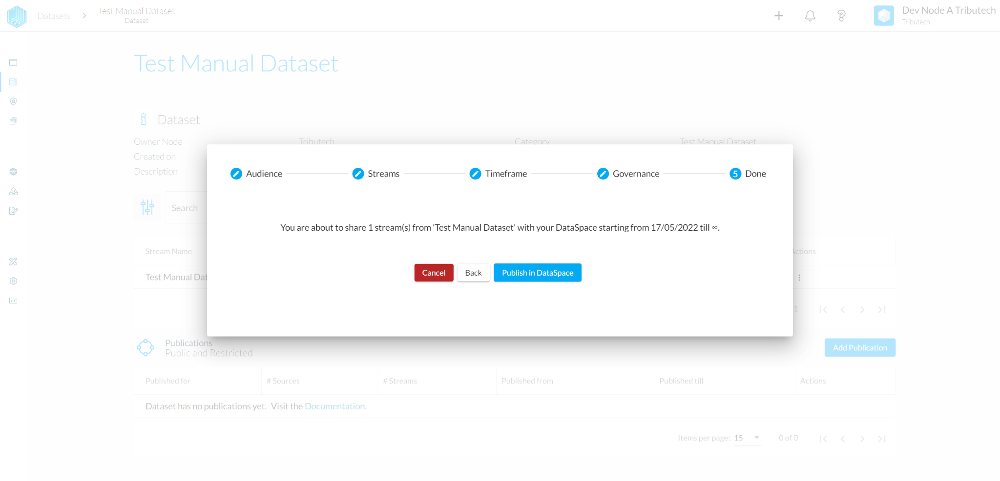

Publishing a Dataset makes a certain timeframe of the data available for selected data consumers.
In order to publish the Dataset, head once again to the detail section of the dataset that you want to share and hit the "Add Publication" button.

 
### Audience

You can choose the target audience with whom you want to share your data.

- Public allows everybody in your ecosystem to see the dataset
  

- Invite only allows choosing a specific member to see the dataset
  

### Streams

In the next step you can choose what streams of the dataset you want to publish.

### Timeframe

In the Timeframe step you can choose from what day till what day the streams should be shared. When the "Share ∞" option is chosen the data will be shared as long as the permission does not get revoked.

### Governance

This step allows you to add a document or terms of use of the data that need to be accepted by the other party.

### Review

In the last step you can again check if everything was registered correctly before publishing the dataset.

If everything worked as expected your dataset should now be visible to your intended audience. To learn how to subscribe to a published dataset please take a look at the [**Shared Data**](../../consume_data/shared_data.md) section.
