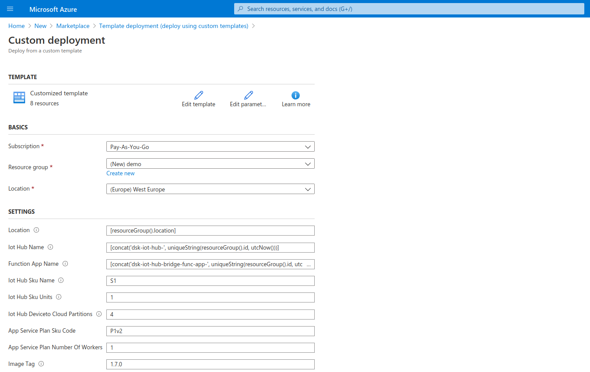

# Install DSK IoT Hub Bridge

After the node is successfully deployed we can add an Instance of the Azure IoT Hub. The IoT Hub is an external service provided by Azure rather than a part of the Data Space Kit. That is why it has to be deployed separately in order to use it. The IoT Hub provides Device-Management and Communication for our Edge Devices. While we use the Azure IoT Hub it is also possible to integrate any other device management solution.

## Find the Node Credentials

For the IoT Hub to be able to connect to your new node it requires credentials. These can be found in the web interface. Note them down for later steps. 

### Open Administrative Settings

### Copy API keys for Data-API

The IoT Hub will use the Data-API to connect to the node. These API Keys will be needed for later.

### Data-API Documentation

Go back to the home-page and open the Data-API section in the left navigation bar.

### Data-API

A new tab will be opened showing the documentation of the Data-API. The URL will be something like https://data-api.my-company-xyz.dataspace-node.com/ with the Name of your Node instead of "my-company-xyz". Note this URL and the Values seen in the Authorization window. 

## Deploy custom ARM template

Selecte the [Template Deployment](https://azuremarketplace.microsoft.com/en-us/marketplace/apps/Microsoft.Template?tab=Overview) from the Marketplace.

## Enter a new template

## Copy the template into the editor

Enter the ARM Template that can be found [here](https://github.com/tributech-solutions/tributech-dsk-docs/blob/master/docs/assets/iot-hub-arm-template/iotHubAndBridgeTemplate.json) into the editor and click "Save".

## Fill in parameters

Select your resource group and other parameters. 

## Fill in node credentials

Most default parameters will be fine for this deployment. Enter the following values and click on "Purchase". 

| Setting             | Value                                                                 |
|---------------------|-----------------------------------------------------------------------|
| Image Tag           | Current version of the DSK you are using. The default is likely fine. |
| Data Api Url        | Url from the browser-window from before.                              |
| Identity Server Url | Toke Url from before. Without the "/connect/token" in the end.        |
| Auth Client         | The Client ID from before.                                            |
| Auth API Scope      | Scope from the Data API Documentation.                                |
| Auth Client Secret  | The Client Secret from before.                                        |

## Next Steps

The deployment will run for a couple of minutes. After the deployment is finished there should be a new instance of the Azure IoT Hub in the selected resource-group. This IoT Hub will be used in the following steps to deploy a simulated Edge Device.