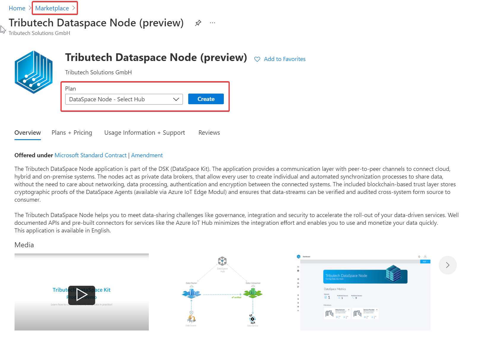
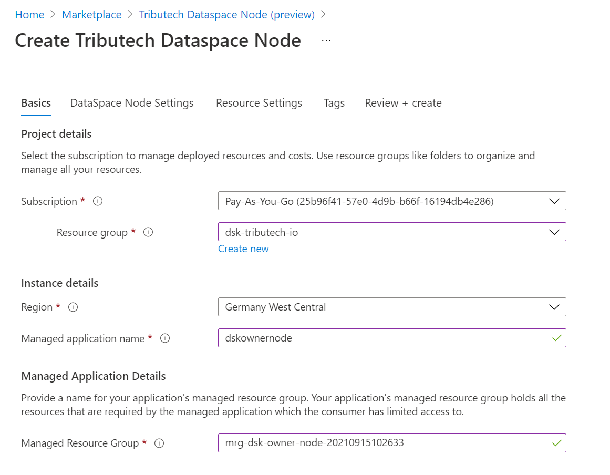
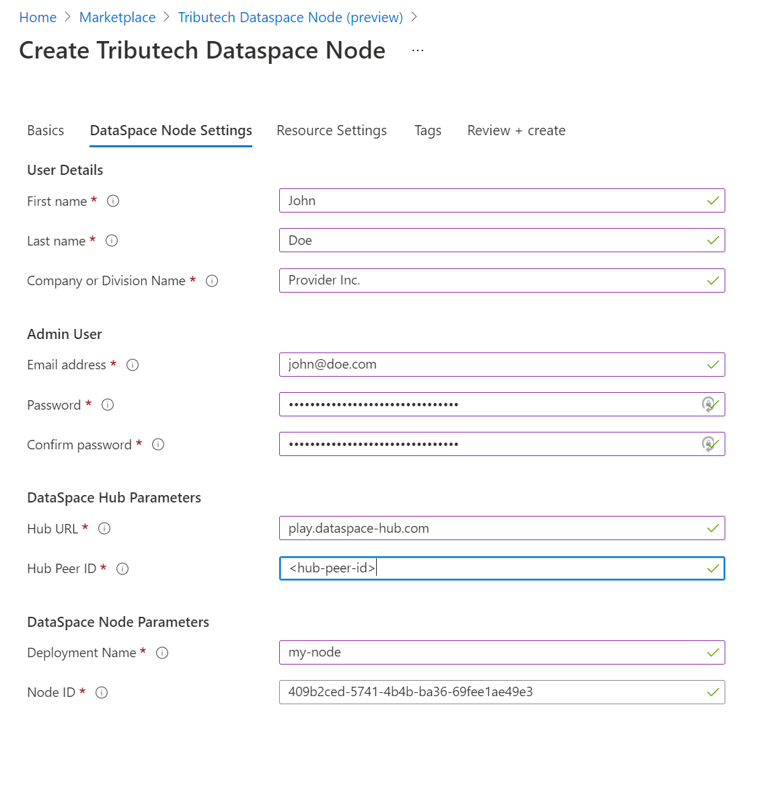
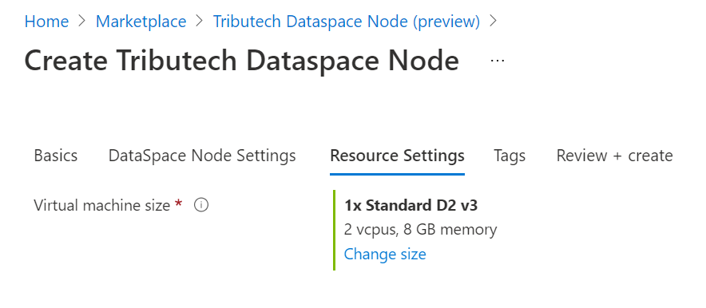
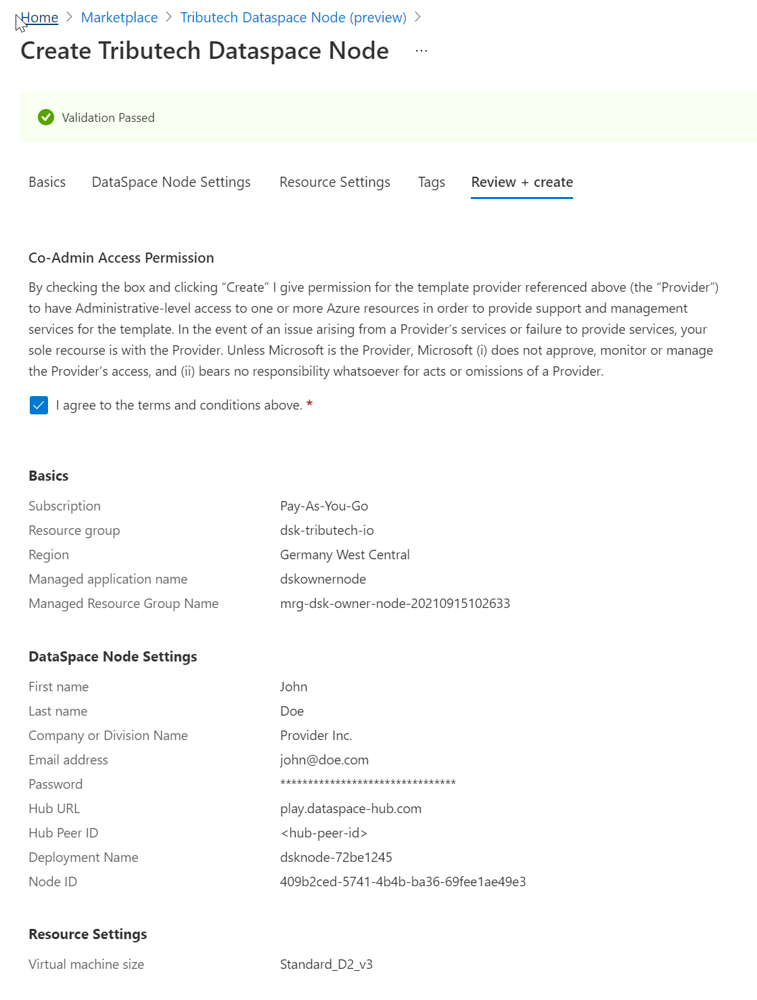
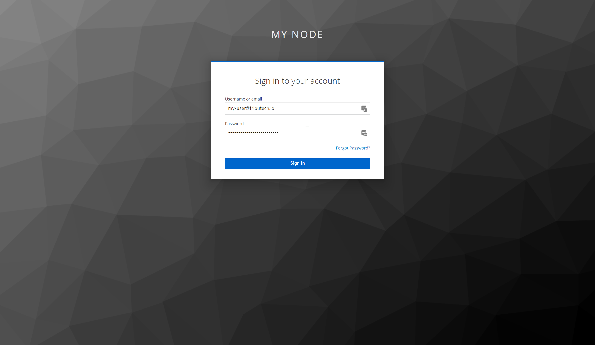
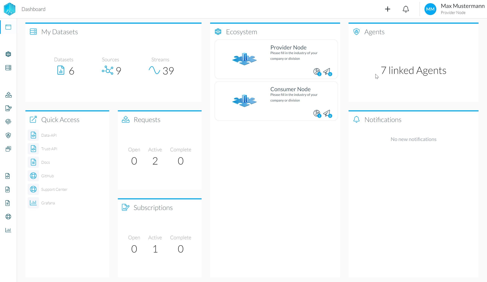

# Installing the data owner node

A demo of a Tributech DataSpace Node can be deployed with only a few clicks through the [Azure Marketplace](https://azuremarketplace.microsoft.com/en-us/marketplace/apps/tributechsolutionsgmbh1582568815297.8aa9010b-3dd5-43e0-a4b6-53e2ea552e4a?tab=Overview), as explained below.

### Go to the Azure Marketplace

In the marketplace simply select the option "DataSpace Node - Select Hub" and click "Create".

### Fill in the basic information

In the first step of the form fill in your desired Resource Group and Region and click next. It is a good idea to create a new Resource Group for this demo.

### Enter user information

Enter personal information for the user-account which will be created automatically on the node. 
Then select a name for your node and enter it in the field "Deployment Name". Note that this name has to be unique! This name will be part of the URL of your node. After the deployment is finished, your node will be reachable under "[deployment-name].dataspace-node.com". Take note of this URL for later steps.  
The DataSpace Hub Parameters define to which DSK ecosystem the DSK Node will be connected. For our playground ecosystem the Hub URL is `play.dataspace-hub.com`.

:::info
The Hub Peer ID will be currently be provided to you as part of the playground sign-up email.
:::

:::caution
The Email address must currently be unique within the whole DSK ecosystem!
:::

### Select VM Size

In the resource settings it is possible to select the VM Size. The default will work fine for most cases. Check out the [node requirements](../setup/node.md#node-requirements) for more information.

### Review and Create

Finally, review the entered information and click "Create". Keep in mind that the deployment process takes some time to complete. Why not go and get a coffee now.

### Login to the DSK Node

Once the deployment is complete you should be able to access the DataSpace Admin App through the newly created Node under "[deployment-name].dataspace-node.com". You will be redirected to a login-page, enter the credentials that you specified in the setup process for the admin user.

 After the successful login, the DataSpace Admin App of the DataSpace Node should be visible.
