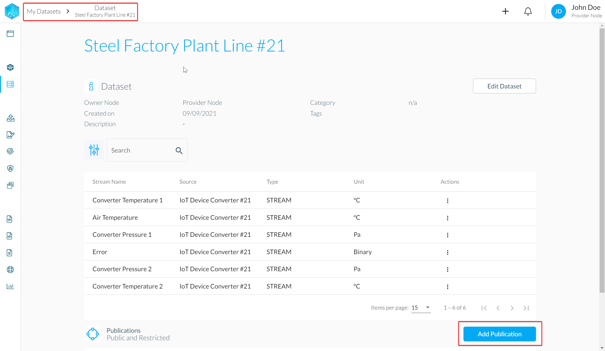
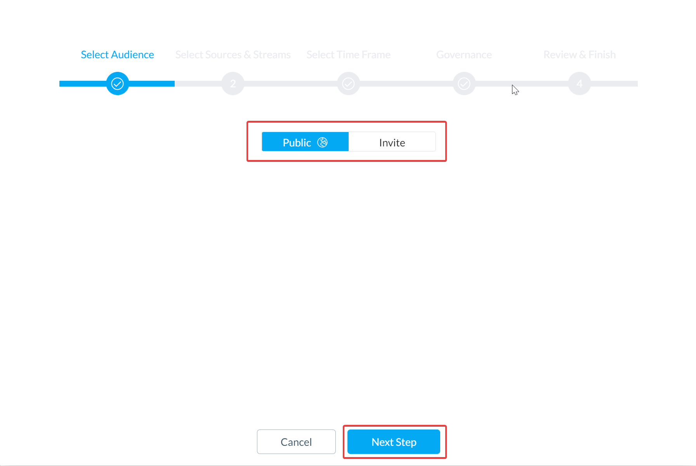
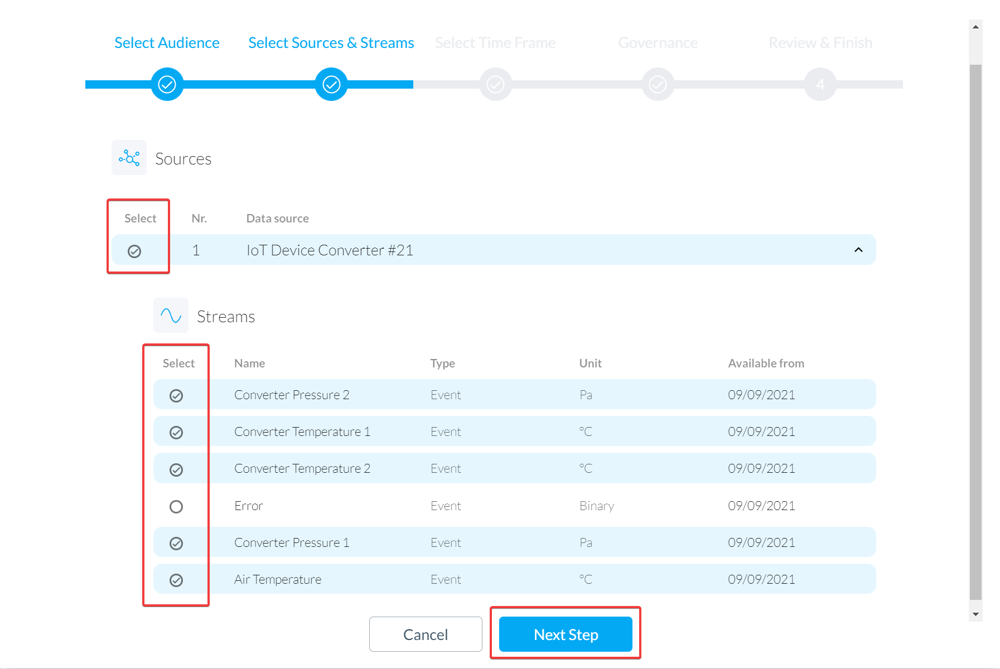
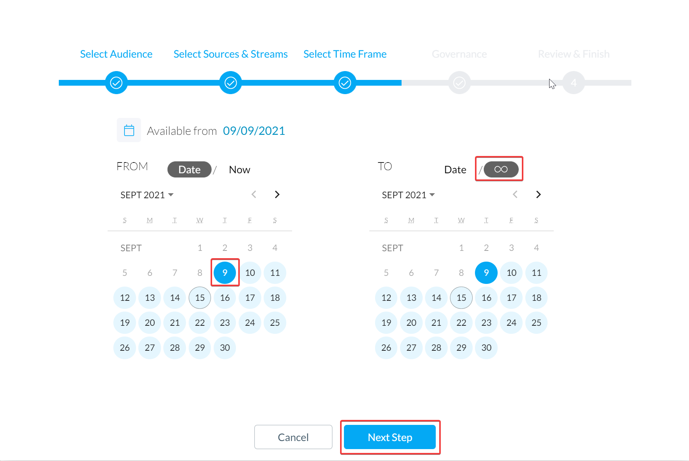
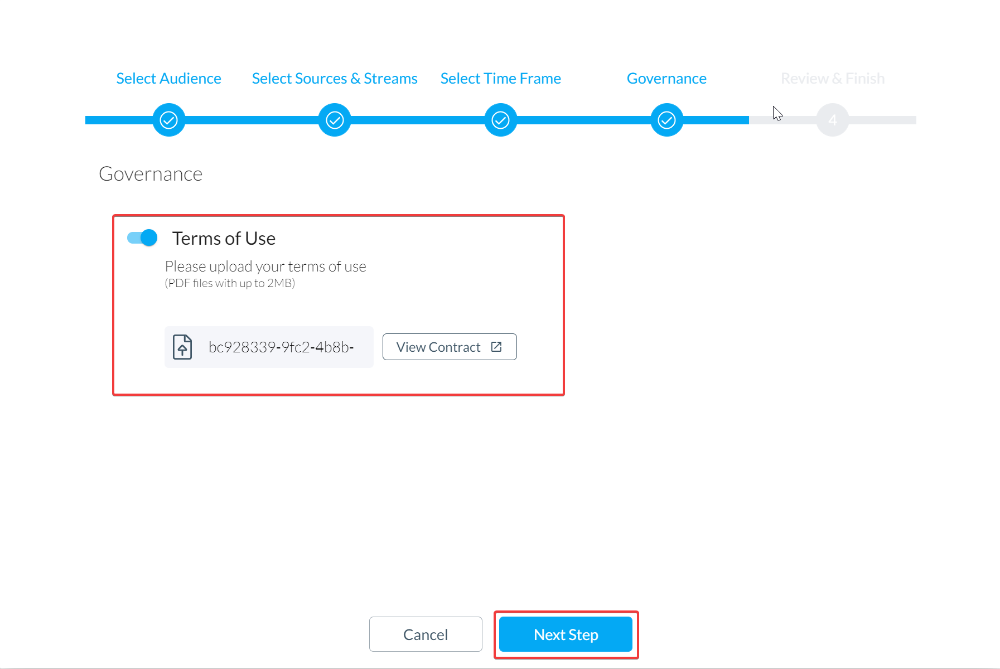
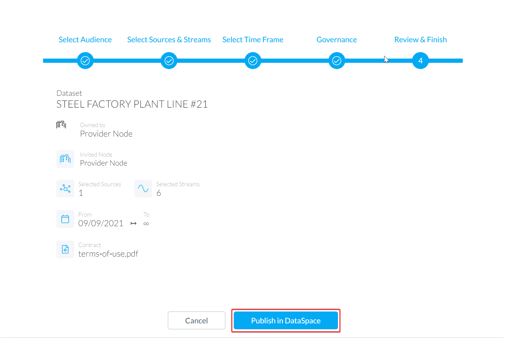
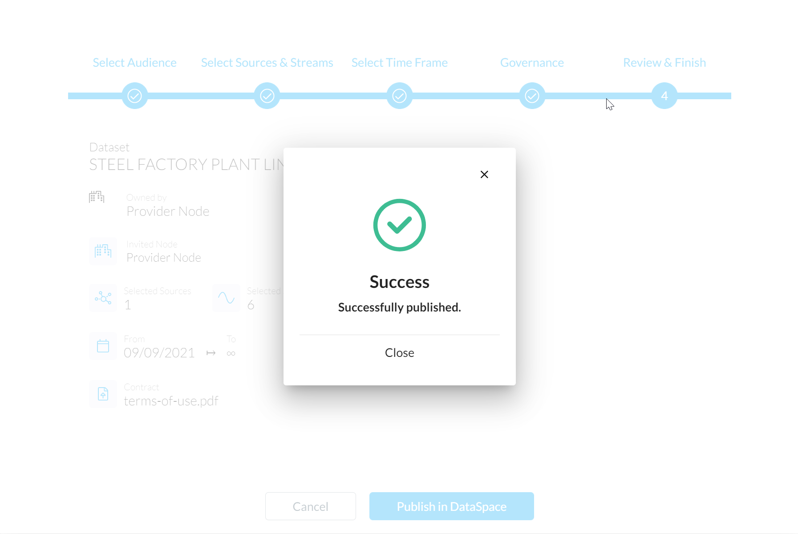
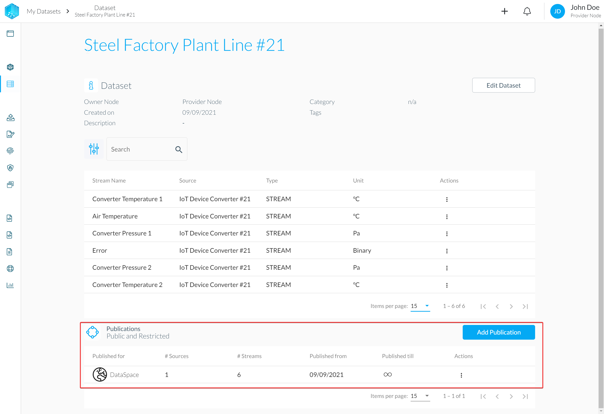

# Publish the Dataset

Now that the values are streaming in, we want to simulate the consumer part of the auditable data sharing.
The Dataset has already been created in a previous step and can now be published, so that a data-consumer can see and consume the data.

### Add Publication

In the DataSpace Admin App, navigate to "My Datasets" on the left side menu. Then select one of your Datasets (probably the auto-generated Dataset from [step Setup DSK Edge Agent](./setup-agent.mdx#setup-agent-verify-dataset)) and click on "Add Publication" for the selected Dataset

### Select Audience

As a first step you will have to set the Audience.

Publishing a Dataset means that you make the descriptive metadata visible for other members of your DataSpace Ecosystem, so they can request access to your Datasets and subscribe to them if you grant access. If you want to publish a Dataset you have two different options.

Selecting "Public" means that metadata is visible for all members of the Ecosystem. The data is not automatically shared with all members. Instead other members will get the option to request access to your dataset.

Selecting "Invite" means that the data will only be visible to a selected group of members, which you invite explicitly.

For the purpose of this guide select "Public".

### Select sources and streams

Select the sources and streams you want to share. As you see in the example you can selectively choose which streams you want to publish. If you choose a data source you can select which streams of the data source you want to publish.

### Select a time frame

Next, select a time frame for your Publication. This time frame sets the period that possible data-consumers can request to subscribe for. The real consumable time frame depends on the availability of each stream. The available date for each stream is defined by the metadata field "Available from" that is set initially when the stream of the Dataset is created.

### Select a contract

If you also want to include some governance, you have the possibility to upload a contract that contains the terms of use that must be agreed upon as part of the request process. Select the checkbox and upload a PDF file containing your terms of use.

### Publish your Dataset

Before completing the publishing process, please review your selection. After you publish a Dataset, it will be visible for other members (depending on the Audience selection) in your DataSpace Ecosystem. After submission, other members can send a Request if they want to consume your data.

