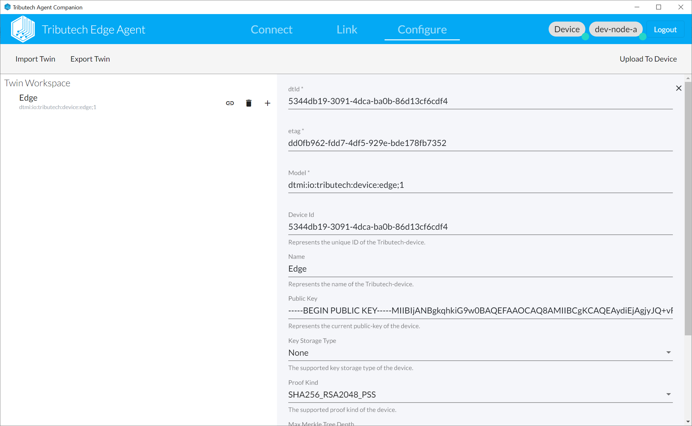
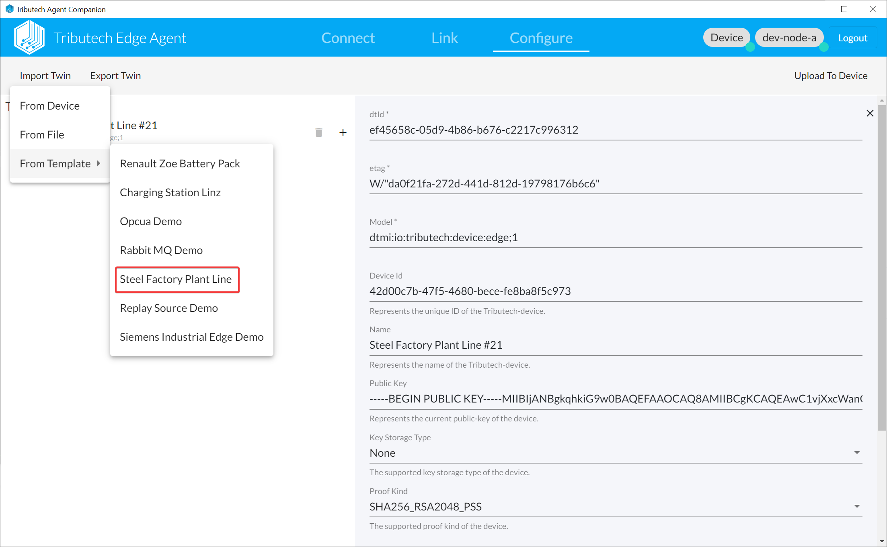
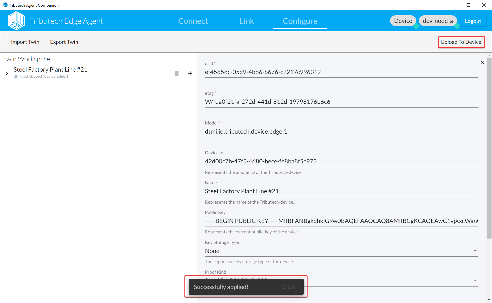

import DockerComposeAutomatedSetup from '../setup/agent/_docker-compose-automated-setup.md';
import AgentCompanionLogin from '../common/_agent-companion-login.md';
import AgentCompanionConnect from '../common/_agent-companion-connect.md';
import AgentCompanionLink from '../common/_agent-companion-link.md';
import AgentCompanionVerifyAgent from '../common/_agent-companion-verify-agent.md';
import AgentCompanionVerifyDataset from '../common/_agent-companion-verify-dataset.md';
import AgentCompanionDownloadWin from '../common/_agent-companion-download-win.md';
import AgentCompanionDownloadMac from '../common/_agent-companion-download-mac.md';
import Tabs from '@theme/Tabs';
import TabItem from '@theme/TabItem';

In this step of our Quicstart Guide we will deploy a DSK Agent Edge with a DSK Edge Simulated Sensor/Source and link it to our Data Owner Node.

## Deploy DSK Agent Edge & Simulated Sensor

<DockerComposeAutomatedSetup />

## Link & Configure with Agent Companion

After the DSK Agent Edge is deployed and running we need to link it to our Node and configure it.

### Download & Run

<Tabs
  defaultValue="win"
  values={[
    {label: 'Windows', value: 'win'},
    {label: 'macOS', value: 'mac'},
  ]}>
  <TabItem value="win"><AgentCompanionDownloadWin /></TabItem>
  <TabItem value="mac"><AgentCompanionDownloadMac /></TabItem>
</Tabs>

More information on [**Downloading & Running**](../setup/agent_companion.mdx) the Agent Companion.

### Login to DSK Node
<AgentCompanionLogin />

### Connect & Link
<AgentCompanionConnect />
<AgentCompanionLink />

### Configure
We can now configure our DSK Agent Edge using a twin based configuration.
* As a simple starting point for our example scenario we can import the *Steel Factory Plant Line* template.

* The *Steel Factory Plant Line* template provides a full example twin configuration for the DSK Agent Edge and Simulated Sensor/Source which you can adapt to your desire.

* After we are finished with defining our twin configuration we need to *Upload To Device* and verify it was *Successfully applied*.
  

## Verify in DataSpace-Admin
After our DSK Agent Edge and Simulated Sensor/Source was deployed, linked and configured, it will be present on the DSK Node as Agent including an auto-generated Dataset.

### Agent
<AgentCompanionVerifyAgent />

### Dataset {#setup-agent-verify-dataset}
<AgentCompanionVerifyDataset />