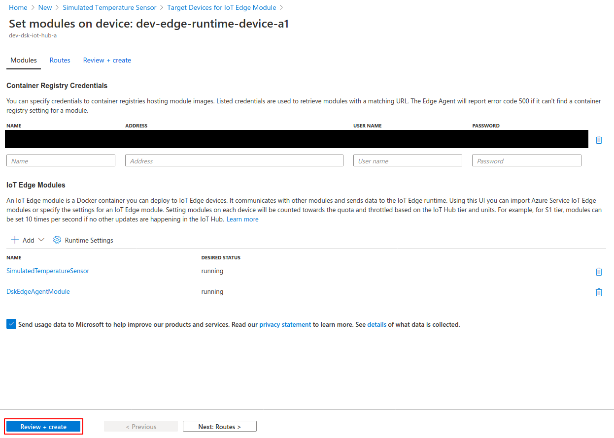

# Setup IoT Device

Now that we have the IoT hub set up, we can create the Edge Device for the IoT Hub.  
We will then deploy a VM as a simulated IoT Edge Runtime and deploy the Edge Runtime Modules which provide the simulation data.

## Create Edge Device in IoT Hub

We start with creating the Edge Device in the IoT Hub. In the just deployed resources from the previous step of installing the DSK IoT Bridge you should find the IoT Hub resource. Open this resource in the Azure Portal.

As shown in the screenshow below, next, navigate through the side menu to "IoT Edge". In the overview click on "Add an IoT Edge device".

Give your device a name and click "Save". Your device will be created.

When the device is created, open the device details by clicking it. Leave this tab open, we will need the primary connetion string in just a second.

---

## Create simulated IoT Edge Runtime VM

Now we will deploy a simulated IoT Edge Runtime and connect it to our just created device.

In a new tab, open the "Azure IoT Edge on Ubuntu" [Azure Marketplace](https://azuremarketplace.microsoft.com/en-us/marketplace/apps/microsoft_iot_edge.iot_edge_vm_ubuntu?tab=Overview) listing.

The simulated Edge Runtime Device is simply an Ubuntu VM with the Azure IoT Edge Runtime installed. Choose a good name for the VM. The Size "Standard_B1s" should be fine for the purpose of this guide. If you are planning on processing large amounts of data consider using a more powerful instance.

Configure SSH so that you can log into the VM after it has been created, e.g. through setting a password.

Create the VM by following the "Review + create" steps.

After the VM has been created log into the VM via SSH in a terminal of your choosing and run the following commands. If you created the SSH access via password, then you can connect through the command
`ssh username@[your-vm-ip-address]`

Note that you can find the ip-address of your vm by navigating to the created VM in the Azure portal.
You will be prompted to enter the password that you have configured.

Finally, execute the following commands in the terminal connected via SSH to the VM.
Use the primary connection string from the previously created device, which you should still have available in the device details tab. Replace the "[IoT-Hub-Primary-Connection-String]" with your primary connection string.

    sudo /etc/iotedge/configedge.sh "[IoT-Hub-Primary-Connection-String]"
    sudo apt-get update
    sudo apt-get upgrade -y
    sudo reboot

---

## Deploy Edge Runtime Modules

You will need two Azure Edge Runtime modules. A simulated source of sensor values and the DSK Agent Edge. The job of the data-source is to create simulated values. The Agent is responsible for signing the data and sending the data as well as the signatures (proofs) to the DSK Node.

### Add Simulated Temperature Sensor Module

The Simulated Temperature Sensor is provided by Azure IoT and can be found in the <a href="https://azuremarketplace.microsoft.com/en-us/marketplace/apps/azure-iot.simulated-temperature-sensor?tab=Overview" target="_blank">Marketplace</a>.

Create a new Simulated Temperature Sensor by clicking "Create" in the Azure Marketplace listing:

Select your IoT Hub and Edge Device as Target devices for the module and click "Create":

### Configure the Simulated Temperature Sensor Module

After the Simulated Temperature Sensor Module has been created, click on the new module to open its settings:

In the settings, in the tab "Environment Variables", set up the variable "MessageCount" and give it a value of -1. This will allow for an infinite number of sensor readings. After that click on "Update":

Finalize the setup of the Simulated Temperature Sensor Module by following the "Review + create" steps:

### Add DSK Agent Edge Module

The DSK Agent Edge can also be found in the [Marketplace](https://azuremarketplace.microsoft.com/en-us/marketplace/apps/tributechsolutionsgmbh1582568815297.57601ccd-62c3-4842-9f73-3dadd3de5b74?tab=Overview).

Proceed the same way as previously for the Simulated Temperature Sensor Module: Click "Create" in the Azure Marketplace listing and select your IoT Hub and the Edge device and click "Create", shown in the screenshots below.

### Configure the DSK Agent Edge Module

Some environment variables must be configured for the agent.

To be able to create signatures, the Agent needs to be connected to the Trust-API of the DSK Node which requires API-Credentials. The credentials for the Trust-API can be obtained [the same way as the credentials for the Data-API have been obtained when installing the DSK IoT Bridge](../install-bridge/#node-specific-parameters).

Open the module by clicking it in the list of IoT Edge Modules and navigate to the tab "Environment Variables".
There you will have a number of variables, which are explained below the screenshot.

| Variable name                                           | Value                                                                                                                                                                                                    | Sample                                                          |
| ------------------------------------------------------- | -------------------------------------------------------------------------------------------------------------------------------------------------------------------------------------------------------- | --------------------------------------------------------------- |
| **EdgeDeviceOptions\_\_AgentID**                        | Choose a unique string -> you can easily [generate a GUID online](https://www.guidgenerator.com/online-guid-generator.aspx)                                                                              | `840c1996-2761-4d90-b390-3ecbd8879015`                          |
| **ProofSinkOptions\_\_TrustAPIBaseUrl**                 | Trust API Url. Replace `<your-node-name>` of the sample with the name of your node.                                                                                                                      | `https://trust-api.<your-node-name>.dataspace-node.com`         |
| **ProofSinkOptions\_\_AuthUrl**                         | Auth Url from Trust API Swagger UI authorization dialog. You can simply replace `<your-hub-name>` of the sample with the name of your hub. The default hub name `azuretrial` should work for most cases. | `https://id.<your-hub-name>.dataspace-hub.com/connect/token`    |
| **ProofSinkOptions\_\_AuthScope**                       | Auth Scope from Trust API Swagger UI authorization dialog. The sample value should work for most cases.                                                                                                  | `data-api-endpoint trust-api-endpoint`                          |
| **ProofSinkOptions\_\_ClientID**                        | Client ID from the DataSpace Admin                                                                                                                                                                       | `9ee39d88-2961-4296-a94e-a1841e454076`                          |
| **ProofSinkOptions\_\_ClientSecret**                    | Client Secret from the DataSpace Admin                                                                                                                                                                   | `ed2a4425-81ad-4a00-8300-affa01d79b46`                          |
| **EdgeDeviceOptions\_\_DataStreamID\_\_[DataStreamID]** | Replace `[DataStreamID]` from the variable name with the DataStream ID generated in the step [Create a Dataset](../create-dataset/#successful-creation-of-the-dataset)                                   | `SimulatedTemperatureSensorValueSource__0__Machine_Temperature` |

As for the last variable, the **EdgeDeviceOptions\_\_DataStreamID\_\_[DataStreamID]**, you will have to set up 4 variables for it:

- Name: `EdgeDeviceOptions__DataStreamID__[DataStreamID]` Value: `SimulatedTemperatureSensorValueSource__0__Machine_Temperature`
- Name: `EdgeDeviceOptions__DataStreamID__[DataStreamID]` Value: `SimulatedTemperatureSensorValueSource__0__Machine_Pressure`
- Name: `EdgeDeviceOptions__DataStreamID__[DataStreamID]` Value: `SimulatedTemperatureSensorValueSource__0__Ambient_Temperature`
- Name: `EdgeDeviceOptions__DataStreamID__[DataStreamID]` Value: `SimulatedTemperatureSensorValueSource__0__Ambient_Humidity`

Note that you can easily copy the DataStreamID by clicking the copy button in the column ID as explained in the step [Create a Dataset](../create-dataset/#successful-creation-of-the-dataset).

**Finally, double check your variables and click "Update". Then follow the "Review + Create" process.**

### Configure Routes

All that's left now is the configuration of the routes, so that the simulated data actually ends up where it should.

#### Navigate to the routes configuration

First, open the IoT Hub in the Azure portal and select the device:

Then, click on "Set Modules" and navigate to the routes by clicking "Next: Routes":

#### Set the routes

Lastly, set the following two routes:

| Name                      | Route                                                                                                                                                                  |
| ------------------------- | ---------------------------------------------------------------------------------------------------------------------------------------------------------------------- |
| SimulatedSensorToDSKAgent | FROM /messages/modules/SimulatedTemperatureSensor/outputs/temperatureOutput INTO BrokeredEndpoint("/modules/TributechDataSpaceAgent/inputs/AzureSimulatedSensorValue") |
| DSKEdgeAgentValuesToCloud | FROM /messages/modules/TributechDataSpaceAgent/outputs/ValueSink INTO $upstream                                                                                        |

Two routes are required, one for sending the simulated sensor data to the DSK Agent and one for transmission of the DSK Agent Edge to the IoT Hub.

Finish the process by clicking "Review + create" and following the process.

## Verify that messages arrive at IoT Hub

You can verify that everything works as expected by checking the Overview dashboard of your IoT Hub in the Azure Portal:

You can also already create your first dashboard and have the simulated data presented visually. Just follow the [guide for consuming data via Dashboards](./data-consuming/data-via-dashboards.md). Note that for this case you would be in the position of data owner.

