# Subscribe to a Dataset

After the setup of the consumer node is complete, the consumer node can subscribe to the dataset that was created before with the owner node.
Execute the following steps by accessing the DataSpace Admin App of the consumer node, e.g. in a new private browser window.

## Create the Request for a Subscription

You can see all available data streams by navigating to "DataSpace Hub" in the left side menu of the DataSpace Admin App.
In this data preview you can browse through the list of available data sources and streams and view their metadata.

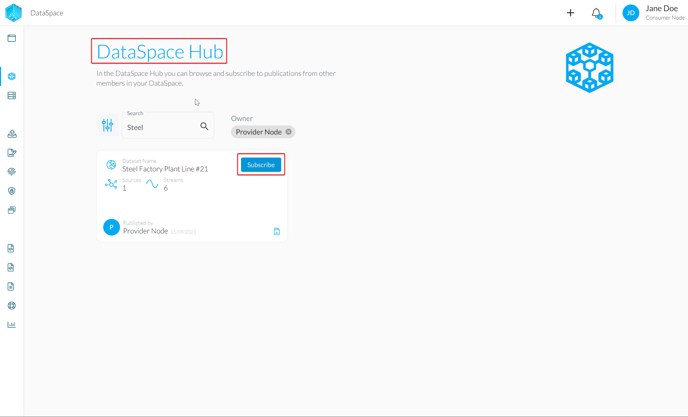

To create a Request to Subscribe to a data stream, click on the "Subscribe to Data" button.

This will open up a dialog similar to the one shown in the screenshot below. Select the data streams for which you would like to send the Subscription request for and click "Next Step".

:::note
You can selectively choose data streams out of one dataset. You don't have to subscribe to all data streams of a dataset.
:::

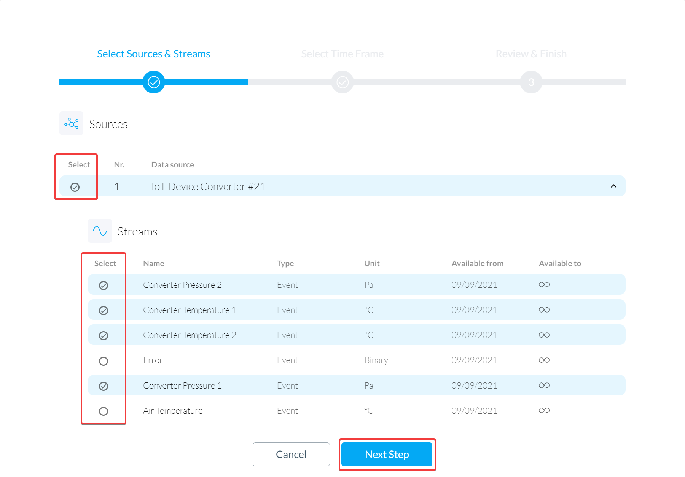

Next, you can select the time frame for which you want to subscribe and consume the selected data streams. The dates for when the stream is generally available ("Available from" and "Available to") of each data stream are also shown.

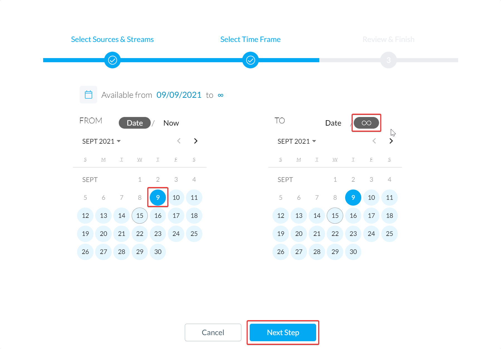

In the next step, you might have to agree to terms and conditions of use, if the data owner has defined such a document.
Finally, once you have selected the data sources and streams of your choice, set the time frame and agreed to the terms and conditions of use, you can send a Request to the owner of the selected dataset by clicking "Send Request to Subscribe".

:::note
You also have the possibility to add a comment for the data owner to your Request.
:::

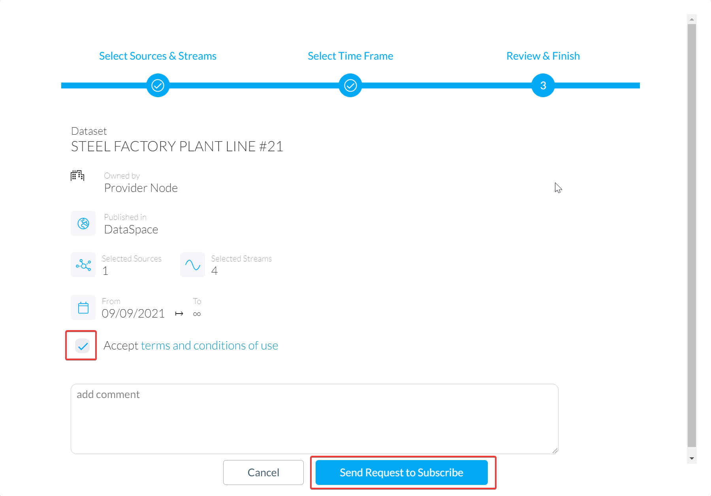
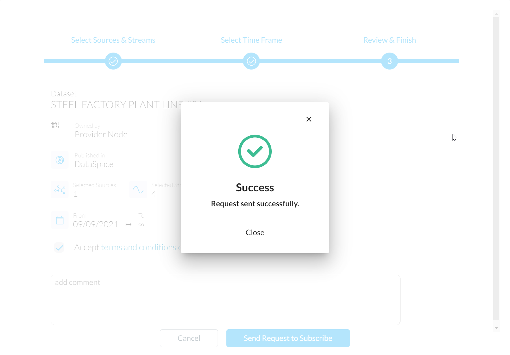

## Your Dataset Subscription

After the Request has been sent, a new entry appears in the "Subscriptions" sections of your DataSpace Node (again reachable through the left side menu). The initial state of this Subscription is "pending" until the owner of the dataset grants or denies your Request.

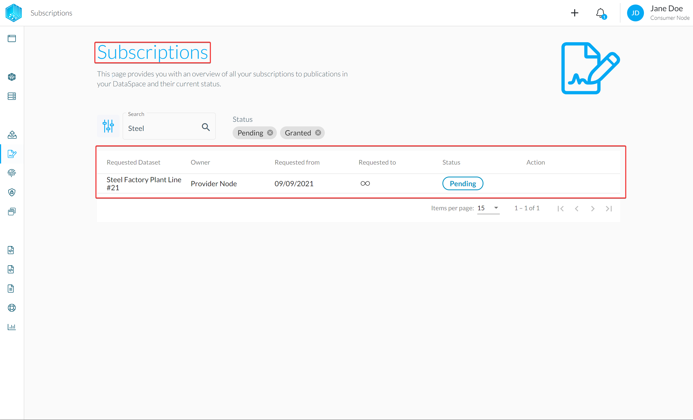

:::tip
You can switch back to the DataSpace Admin App of the Data Owner Node and grant the request where should see a notification and entry in the "Requests" section.

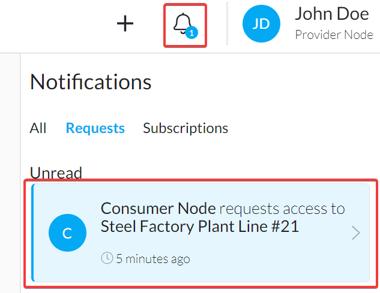
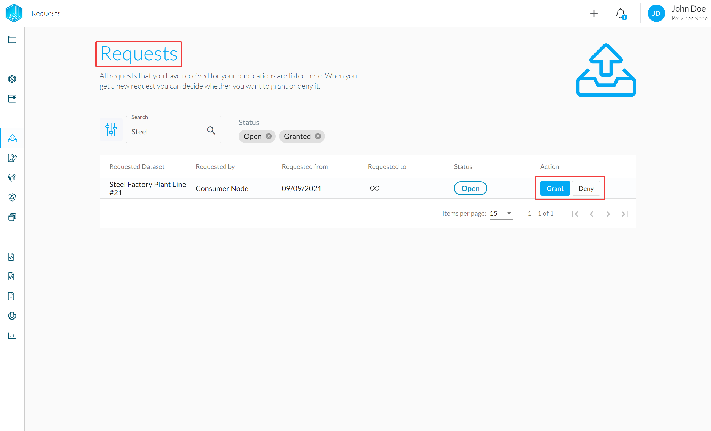
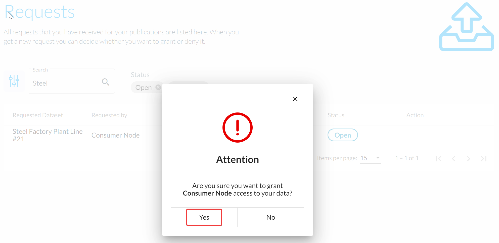
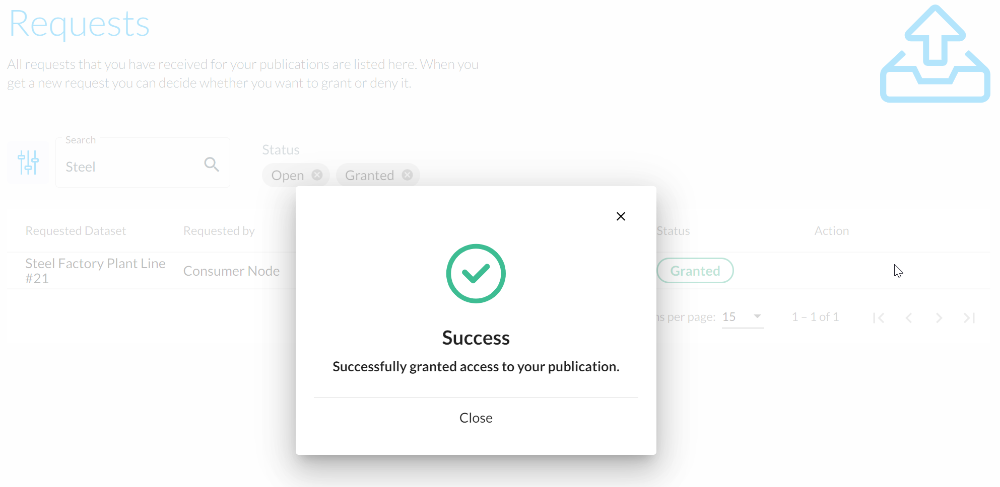
:::

Once your Request is granted by the owner you will get a notification and the state for the entry under "Subscriptions" changes to **granted**. 

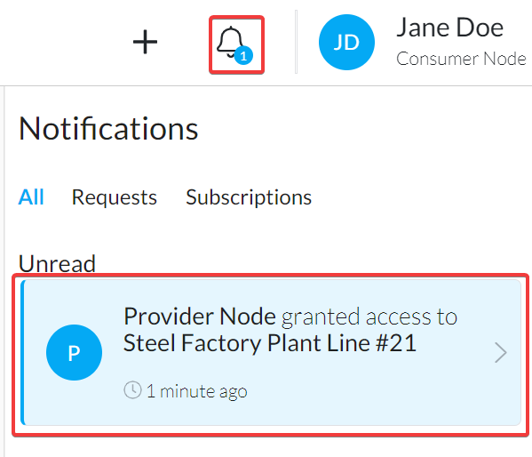
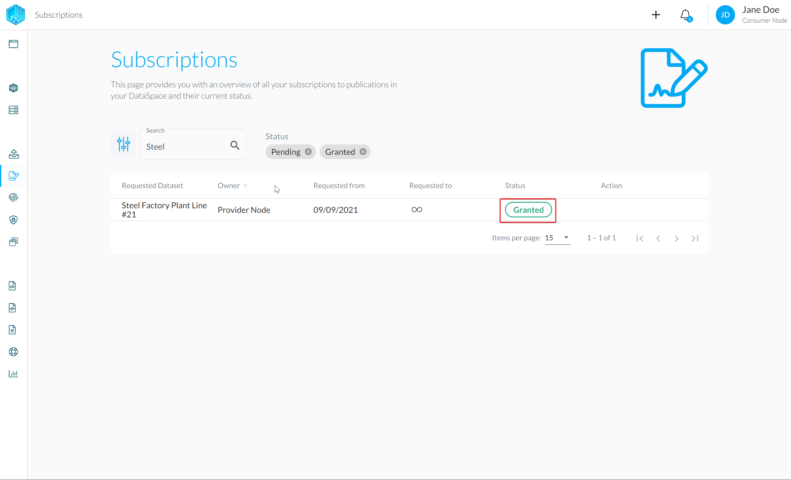

The synchronisation process starts and the data for the selected time frame and streams will be synced from the owner side. You are now ready to consume the data.
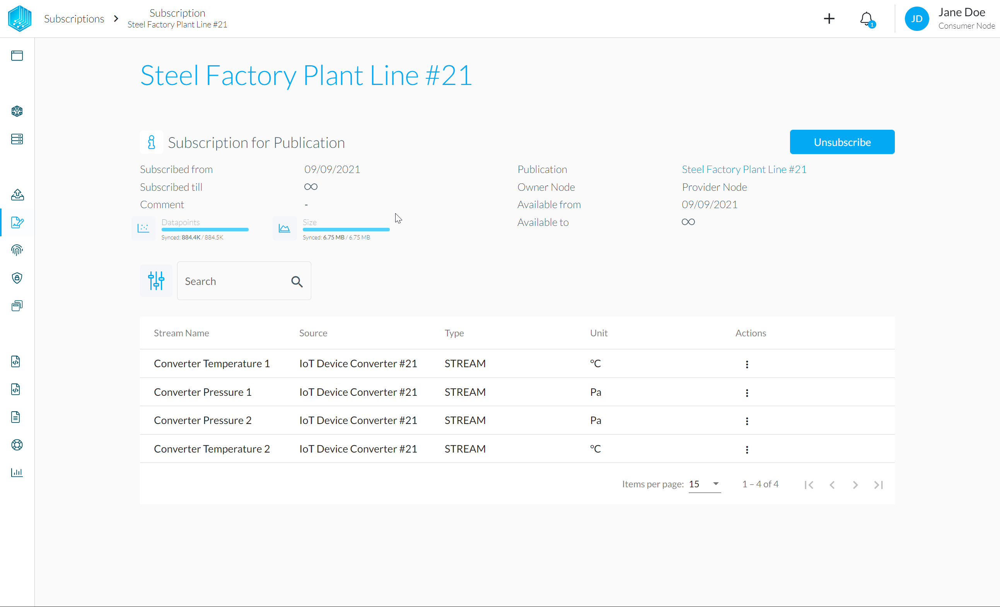

:::note
Of course the data owner also has the possibility to revoke access to the shared data stream at all times.
The consumer can also chose to unsubscribe.
:::
