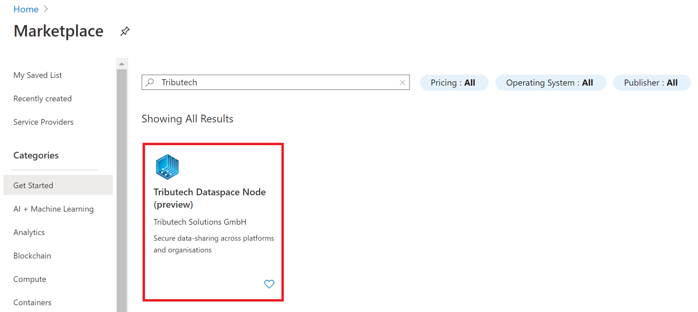
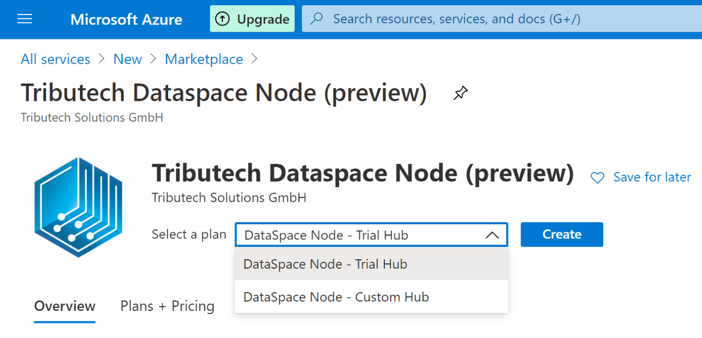
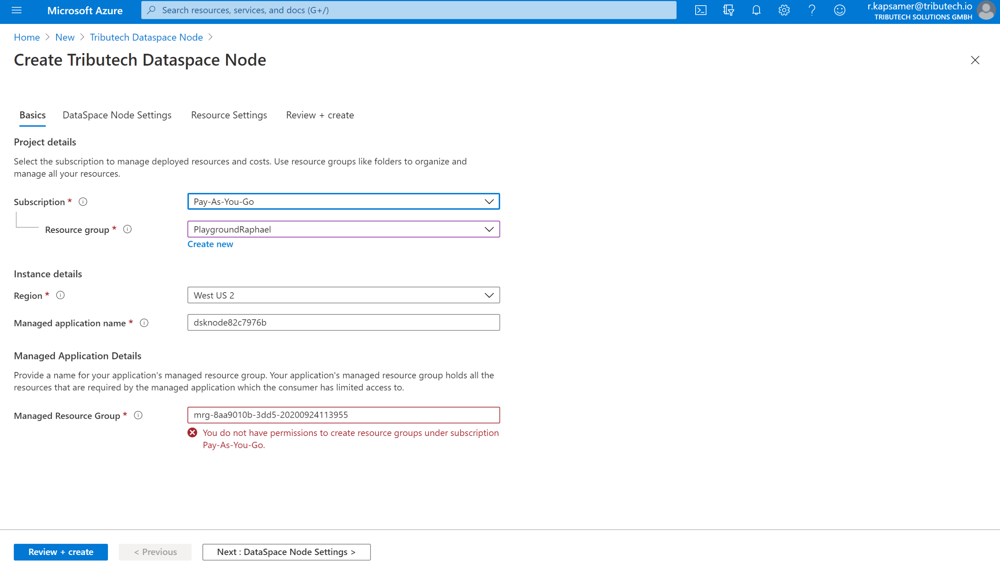
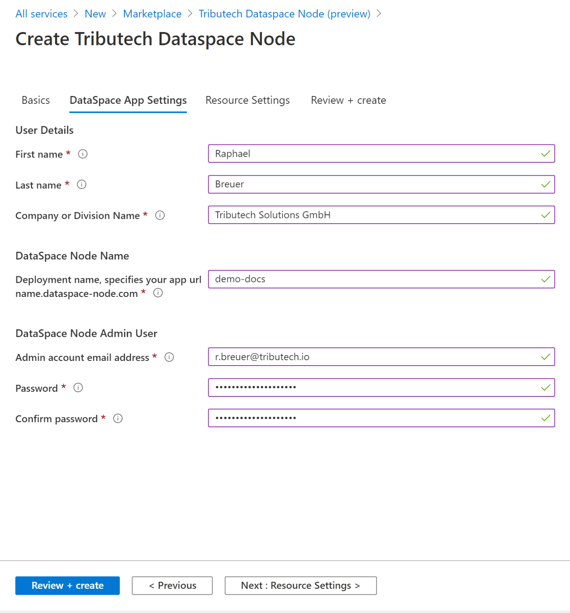
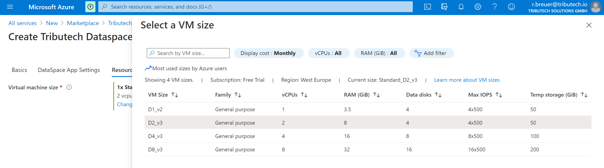
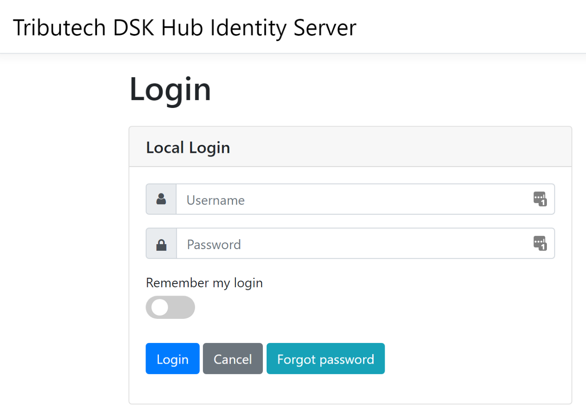
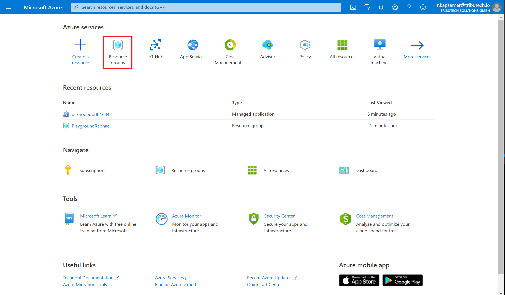
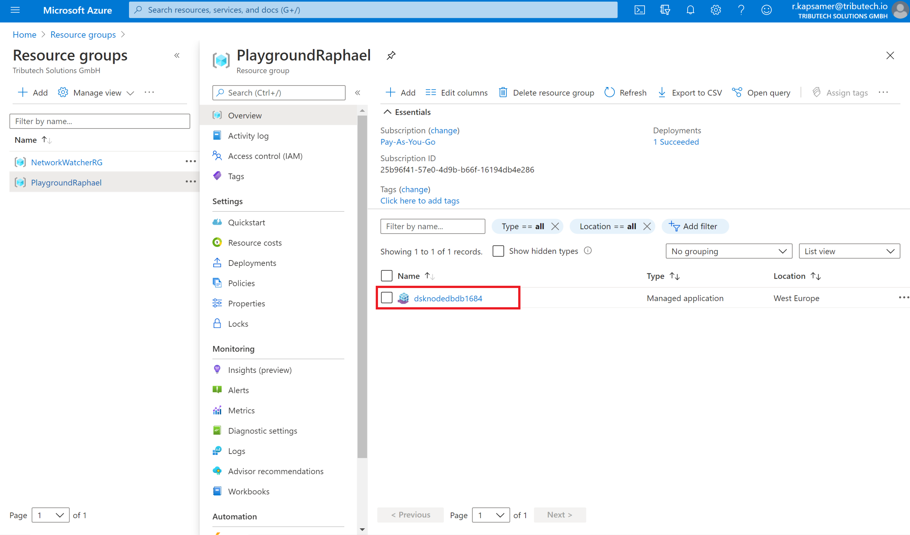
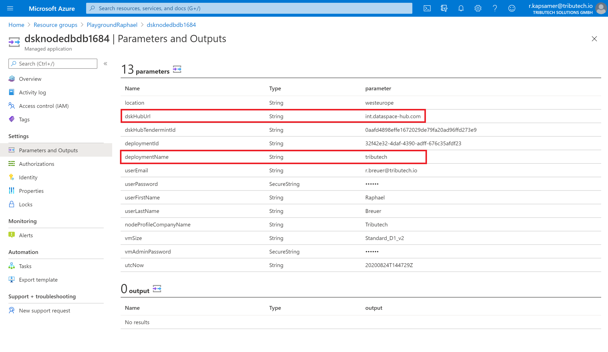

# Setup Node via the Azure Marketplace

In this guide you will learn how to deploy a DataSpace Node via the Azure Marketplace.

**1. Go to Azure Marketplace -** Following this link: <a href="https://portal.azure.com/#blade/Microsoft_Azure_Marketplace/MarketplaceOffersBlade/selectedMenuItemId/home/searchQuery/Tributech" target="_blank">Azure Marketplace</a>.

**2.Click on Tributech Dataspace Node** 

Your screen should look as follows: 

Click on the Tributech DataSpace Node.

**3. Choose a Hub -** Now you can select between 
| Plan  | Description   |
|:---                           |:-                           |
|Trial Hub | Free trial for try out purposes, available for 30 days |
|Custom Hub | Private Hub that can only be entered on invitation. In order to get connected to an existing Data Ecosystem please contact our [Customer Advisory Team](mailto:customer-advisory@tributech.io) |
After selecting a Hub click on **create**.

**4. Fill in basics** 

These details can very because of different organisational guidelines on Azure, therefore we provided a table with general information and recommendations.

|Subscription   |Resource group | Region    |Managed application name   |Managed Resource Group|
|:-|:-|:-|:-|:-|
|Choose the Subscription you want to bill for the Azure resources of your DataSpace Node.|Choose the resource group you want to deploy your DataSpace Node in.|It is recommended to choose the nearest datacenter to your location.|This name needs to be unique, therefore it is generated automatically, but can also be changed.|This holds all the resources needed for deploying a managed application. It is recommended to use a consistent naming scheme within your company.

**5. DataSpace App Settings**

First, you need to fill out the user details according to your name and company. 
In the admin user section you need to provide an e-mail adress and a password, which will be needed to log in to your DataSpace Node.

DataSpace Hub parameters are only relevant if you chose the Custom Hub.

More important is the DataSpace Node name, as it determines the name of the app url. The URL is composed as follows: *deployment-name*.dataspace-node.com. In this case the app url would be demo-docs.dataspace-node.com.

**6. Virtual machine size**

Here you need to determine the size of the virtual machine on which the DataSpace Node will be running. You can choose between 4 predesigned virtual machine sizes. 

After choosing the size of the virtual machine you can click **Review + create**. 
Then it will take 10-15 minutes to deploy your DataSpace Node. Once the deployment is finished you can start to create Datasets as described in the guide [create Dataset](guides/guide-create-dataset).

**7. Log in your DataSpace Node**

After the deployment of your DataSpace Node is finished you can log in the webinterface. Therefore, enter *deployment-name*.dataspace-node.com. Then you will be directed to the log in screen that you can see below. 

## Look up parameters of your DataSpace Node

All the details of your DataSpace Node that you filled in at 4. and 5. can be accessed on Azure in case you forgot important parameters like the deployment name. 
Therefore, go to the Azure Marketplace and click on **resource groups**

**Select resource group** 

Select the resource group that you deployed the DataSpace Node in and click on the resource group. In this case the resource group is named "PlaygroundRaphael".

After clicking on the resource group you can see every resource that is deployed in this resource group. In this case only the DataSpace Node is deployed in here.

**Click on the DataSpace Node**

Every DataSpace Node has a unique name starting with "dsknode" that is automatically generated during the deployment. Now click on the described name. AFter that click on the section **Parameters and Output**

Here you can view all the relevant parameters of your managed application. The most important information are highlighted in red. 
First, you can see the **dskHubUrl**. This URL represents the DataSpace Hub to which your DataSpace Node belongs to.
Secondly, the **deploymentName**. The deployment name is part of the URL of the DataSpace Node. The URL is composed of "deploymentName".dataspace-node.com.
In this case the URL of the DataSpace Node is: "tributech.dataspace-node.com".