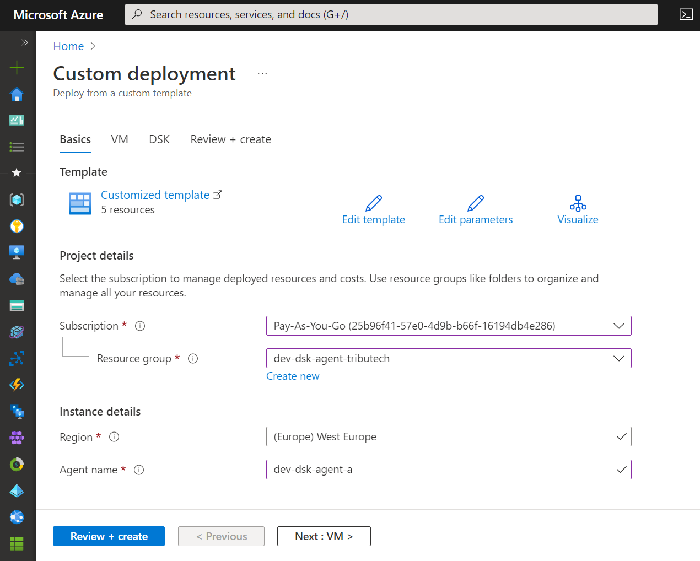
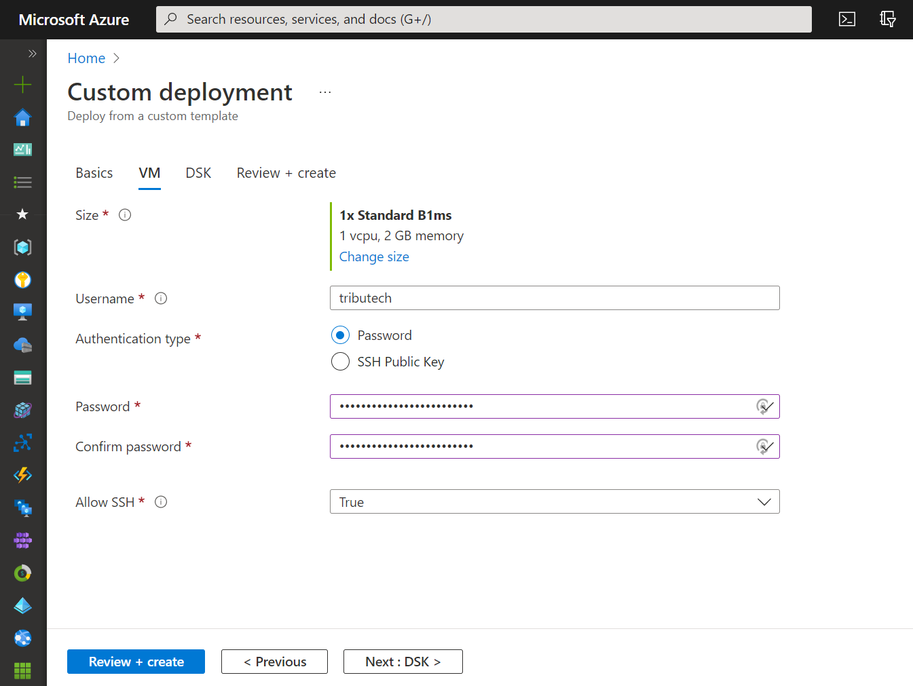
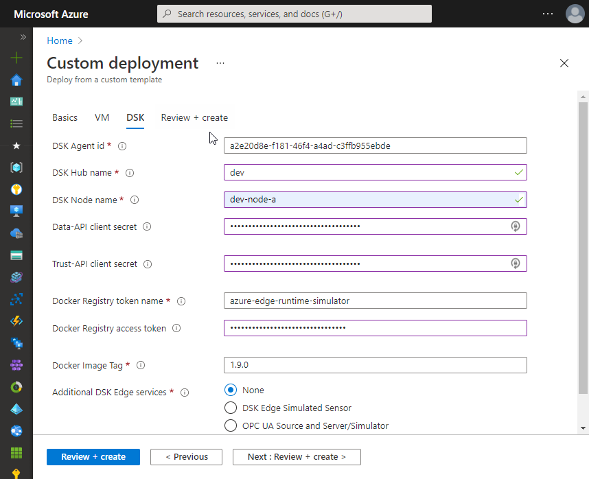
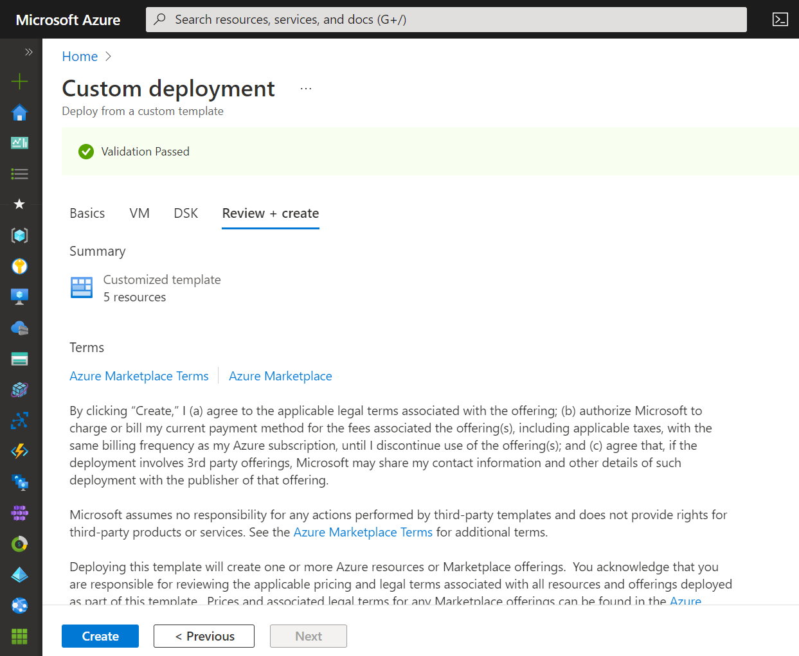
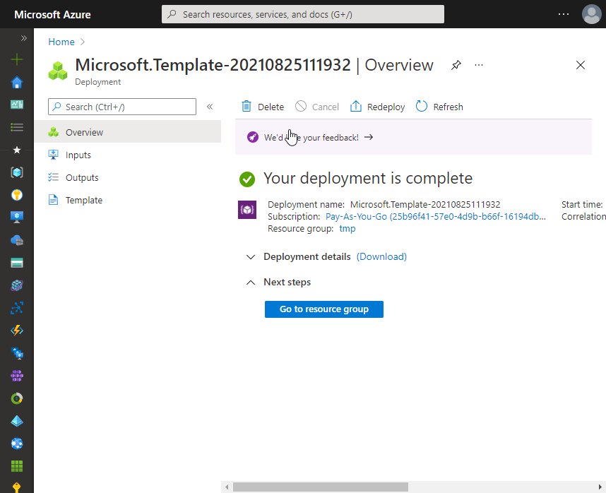
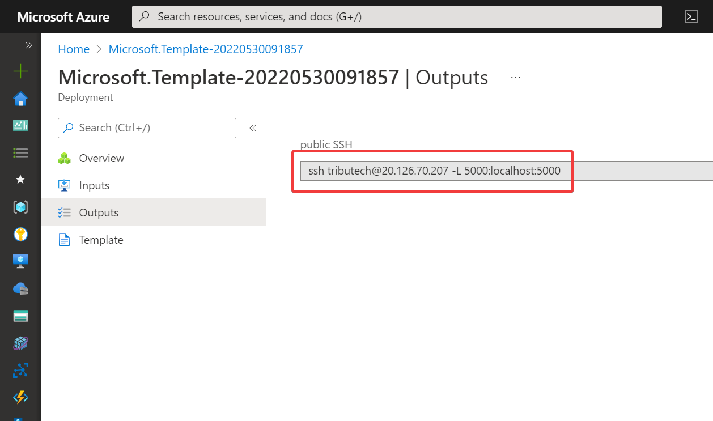

import CodeBlock from '@theme/CodeBlock';
import DskAgentDockerCompose from '!!raw-loader!../../../deployments/dsk-agent/docker-compose.yml';
import DskAgentEnv from '!!raw-loader!../../../deployments/dsk-agent/sample.env';

## Automated setup {#agent-automated-setup}

Use the "Deploy to Azure" button to create a Linux virtual machine on Azure with everything pre-installed/configured and the Tribtuech DSK Edge services up and running. 
Preview the Azure resources that will be created with the "Visualize" button.  
[](https://portal.azure.com/#create/Microsoft.Template/uri/https%3A%2F%2Fraw.githubusercontent.com%2Ftributech-solutions%2Ftributech-dsk-docs%2Ffeature%2Fagent-doc%2Fdeployments%2Fdsk-agent%2Fazuredeploy.json/createUIDefinitionUri/https%3A%2F%2Fraw.githubusercontent.com%2Ftributech-solutions%2Ftributech-dsk-docs%2Ffeature%2Fagent-doc%2Fdeployments%2Fdsk-agent%2FcreateUiDefinition.json)
[](http://armviz.io/#/?load=https%3A%2F%2Fraw.githubusercontent.com%2Ftributech-solutions%2Ftributech-dsk-docs%2Ffeature%2Fagent-doc%2Fdeployments%2Fdsk-agent%2Fazuredeploy.json)

* Select desired Azure Subscription/Resource Group/Region and define the name for the Agent related Azure resources (VM, Network security group,...). The Agent name must be unique within your Resource Group.

* Define virtual machine Size and authentication related properties.  
The Size needs to meet our [Hardware Requirements](#hardware-requirements). We recommend e.g. `Standard_B1ms` or `Standard_DS1_v2`.  
SSH access allows to connect to the VM for management purposes and to support SSH port forwarding used for connections to the DSK Agent from the Agent-Companion (TODO link).  

* Provide DSK related configuration:
  * *DSK Agent id*: globally unique identifier (UUID) for the Agent  
  * *DSK Hub name*: The name of the DSK Hub (e.g. `your-hub` for `your-hub.dataspace-hub.com`) to which your DSK Node is connected.
  * *DSK Node name*: The name of your DSK Node (e.g. `your-node` for `your-node.dataspace-node.com`) to which the DSK Agent will be linked.
  * *Data-API client secret*: The client secret for the authentication at the Data-API of the DSK Node. See [TODO](#TODO).
  * *Trust-API client secret*: The client secret for the authentication at the Trust-API of the DSK Node. See [TODO](#TODO).
  * *Docker Registry token name*: The name of the token used for authentication at the private Docker Registry hosting the DSK Agent Docker images. See [TODO](#TODO).
  * *Docker Registry access token*: The access token for authentication at the private Docker Registry hosting the DSK Agent Docker images. See [TODO](#TODO).
  * *Docker Image Tag*: The Docker Image tag defining the DSK Agent version to be deployed.
  * *Additional DSK Edge services*:
    * *None*: Only the main DSK Edge services (DSK Agent and mosquitto MQTT broker) will be deployed.
    * *DSK Edge Simulated Sensor*: Additionally deploy the [DSK Edge Simulated Sensor](./sources/simulated) service.
    * *OPC UA Source and Server/Simulator*: Additionally deploy the [OPC UA Source and Server/Simulator](./sources/opc-ua) service.

  
* Review terms and provided input and create the Azure resources.

* Successful deployment🎉.

* Output of the deployment showing sample command to connect to the VM using SSH incl. port forwarding for access to the DSK Agent (e.g. for the Agent-Companion).



## Manual setup {#agent-manual-setup}

The following steps describe the tasks required to get the main DSK Edge services (`dsk-agent` and `mosquitto-server`) up and running on a system.

* Prerequisite: Recent Linux based system meeting our [requirements](#requirements).  
Our [automated setup](#agent-automated-setup) creates e.g. a Ubuntu 20.04 based Linux virtual machine on Azure.
* [Install Docker](https://docs.docker.com/engine/install/) based on the desired option from the official documentation.  
    e.g. for Ubuntu using the Official Docker Repository https://docs.docker.com/engine/install/ubuntu/
    ```bash
    sudo apt-get update
    sudo apt-get install \
        apt-transport-https \
        ca-certificates \
        curl \
        gnupg \
        lsb-release

    curl -fsSL https://download.docker.com/linux/ubuntu/gpg | sudo gpg --dearmor -o /usr/share/keyrings/docker-archive-keyring.gpg
    echo \
    "deb [arch=amd64 signed-by=/usr/share/keyrings/docker-archive-keyring.gpg] https://download.docker.com/linux/ubuntu \
    $(lsb_release -cs) stable" | sudo tee /etc/apt/sources.list.d/docker.list > /dev/null

    sudo apt-get update
    sudo apt-get install docker-ce docker-ce-cli containerd.io  
    ```
* [Install docker-compose](https://docs.docker.com/compose/install/)  
    We recommend the installation via package manager (e.g. Ubuntu `apt-get`):
    ```bash
    sudo apt-get install docker-compose
    ```
* (Optional) Allow to [manage Docker as non-root user](https://docs.docker.com/engine/install/linux-postinstall/#manage-docker-as-a-non-root-user)
* Login to the private Docker registry to allow retrieval of DSK Edge Docker images. (TODO credentials)
    ```bash
    echo <access-token> | docker login --username <token-name> --password-stdin tributech.azurecr.io
    ```
* Copy and adapt the <a target="_blank" href={require('!file-loader!../../../deployments/dsk-agent/sample.env').default}>`.env`</a> environment configuration file.  
See [automated setup](#agent-automated-setup) for parameter description and [Docker doc - The “.env” file](https://docs.docker.com/compose/environment-variables/#the-env-file).
<CodeBlock className="language-plain" title=".env">{DskAgentEnv}</CodeBlock>

* Copy the [`docker-compose.yml`](../../../deployments/dsk-agent/docker-compose.yml) file. 
<CodeBlock className="language-yml" title="docker-compose.yml">{DskAgentDockerCompose}</CodeBlock>

* Startup the DSK Edge services (will automatically retrieve the Docker images).
    ```bash
    docker-compose up -d
    ```

## Agent management commands

The following shows some docker commands for the management of the DSK Edge services.  
Check the [docker-compose CLI](https://docs.docker.com/compose/reference/) and [Docker CLI](https://docs.docker.com/engine/reference/commandline/cli/) documentation for a full overview of the commands.

[](https://asciinema.org/a/ySB0YG0BMgrwO9MM124rsaL5w)

```bash
# pull docker images for all services
docker-compose pull

# create & start all services
docker-compose up -d

# check service status 
docker-compose ps

# check logs of specific service (-f for following log output)
docker-compose logs -f -t --tail=500 dsk-agent

# stop all services
docker-compose stop
# stop single service
docker-compose stop dsk-agent
# restart single service
docker-compose restart dsk-agent
# start all services
docker-compose start
# start single service
docker-compose start dsk-agent

# remove services
docker-compose down
```
Depending on your environment the commands might need to be run as root using `sudo`.