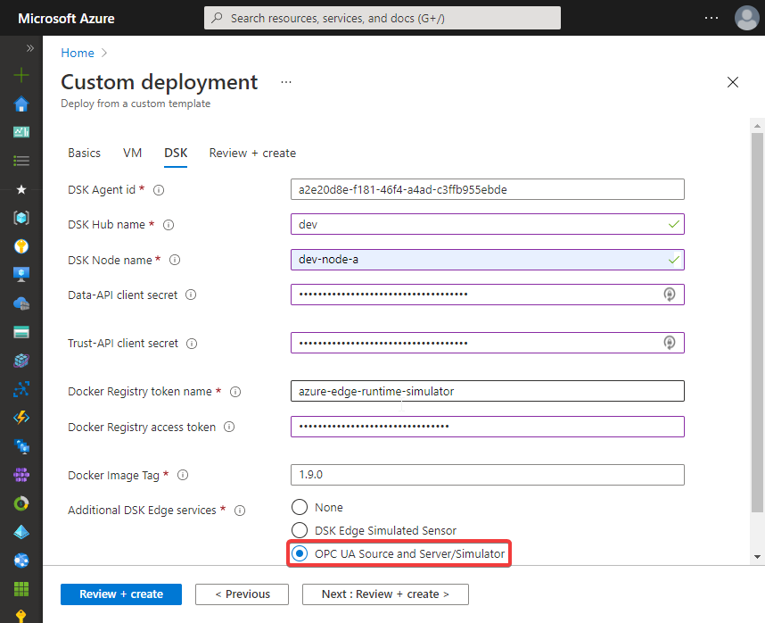

import CodeBlock from '@theme/CodeBlock';
import DskAgentDockerComposeOpcua from '!!raw-loader!../../../deployments/dsk-agent/opcua/docker-compose.override.yml';


The Tributech OPC UA Source allows to connect to [**OPC Unified Architecture (UA)**](https://opcfoundation.org/about/opc-technologies/opc-ua/) based servers for data integration. The OPC UA Source act's as a OPC UA client and forwards the received data for a stream to the Tributech Agent via our MQTT broker.

## Automated setup

During the [**automated setup**](../docker-compose#agent-automated-setup) of the Tributech Agent you can select to additionally deploy the Tributech OPC UA Source and OPC UA server/simulator for demonstration of such an integration.



Afterwards you can continue with [**connecting to, linking & configuring**](../../agent_companion.mdx#agent-companion-connect) the Tributech Edge Agent and the [**OPC UA Source**](../../../provide_data/iot/opc-ua.md).

## Manual setup

For the manual setup of the Tributech OPC UA Source (`opcua-source`) and an OPC UA server/simulator (`opcua-server`) we need the main [**DSK Edge services**](../docker-compose#agent-manual-setup) as a basis.

* Copy the [`docker-compose.override.yml`](../../../deployments/dsk-agent/opcua/docker-compose.override.yml) file.
(see also [**Docker doc - Understanding multiple Compose files**](https://docs.docker.com/compose/extends/#understanding-multiple-compose-files))
<CodeBlock className="language-yml" title="docker-compose.override.yml">{DskAgentDockerComposeOpcua}</CodeBlock>

* Startup all Tributech Edge and OPC UA services (will automatically retrieve the Docker images).
    ```bash
    docker-compose up -d
    ```
* You can now continue with [**connecting to, linking & configuring**](../../agent_companion.mdx#agent-companion-connect) the Tributech Edge Agent and the [**OPC UA Source**](../../../provide_data/iot/opc-ua.md).
