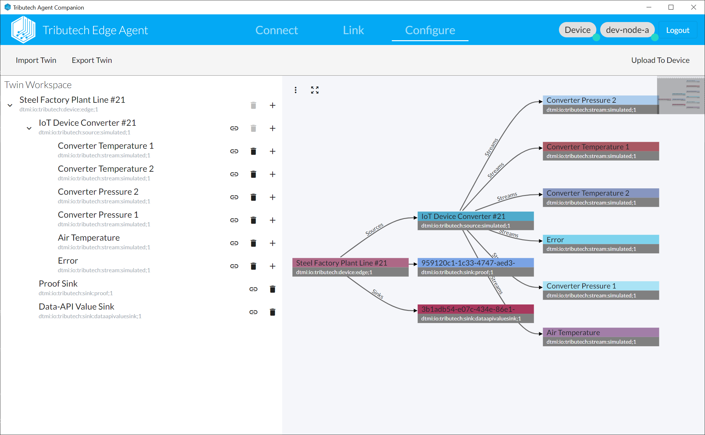
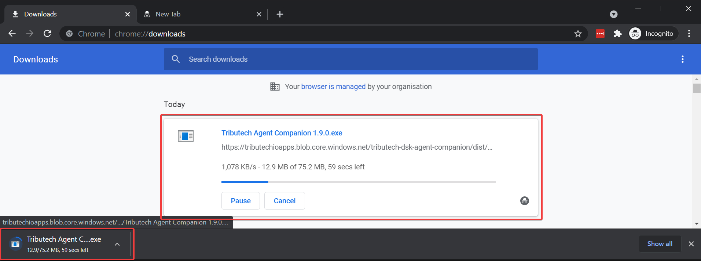
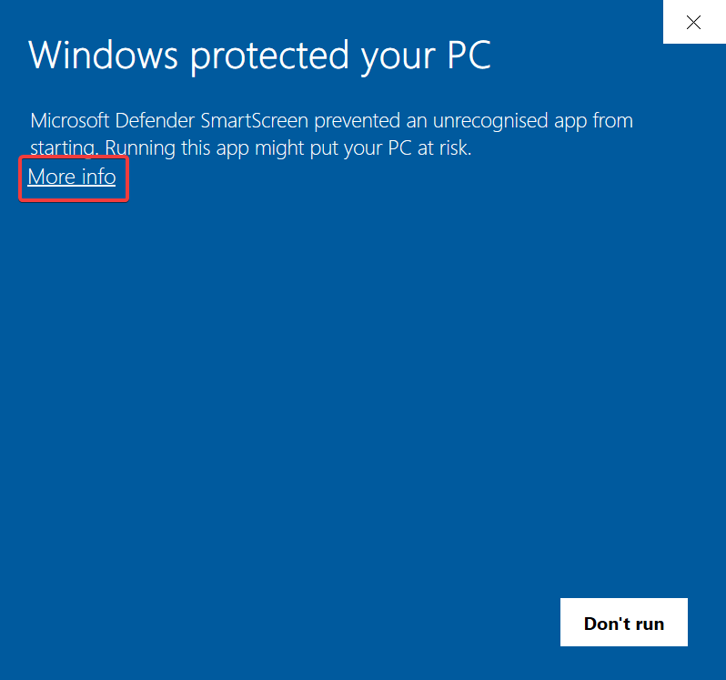
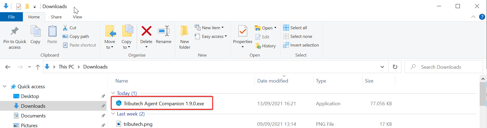
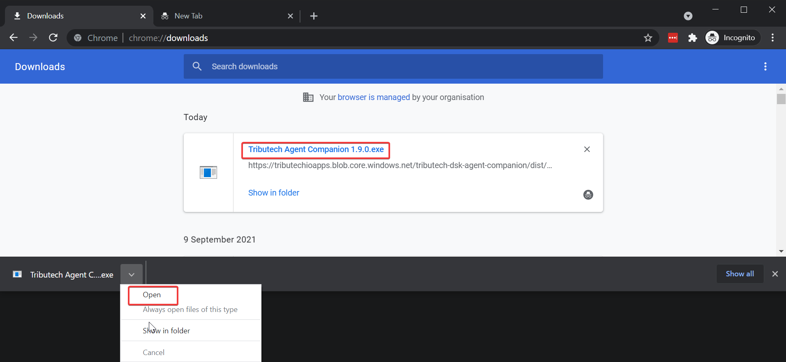
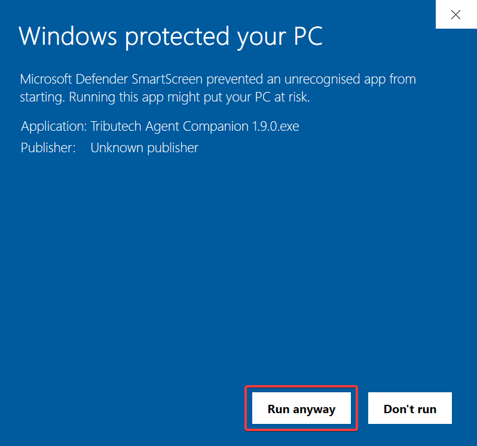
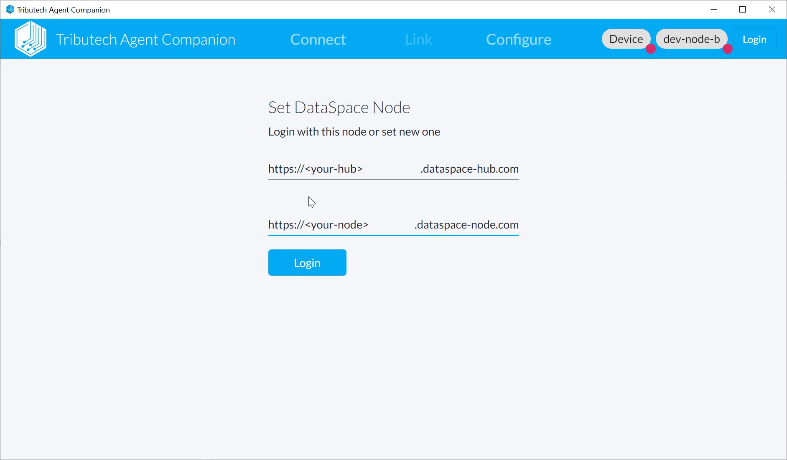

import AgentCompanionDownloadWin from '../common/_agent-companion-download-win.md';
import AgentCompanionDownloadMac from '../common/_agent-companion-download-mac.md';
import AgentCompanionLogin from '../common/_agent-companion-login.md';
import AgentCompanionConnect from '../common/_agent-companion-connect.md';
import AgentCompanionLink from '../common/_agent-companion-link.md';
import AgentCompanionConfigure from '../common/_agent-companion-configure.md';
import AgentCompanionVerifyAgent from '../common/_agent-companion-verify-agent.md';
import AgentCompanionVerifyDataset from '../common/_agent-companion-verify-dataset.md';

The Tributech Agent Companion is an application for the management of DSK Edge Agents / Sensor Securty Modules (SSM). It allows to link them to a DSK Node and configure them based on twins. It offers a twin builder UI (which can also be used stand-alone). It communicates with the APIs of the DSK Node and DSK Edge Agent / Sensor Securty Module (SSM) and must be connected accordingly.

## Download & Run

### Windows
* <AgentCompanionDownloadWin/>
* Check download progress in your browser 
* Open your `Downloads` folder

* Identify `Tributech Agent Companion X.X.X` executable and double-click

* Or directly open/run the executable from your browser

:::note
Depending on your system configuration you might see a security warning from e.g. Microsoft Defender on the first run of the app executable.  
This is since our app is currently not signed. We will improve this in one of the future releases. In the meanwhile we recommend that you check the file with your antivirus software and ignore the warning if everything looks good.
  
Ignore Microsoft Defender warning and run application anyway.  
  
:::

* The Tributech Agent Companion should now be started.

### macOS
* <AgentCompanionDownloadMac />

## Login to DSK Node {#agent-companion-login}

<AgentCompanionLogin/>

## Connect to Edge Agent {#agent-companion-connect}
<AgentCompanionConnect/>

## Link Agent
<AgentCompanionLink/>

## Configure Agent
<AgentCompanionConfigure/>

## Verify in DataSpace-Admin
We can verify in the Dataspace-Admin that the DSK Edge Agent was linked and configured properly.

### Agent
<AgentCompanionVerifyAgent />

### Dataset {#setup-agent-verify-dataset}
<AgentCompanionVerifyDataset />