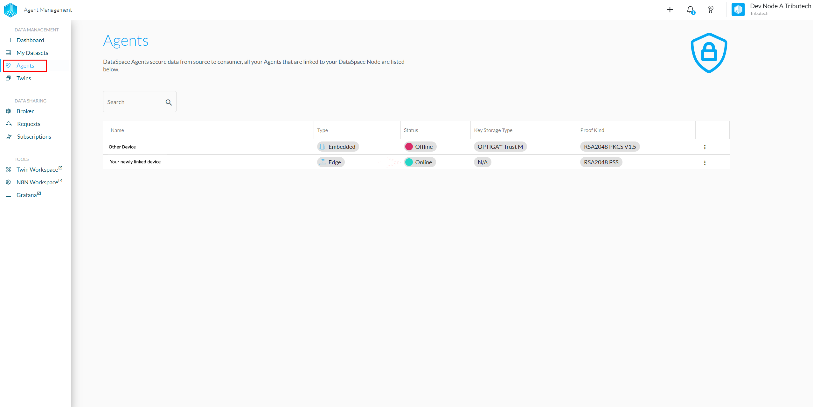
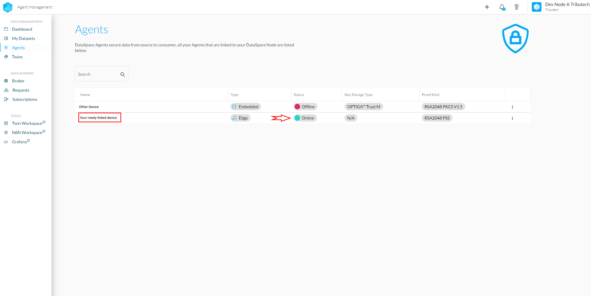
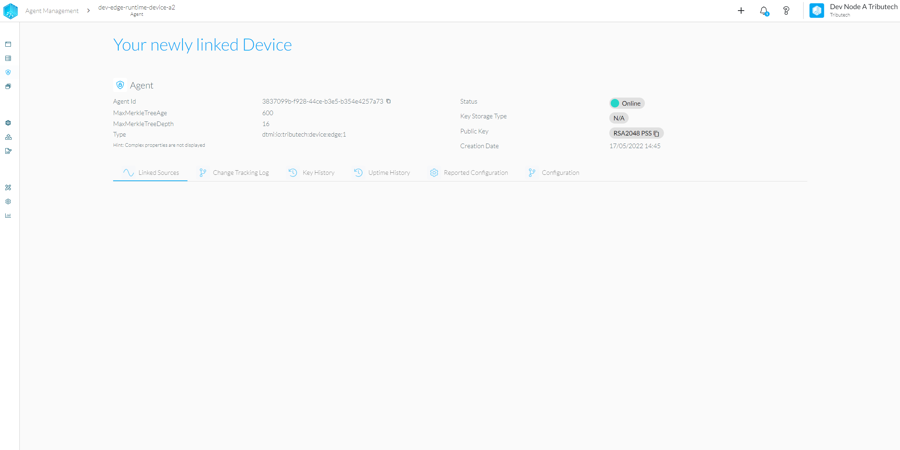
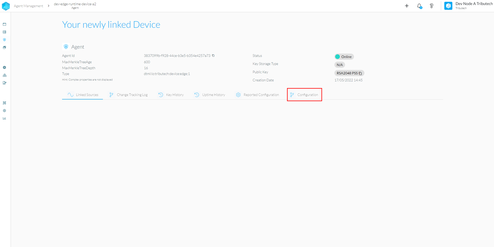
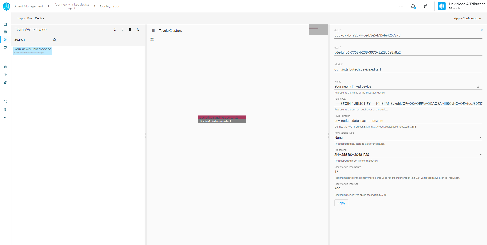
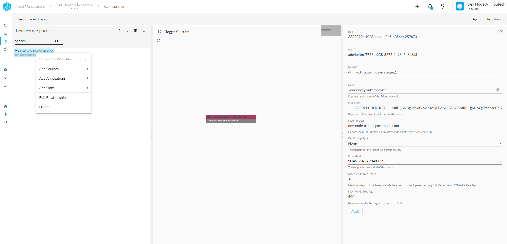
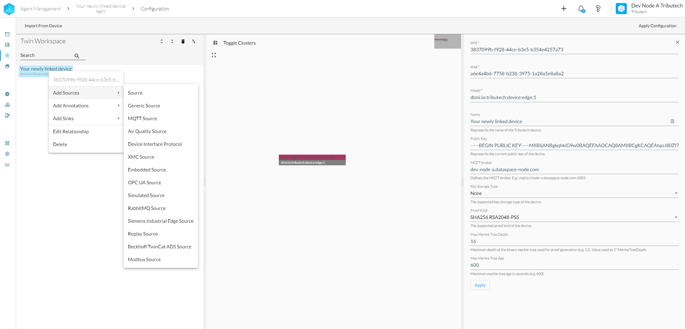
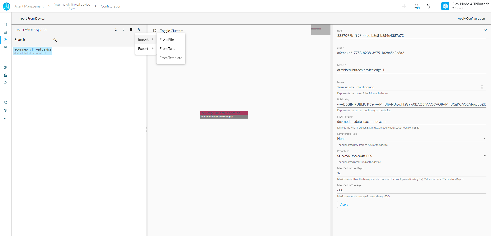

After successfully linking an Agent using the [**Agent Companion**](./agent_companion.mdx) it can be configured.
The recommended option is to configure the Agent via the Dataspace Admin (DSA).

## Configure Agent
* Login into Tributech Node
* Navigate to the Agent Section

* Locate your newly linked Agent and click on it

* Ensure your device is online

* Click on "Configuration"

* The current state of your device will automatically be loaded

* By right-clicking on the device you can open the edit menu

* Here you can also link new sources

* As an alternative you can also import an existing twin configuration defined with [**Digital Twins Definition Language (DTDL) Version 2**](https://github.com/Azure/opendigitaltwins-dtdl/blob/master/DTDL/v2/dtdlv2.md) or a template

:::info
  After editing the form you need to press the Apply button on the bottom of the form to store the changes. To apply the configuration to the device you need to press the Apply Configuration button in the header of the editor.
:::
