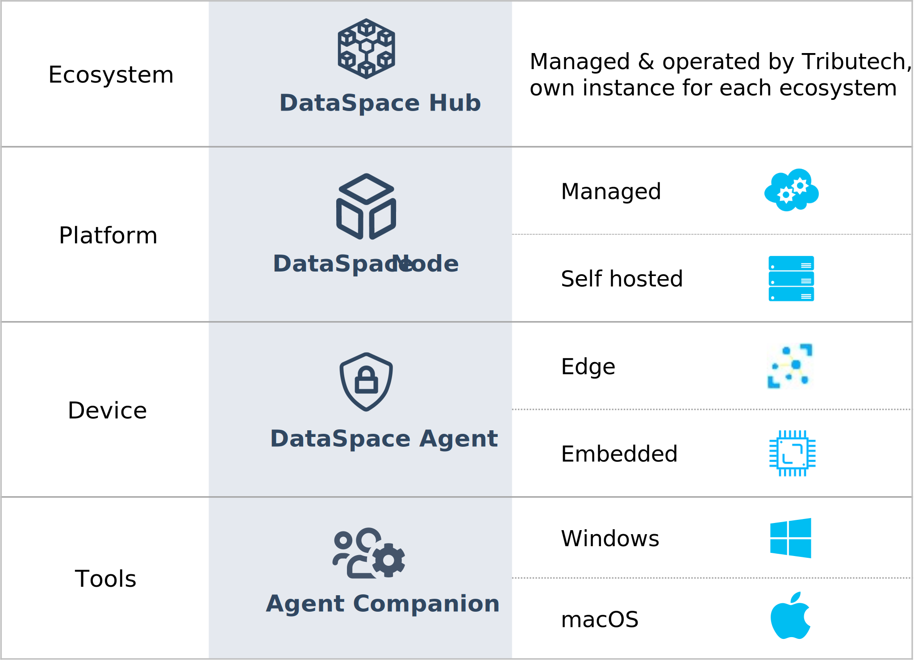

# Setup Overview

This section of the documentation describes how to setup the individual components of the DataSpace Kit (DSK).

The following table offers a quick overview of the components which are at the core of the Tributech DataSpace Kit.

If it's your first time setting up the DSK we also suggest having a look at our [**Quick Start Guide**](../quickstart/overview.md).

## DSK Ecoystem

The ecosystem consists of the DataSpace Hub and is managed & operated by Tributech. If you want to own an ecosystem, please reach out to us via our [**Contact Form**](https://www.tributech.io/about-us/).

## DSK Node

The DataSpace Node serves as a platform and is most likely the part of the architecture that you'll want to setup first. It can either be managed or self-hosted.
Please refer to the [**DSK Node setup**](./node.md) to learn about its setup and the available setup options.

## DSK Agent

The device that is responsible for transmitting auditable data is the DSK Agent. This device can be an Embedded device or also an Edge device.
There are three variants of the DSK Agent available:

- DSK Agent Edge (software-based)
- DSK Agent Embedded (hardware-based)
- DSK Agent Integrated (running at the DSK Node)

### DSK Agent Edge {#dsk-agent-edge}

The DSK Agent Edge is the most common Agent variant and is perfect for all software-based use-cases. Learn how to set it up in our [**specific setup guide**](/docs/setup/agent/overview.md).

**When to choose:** 
This option should be preferred if you have access to the controllers of the machines on the shop-floor but not to the sensors directly (e.g. Industrial IoT Gateway).

**Data signing:** 
Data is signed on the shop-floor still close to the data-source (the closer to the data-source, the better for security).

**Integration:** 
You can use your existing connectors, the Agent is integrated at the message bus layer.

### DSK Agent Embedded {#dsk-agent-embedded}

The DSK Agent Embedded reads data directly from sensors and uses a dedicated hardware security module for signing the data-streams. This is available as either a C implementation or as a dedicated hardware module in the form of our Sensor Security Module (SSM).

**When to choose:** 
This option should be preferred if you have access to your system on a sensor level.

**Data signing:** 
Data is signed as close as possible to the data-source (the closer to the data-source, the better for security). This option offers the highest level of security.

**Acquire:** 
[**Contact us**](https://www.tributech.io/about-us/) if you need more information or wish to acquire an SSM.

### DSK Agent Integrated {#dsk-agent-integrated}

The DataSpace Node comes with an integrated agent, there is no additional setup required for it.

**When to choose:** 
This option should be preferred if you are looking to use a software system (for example an ERP system) as a data-source.

**Data signing:** 
Data is signed as soon as it reaches the node.

**Integration:** 
Data can be sent to the integrated agent through the Trust-API - have a look at [**API integration**](../provide_data/rest.md). API Clients for C# can be found [**here**](https://github.com/tributech-solutions/tributech-dsk-api-clients).

## DSK Agent Companion

The Tributech Agent Companion is an application for the management of the DSK Agent Edge & Sensor Securty Modules (SSM). Head over to [**Agent Companion Setup**](agent_companion.mdx) to find out more!
