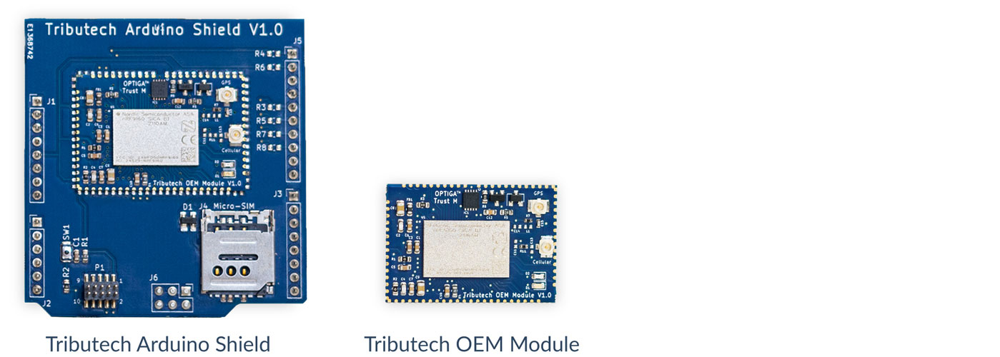
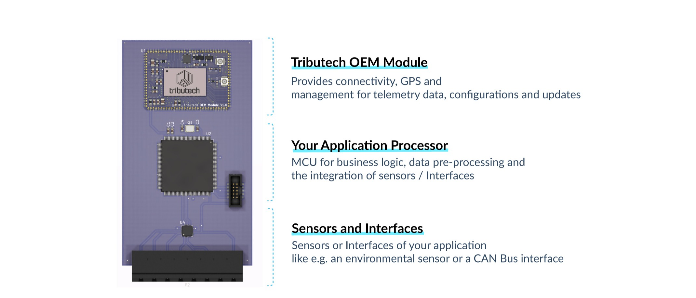
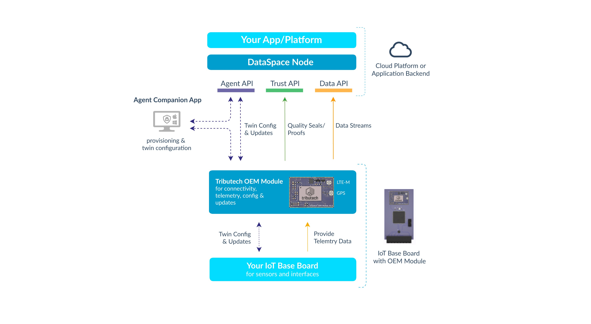
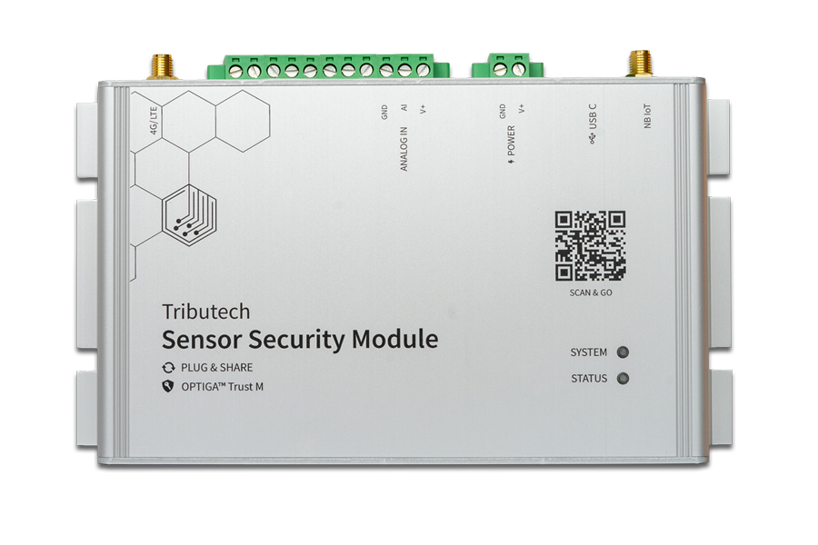
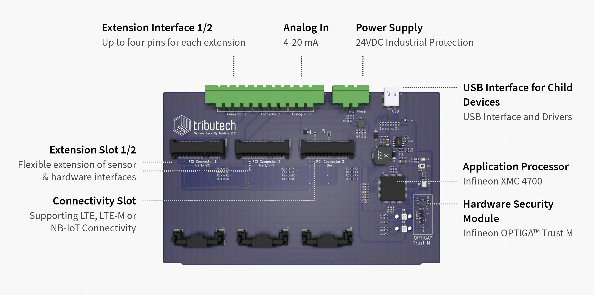

# Setup Overview

This section of the documentation describes how to setup the individual components of the DataSpace Kit (DSK).

The following table offers a quick overview of the components which are at the core of the Tributech DataSpace Kit.

## DSK Ecoystem

The ecosystem consists of the DataSpace Hub and is managed & operated by Tributech. If you want to own an ecosystem, please reach out to us via our [**Contact Form**](https://www.tributech.io/about-us/).

## DSK Node

The DataSpace Node serves as the central platform and is the part of the system which should be deployed first since it allows you to participate in an ecosystem and connect your [**DSK Agents**](#dsk-agent).
Please refer to the [**DSK Node setup**](./node.md) to learn more about the available hosting options and their setup.

## DSK Agent {#dsk-agent}

The device that is responsible for transmitting auditable data is the DSK Agent. This device can be an Embedded device or also an Edge device.
There are three variants of the DSK Agent available:

- DSK Agent Edge (software-based)
- DSK Agent Embedded (hardware-based)
- DSK Agent Integrated (running at the DSK Node)

### DSK Agent Edge {#dsk-agent-edge}

The DSK Agent Edge is our containerized, software-based solution perfect for all devices/environments offering a [**container runtime**](./agent/overview.md#software-requirements-software-requirements). Learn more in our [**setup guide**](./agent/overview.md).

**When to choose:** 
This option should be preferred if you have access to the controllers of the machines on the shop-floor but not to the sensors directly (e.g. Industrial IoT Gateway).

**Data signing:** 
Data is signed on the shop-floor still close to the data-source (the closer to the data-source, the better for security).

**Integration:** 
You can use your existing connectors, the Agent is integrated at the message bus layer (e.g. [**MQTT**](../provide_data/iot/mqtt.md), [**OPC-UA**](../provide_data/iot/opc-ua.md), [**Beckhoff ADS**](../provide_data/iot/ads.md),...).

### DSK Agent Embedded {#dsk-agent-embedded}

The DSK Agent Embedded is our solution designed to read data directly from interfaces/sensors on the hardware level. It uses a dedicated hardware security module for signing the data-streams. 
The DSK Agent Embedded is available as either a C implementation or as a dedicated hardware module.

* [**OEM Module**](https://tributech.io/blog/oem-module)  
We offer two variants, the OEM Module itself which can be directly integrated into your hardware design and an Arduino Shield for prototyping.
The shield can be used with all popular hardware development platforms like Arduino Uno, STM32 Nucelo, Infineon XMC Relax Kit and more.  
  
An IoT device based on the OEM Module typically consists of three parts. Part 1: the Tributech OEM Module which takes care of connectivity, data management, configurations, updates and security. Part 2: the application-specific microcontroller which takes care of data pre-processing and business logic. Part 3: the sensors and interfaces needed for the application. 
  
On the device side, the OEM module provides a UART interface for exchanging configurations, providing telemetry data and performing updates. This allows developers to focus on firmware development for data pre-processing and sensor/interface integration, as all complexity is abstracted via an easy-to-use interface.  
Overview highlighting the role of the OEM module in the overall DSK:

<!---
* [**Sensor Security Module (SSM)**](https://tributech.io/blog/sensor-security-module)  
The Tributech Sensor Security Module is designed to enable the highest possible customization while minimizing the implementation effort required to integrate new sensors or protocols for embedded systems applications. Combined with the included connectivity and data management solution it can be facilitated for the creation of fully verifiable data streams and reduces the time and effort for companies to connect their sensors and assets to the cloud.

The following picture provides an overview of the SSM, its core components and main interfaces:  

-->
**When to choose:** 
This option should be preferred if you have access to your system on a hardware interface/sensor level.

**Data signing:** 
Data is signed as close as possible to the data-source (the closer to the data-source, the better for security). This option offers the highest level of security.

**Acquire:** 
[**Contact us**](https://www.tributech.io/about-us/) if you need more information or wish to acquire an SSM.

### DSK Agent Integrated {#dsk-agent-integrated}

The DataSpace Node comes with an integrated agent, there is no additional setup required for it.

**When to choose:** 
This option should be preferred if you are looking to use a software system (for example an ERP system) as a data-source.

**Data signing:** 
Data is signed as soon as it reaches the node.

**Integration:** 
Data can be sent to the integrated agent through the Trust-API - have a look at [**API integration**](../provide_data/rest.md). Generated API Clients for C# can be found [**here**](https://github.com/tributech-solutions/tributech-dsk-api-clients).

## DSK Agent Companion

The Tributech Agent Companion is an application for the management of the DSK Agent Edge & Embedded. Head over to [**Agent Companion Setup**](agent_companion.mdx) to find out more.
