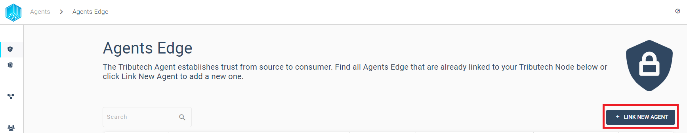
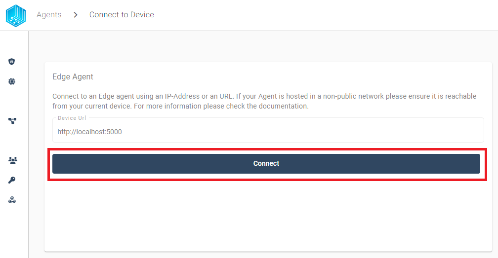
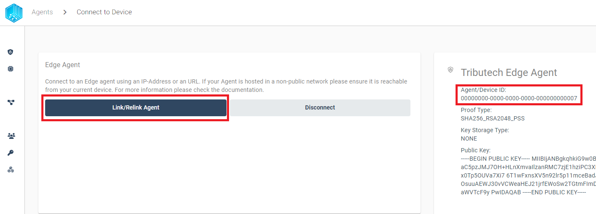
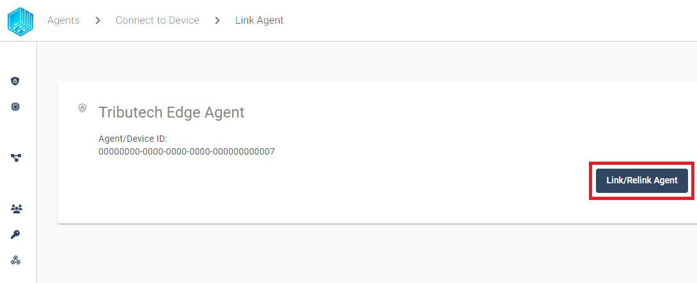
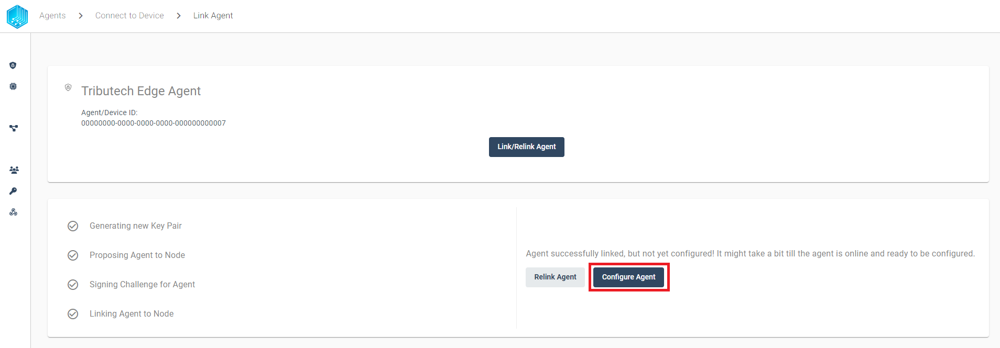
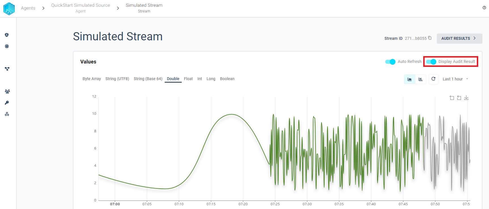
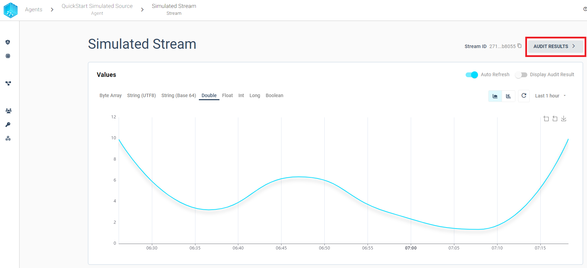
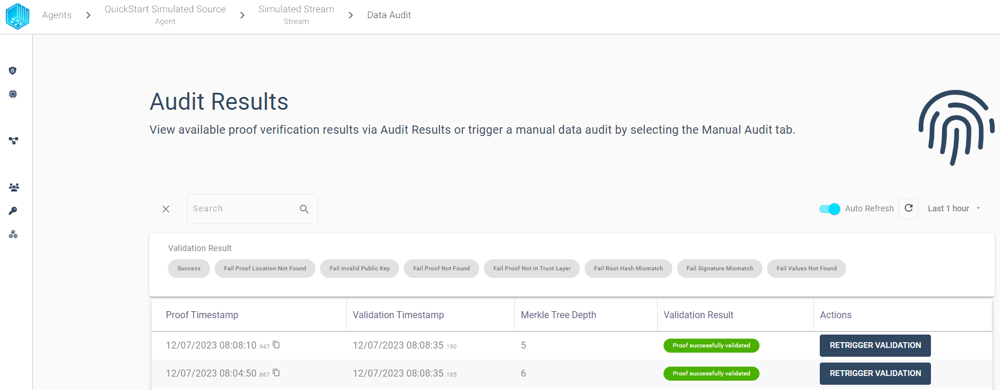
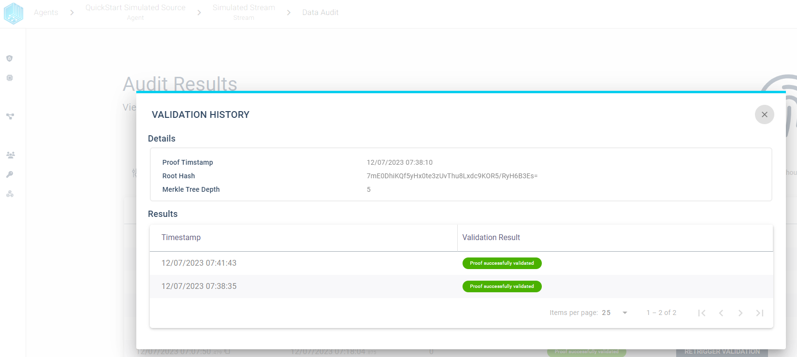

import CodeBlock from "@theme/CodeBlock";
import SourceDockerCompose from "!!raw-loader!./examples/agent/docker-compose.yml";
import SourceEnv from "!!raw-loader!./examples/agent/env-quickstart";

In the following section we describe in detail how to setup and link an Tributech Agent with an existing Tributech Node.
We will show how to gain access to the Tributech Docker Registry and startup an Tributech Agent with a [Tributech Simulated Source](./sources/simulated_source.mdx).

## Deployments

First we need to setup an environment for the execution of the Tributech Software components. We will use
[Docker Compose](https://docs.docker.com/compose/) to run a Tributech Agent and Tributech Simulated Source in the Docker Containers. If you want to use any other container runtime (e.g. containerd) please create a support ticket or talk to your contact person at Tributech.

### Requirements

The environment must meet the following hardware and software requirements:

#### Hardware Requirements

The following table shows the recommended minimum hardware requirements for the overall system.

| Type    | Minimum Requirement                 | Additional Information                                                                                                                              |
| :------ | :---------------------------------- | :-------------------------------------------------------------------------------------------------------------------------------------------------- |
| CPU     | 1 Core (x86-64 / ARM 32/64) or more | The minimum requirements for small and medium workloads.                                                                                            |
| RAM     | 1 GB                                | The minimum requirements for small and medium workloads.                                                                                            |
| Storage | 221 MB                              | A typical setup requires around 500MB consisting of the Tributech Agent = 221 MB, the Tributech Source = 227 MB and the Mosquitto broker = 11,6 MB. |

The following table shows an example of a performance test with a typical IoT gateway or low-end servers. The results include the consumed CPU and RAM resources of the Tributech Agent, in addition you also need to consider the resource consumption of your selected source and your own services.

| Value per second | CPU load(1 core 2.2GHz) | RAM     |
| :--------------- | :---------------------- | :------ |
| 1                | 0,54%                   | 103,1MB |
| 10               | 2,45%                   | 112,2MB |
| 100              | 13,55%                  | 129MB   |

If you have any questions regarding infrastructure requirements, please talk to your contact person at Tributech or create a support ticket.

#### Software Requirements

| Type        | Requirement                       | Additional Information                                                                                                                                                                                   |
| :---------- | :-------------------------------- | :------------------------------------------------------------------------------------------------------------------------------------------------------------------------------------------------------- |
| OS          | Any current Linux Distribution    | We recommend to select a managed solution from an IoT device or infrastructure provider which also takes care of operating system updates for example a vendor like [Welotec](https://www.welotec.com/). |
| Runtime     | Any current Docker environment    | We recommend a managed solution for docker container orchestration e.g.: [Azure IoT Edge Runtime](https://azure.microsoft.com/de-de/products/iot-edge)                                                   |
| File System | any suppoerted docker file system | The user/instance which runs the docker containers must have read and write permission for the volume where the docker containers are situated.                                                          |

#### Network requirements

| Type                   | Requirement                                           | Additional Information                                                                                                       |
| :--------------------- | :---------------------------------------------------- | :--------------------------------------------------------------------------------------------------------------------------- |
| Communication protocol | MQTTS                                                 | Communication protocol used between Tributech Agent and Node. MQTTS is the secure version of the MQTT protocol using TLS.    |
| Port                   | 1883                                                  | Communication port used between Tributech Agent and Node.                                                                    |
| Endpoint URL           | &lt;name&gt;.tributech-node.com                          | MQTT endpoint on server (platform) side.                                                                                     |
| Firewall rules         | allow outbound traffic for endpoint URL for port 1883 | Tributech Agent needs to be allowed to communicate with the platform, typically required for restricted enterprise networks. |

### Docker-Compose Setup

The Tributech Agent Services can be run using [**Docker Engine**](https://docs.docker.com/engine/) as a container runtime. We use [**Docker Compose**](https://docs.docker.com/compose/) for management/orchestration of the Docker services.

```bash
sudo apt-get update
sudo apt-get install \
    apt-transport-https \
    ca-certificates \
    curl \
    gnupg \
    lsb-release
```

```bash
curl -fsSL https://download.docker.com/linux/ubuntu/gpg | sudo gpg --dearmor -o /usr/share/keyrings/docker-archive-keyring.gpg
echo \
"deb [arch=amd64 signed-by=/usr/share/keyrings/docker-archive-keyring.gpg] https://download.docker.com/linux/ubuntu \
$(lsb_release -cs) stable" | sudo tee /etc/apt/sources.list.d/docker.list > /dev/null
```

```bash
sudo apt-get update
sudo apt-get install docker-ce docker-ce-cli containerd.io
sudo apt-get install docker-compose
```

If you want to enable `non-root users` to execute docker commands visit [Post-install](https://docs.docker.com/engine/install/linux-postinstall/).

## Configurations

After completing the installation process for our environment we now need to retrieve the Tributech Docker Images and configure the Docker-Compose environment as follows:

### Authentication

In order to gain access to the Tributech Agent docker image we need to provide docker with the credentials to access the private Tributech Docker Registry. The authentication information can be found in the `Secrets` section of the Tributech Node.


The following command provides docker with the required permissions to access the private Tributech Docker Registry.
For more information on docker authentication visit [docker login](https://docs.docker.com/engine/reference/commandline/login/).

```bash
echo <Client Secret> | docker login --username <Client ID> --password-stdin <Endpoint>
```

### Docker-Compose environment

We have a `docker-compose.yml` prepared for an quick and easy setup with a [Tributech Simulated Source](sources/simulated_source.mdx):

<CodeBlock className="language-yml" title="docker-compose.yml">
  {SourceDockerCompose}
</CodeBlock>

The docker-compose.yml can be used without any changes. However, we also need to create a `.env` file which contains the configuration details, for our docker-compose environment. The content of the file contains all relevant information about the docker image tags and the AGENT_ID. The `AGENT_ID` is a GUID that can be freely chosen, for easy recognition we use `00000000-0000-0000-0000-000000000007`. We will use the `AGENT_ID` later on in the linking process to validate that we link the correct Tributech Agent with our Tributech Node. In our example the `.env` file looks as follows:

<CodeBlock className="language-plain" title=".env">
  {SourceEnv}
</CodeBlock>

We can now **_Startup_** the environment by running the following command:

<CodeBlock className="bash" title="terminal">
  docker-compose up -d
</CodeBlock>

**_Validate_** that all containers are running. The output should return that every container is in the state `Up`

<CodeBlock className="bash" title="terminal">
  docker-compose ps
</CodeBlock>

If you encounter problems with starting the containers please consult the official docker documentation [docker login](https://docs.docker.com/engine/reference/commandline/login/) and [docker compose CLI](https://docs.docker.com/compose/reference/).

## Link Agent

After successfully starting the docker compose setup, in the previous step, we can now link the agent with the Tributech Node. Without completing the linking process the Tributech Node will not be able to receive any data from the Tributech Agent. In the agent overview we can click `LINK NEW AGENT` to initialize this process.



Our prepared [docker-compose.yml](./examples/agent/docker-compose.yml) from the previous step exposes the port `5000` of the Agent to interact with the Tributech Node. The port of you environment must be reachable from the Tributech Node. If you are running the Tributech Node on a virtual machine you can use the following command to forward the port to your local machine:

```bash
ssh <vm-user>@<vm-ip> -L <local-port>:localhost:5000
# e.g.
ssh root@100.101.102.103 -L 5000:localhost:5000
```

After the port forwarding is established we can start the linking process by clicking `Connect`:



After pressing connect, we can see the AGENT_ID `00000000-0000-0000-0000-000000000007` we previously defined in our `.env` file for the docker environment. If the AGENT_ID is correct we can click `Link/Relink Agent` to continue the linking process:



Now we can finish the linking process by clicking `Link/Relink Agent`:



After the successfully completed linking process, we can configure our desired [Tributech Agent Source](source_integration.md) for the Agent.



## Verify

In order to detect [data tampering](https://www.tributech.io/blog/cybersecurity-threat-data-tampering) we provide the possibility to audit each stream individually and quickly find failed validations. We can either use graph a to visually find problems or a table to filter proofs with predefined filters. We will describe both options in the following sections.

### Validation Graph

The Validation Graph can be displayed by clicking **_Display Audit Result_** and contains three different colors:

- **_gray_** - validation is pending
- **_green_** - validation was successful
- **_red_** - validation was not successful



### Validation Table

In Order to view every created proof with its validation history in table format we can use the `AUDIT RESULTS` button from the stream overview:



The audit results table view provides the possibility to filter the audit results based on the validation result. We can use the filter to quickly find failed validations and inspect the validation history for a given proof.
We want to highlight some features to quickly get started with the audit:

- Overview - Display all created proofs in timespan sorted by Proof Timestamp
  

- Filter - Limit the displayed audit results based on the validation result
  

  

- Retrigger - Validation can be triggered manually and the table view will always display the latest validation result for any proof.

  

- History - By selecting a proof row we can inspect the validation history for each proof.

  
