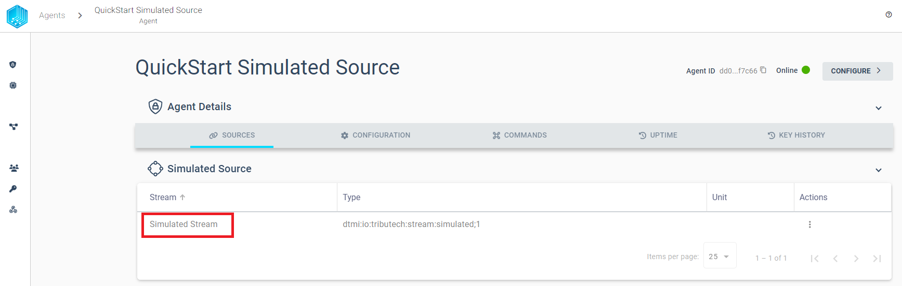
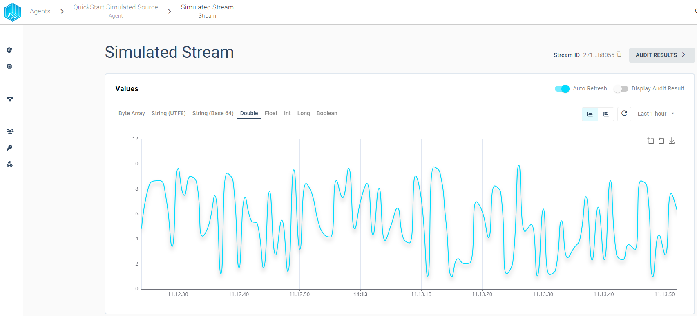

import CodeBlock from '@theme/CodeBlock';
import SourceEnv from '!!raw-loader!./examples/agent/env';
import DockerLogin from '!!raw-loader!./examples/docker/docker-login-cmd';

In this QuickStart Guide we assume that the [requirements](#Requirements) are met. For a more the detailed description on how to meet those requirements for the Tributech Agent environment visit [Agent Integration](./agent_integration.md).

## Requirements
In Order to link a Tributech Agent to a Tributech node we need the following:

- Access to an existing [Tributech Node](../tributech_node/overview.md)
- Access to an environment which meets the [Tributech Agent Requirements](./agent_integration.md#requirements)

## Docker-Compose Up
Open a terminal in your environment where you want to run the Tributech Agent and follow the steps below to startup the docker-compose environment.  
- ***Authenticate docker*** to retrieve the relevant docker images from the private [Tributech Docker Registry](./agent_integration.md#authentication).

    <CodeBlock className="bash" title="terminal">{DockerLogin}</CodeBlock>

 - Setup the ***docker environment*** by creating a `.env` file with the following content and replace the placeholder values with your values:

    <CodeBlock className="language-plain" title=".env">{SourceEnv}</CodeBlock>

    We will use the AGENT_ID ***00000000-0000-0000-0000-000000000007*** in our example.

- ***Download*** the file [docker-compose.yml](./examples/agent/docker-compose.yml) and save it in the same folder containing the `.env` file.

 - ***Startup*** the environment
    
    <CodeBlock className="bash" title="terminal">
        docker-compose up -d
    </CodeBlock>

- ***Validate*** that all containers are running
    <CodeBlock className="bash" title="terminal">
        docker-compose ps
    </CodeBlock>
    The output should return that every container is in the state ***Up***

## Link Agent
After starting the Tributech Agent we need to link the Agent to a Tributech Node in order to receive data. In the agent overview we can click ***Link new agent*** to initialize this process.

Our prepared [docker-compose.yml](./examples/agent/docker-compose.yml) from the previous set exposes the port `5000` of the Agent to interact with the Tributech Node.

After pressing connect we can see the AGENT_ID ***00000000-0000-0000-0000-000000000007*** we previously defined in the `.env` file of the docker environment. 

Now we can finish the linking process by clicking ***Link/Relink Agent***

After the successly completed linking process we can configure the Agent to support the desired [Tributech Agent Source](source_integration.md).

## Source Configuration 
The previous steps established the communication between an Tributech Agent and a Tributech Node but we also need a [Tributech Source](source_integration.md) to receive data. In the following section we complete our Tributech Agent Quickstart Setup by configuring a simple double stream for the [Tributech Simulated Source](sources/simulated_source.mdx) by selecting our previously linked Tributech Agent (the Agent Name depends on the `.env` file ***AGENT_ID*** value defined in the previous section).

Next we need to configure the Agent to receive data for the Tributech Simulated Source we defined in the docker-compose setup:

We have prepared a Simulated Source configuration containing a double data stream, simple import the [TwinConfiguration Template File](examples/agent-source/quick-start.json)

After successfully importing the [TwinConfiguration Template File](examples/agent-source/quick-start.json)
apply the configuration to persist the configuration.

We can now select the Simulated Stream of our newly configured ***QuickStart Simulated Source*** Agent

The Stream generates a new data point every second in the range between 1 and 10

This completes the QuickStart. Visit [Source Integration](source_integration.md) for information on how to add other types of Tributech Sources or [Tributech Agent Integration](agent_integration.md) for a more details on how to configure the Tributech Agent.

## Verify
In order to detect [data tampering](https://www.tributech.io/blog/cybersecurity-threat-data-tampering) we provide the possibility to audit each stream proofs individually. We provide the two possibilities to view the audit results:

- A Graph view, which displays pending validation in grey, successful validations in green and failed in red.
    

- A Table view, which includes a list of all proofs. For each proof the validation can be retriggered with a button click or display the history of validations by selecting a table entry.
    

    

For more details on how to use the audit process visit the detailed guide for the [Agent Integration](agent_integration.md#verify)