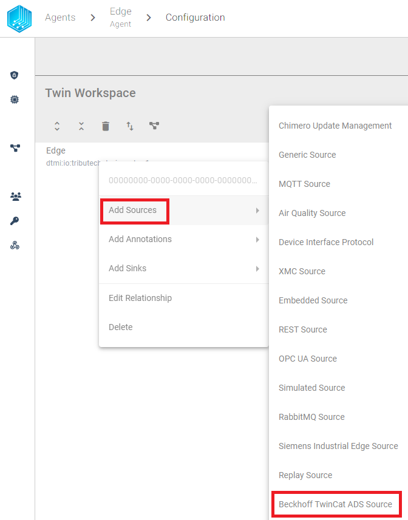
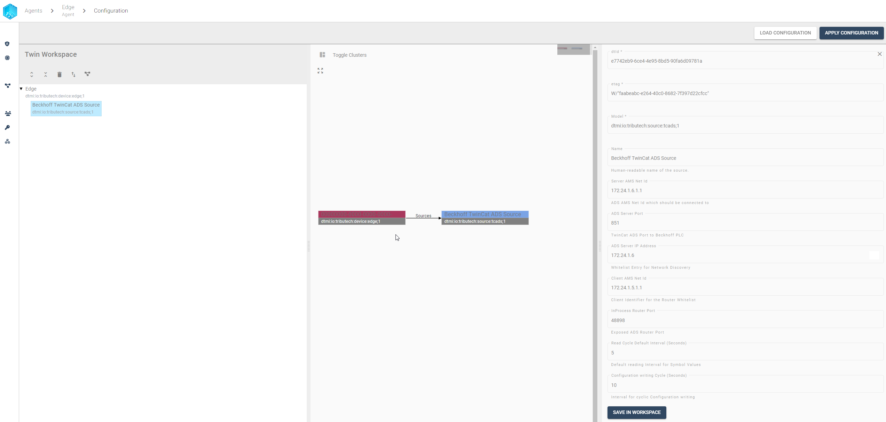
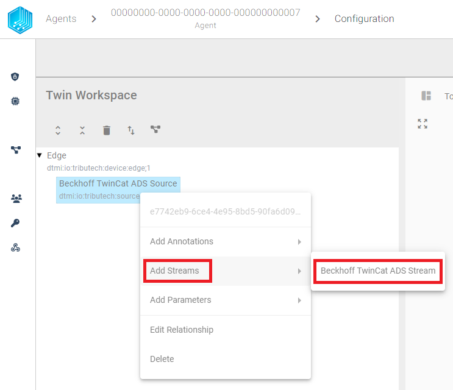
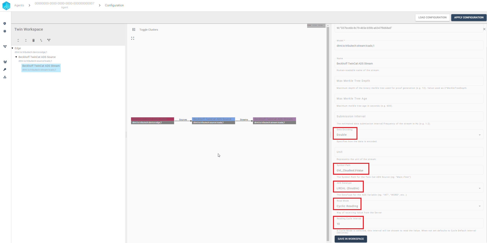
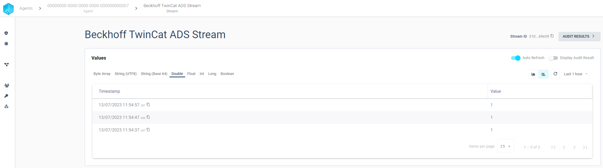

import CodeBlock from '@theme/CodeBlock';
import SourceDockerCompose from '!!raw-loader!../examples/agent-source/ads/docker-compose.yml';
import SourceEnv from '!!raw-loader!../examples/agent-source/ads/.env';
import SoourceDockerComposeMock from '!!raw-loader!../examples/agent-source/ads/docker-compose.override.yml';

The Tributech ADS Source allows to connect to an [Beckhoff ADS Server](https://infosys.beckhoff.com/english.php?content=../content/1033/cx8190_hw/5091854987.html) and recieve or write values to the ADS Server.  
The Tributech ADS Source acts like a ADS Client in a Docker Setup and enables the forwarding of the Data to a Stream via our Tributech Agent.

The Tributech ADS Source furthermore provides control over the single symbol paths:
- Which symbol path to receive
- How and when to receive a value from the symbol
- What kind of datatype should be received from the symbol
- When should a symbol be written to (Optional)

We generally provide two different ways to configure the Tributech ADS Source read operations for each symbol path individually:
- ***Cyclic Reading*** - The symbol path will be read in a defined interval
- ***On Change*** - The symbol path will be read when the value of the symbol has been changed

## Setup
The Tributech ADS Source image can be started without any dependencies but will not be functional without a valid Twin Configuration or MessageBroker connect to the Tributech Agent. The TwinConfiguration can be provided via the Tributech Node (recommended) or MessageBroker (see [Source Integration](./source_integration.md#TwinModel)). The ADS Source will automatically connect to the Tributech Agent if the Tributech Agent is running and the MQTT Source is configured with the correct MessageBroker settings.

In the following part we will describe the setup of a Tributech ADS Source. 

 - Setup the ***docker environment*** by creating a `.env` file with the following content and replace the placeholder values with your values:

<CodeBlock className="language-plain" title=".env">{SourceEnv}</CodeBlock>

- Setup the ***docker-compose.yml*** file by creating a `docker-compose.yml` file with the following content in the same folder as the  `.env` file:

<CodeBlock className="language-yml" title="docker-compose.yml">{SourceDockerCompose}</CodeBlock>

## Configuration

After setting up the Tributech ADS Source we need to link it to the Tributech Node (see [QuickStart](../quickstart.mdx#link-agent)) and configure the TwinConfiguration.

We can now add by right clicking the Device Edge entry a new Beckhoff TwinCat ADS Source.

In order to connect to the ADS Server we need to configure the ADS Server settings. The following table contains the description for each setting for our MockClient (later we will describe how to setup a [MockServer](#mock-server) if you don't have a real ADS Server available):

Meaning of the settings:

| Setting | Description |
| --- | --- |
| **Server AMS Net Id** | AMS Net Id of the PLC ADS Server |
| **ADS Server Port** | Port of the PLC ADS Server |
| **ADS Server IP Address** | IP-Address of the PLC ADS Server (needed for whitelist) |
| **Client AMS Net Id** | AMS Net Id of the ADS Source |
| **InProcess Router Port** | Should always be **48898**, only needs to be changed if the network configuration changes |
| **Read Cycle Default Interval** | Default read interval value for all cyclic streams, will only be overruled if defined in the stream itself |
| **Configuration writing Cycle** | Write function cycle time to write values to the server (used for every parameter) |

We can save the settings by clicking on the `Save in workspace` button in the buttom right corner and add a new ADS Stream by right clicking on the ADS Source entry:

The following table contains the description for each setting for the ADS Stream path of type LREAL (double) which will be read every 10sec from the MockServer:

We can save the settings by clicking on the `Save in workspace` button in the buttom right corner and continue adding every symbol path we want to read from the ADS Server.

After all symbol paths have been configured, we can apply the configuration to the Tributech Agent by clicking on the `Apply Configuration` button in the top right corner.

We can now see the value of the symbol path in the `Beckhoff TwinCat ADS Stream`:

## Value Change Options
The basic handling of Value Change Options (VCO) can be found in [Source Integration](../source_integration.md#value-change-options). This section contains the concrete handling of the ***Step (Delta)*** for the simulated source. The following list contains the description for each supported ***ADSDataType*** where ***X*** represents the value for ***Step (Delta)***:

- ***INT***, ***UINT***, ***WORD***, ***SINT***, ***DINT***, ***UDINT***, ***DWORD***, ***REAL***, ***LREAL***: defines the minimum difference between values to be submitted, the change is always compared to the last successful submitted value, e.g. if ***X***= 3 if the values 1, 2, 5, 8, 10, 11, 14 are received by the Tributech Source only 1, 5, 8, 11, 14 will be submitted.
-  ***USINT***,  ***BYTE***: will only be submitted if the value of the first byte of the current value is bigger or equal than the previous value
- ***BOOL***: will only be submitted if the current and last submitted value are not equal
- ***STRING***: will only be submitted if the current and last submitted value are not equal

## Providing Data
If a Beckhoff ADS Server is used as a source, no specific settings are required, only the settings described in [Configuration](#configuration). If no Beckhoff ADS Server is available the Tributech ADS Source can use a Tributech ADS Mock to provide data to the Tributech ADS Source. 

### Mock Server
The Mock Server is a simple application based on the [Beckhoff.TwinCAT.Ads.Server](https://www.nuget.org/packages/Beckhoff.TwinCAT.Ads) to generate a simple ADS Server with a few symbol paths. The Mock Server can be started by downloading the `docker-compose.override.yml` file into the same folder as the Tributech ADS source. 

<CodeBlock className="language-yml" title="docker-compose.override.yml">{SoourceDockerComposeMock}</CodeBlock>

The Mock Server needs access to the same docker network as the Tributech ADS Source, therefore the ip addresses and environment variables need to be adjusted if they are not identical to our provided `docker-compose.yml` file (see [Setup](#setup)). The Mock Server will be started automatically when the Tributech ADS Source is started.

The following table contains the description for each available symbol path of the Mock Server:

| Path | TypeName | 
| --- | --- |
| **GVL_Cloudtest.bValue** | BOOL |
| **GVL_Cloudtest.byValue** | BYTE |
| **GVL_Cloudtest.iValue** | INT |
| **GVL_Cloudtest.uiValue** | UINT |
| **GVL_Cloudtest.siValue** | SINT |
| **GVL_Cloudtest.usiValue** | USINT |
| **GVL_Cloudtest.dwValue** | DWORD |
| **GVL_Cloudtest.diValue** | DINT |
| **GVL_Cloudtest.udiValue** | UDINT |
| **GVL_Cloudtest.rValue** | REAL |
| **GVL_Cloudtest.lrValue** | LREAL |
| **GVL_Cloudtest.s50Value** | STRING(50) |
| **GVL_Cloudtest.s201Value** | STRING(201) |
| **GVL_Cloudtest.ws80Value** | WSTRING(80) |

