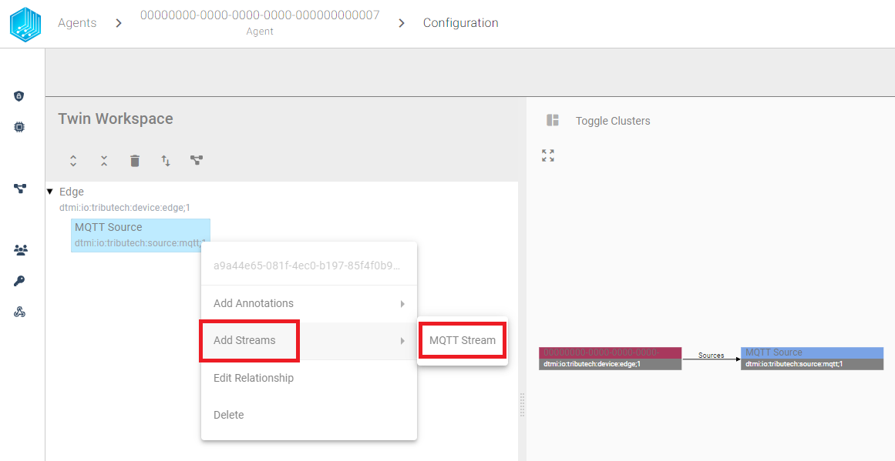
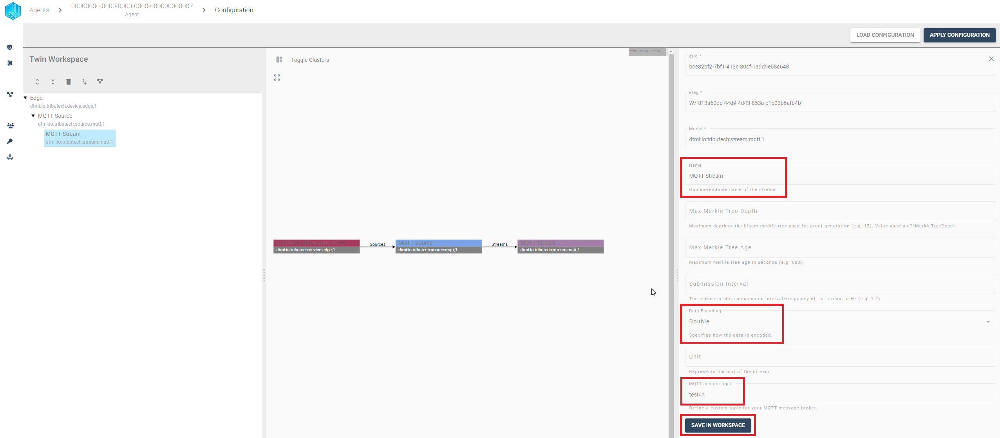
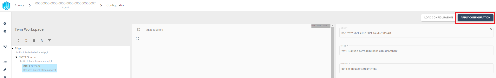
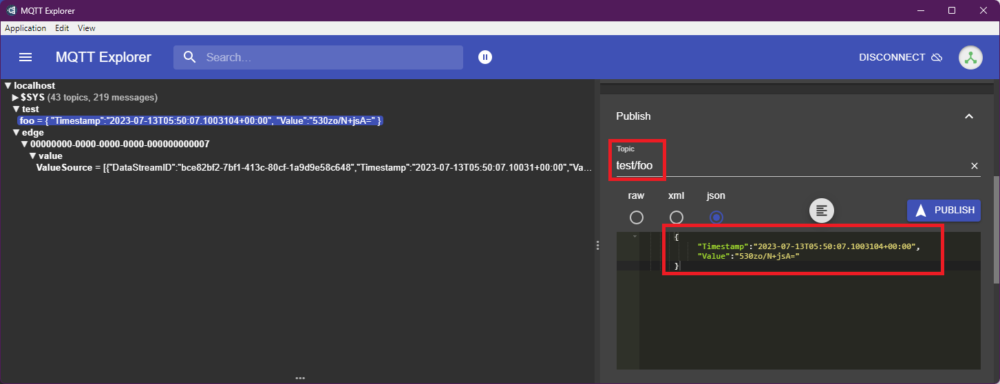
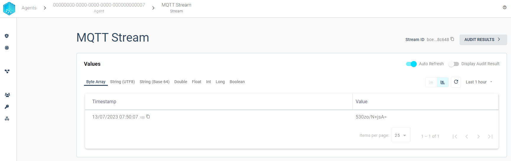
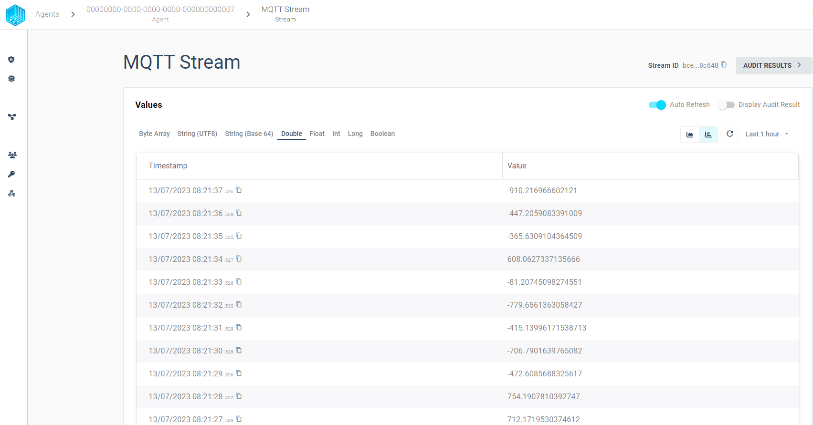

import CodeBlock from '@theme/CodeBlock';
import SourceDockerCompose from '!!raw-loader!../examples/agent-source/mqtt/docker-compose.yml';
import SourceEnv from '!!raw-loader!../examples/agent-source/mqtt/.env';
import SoourceDockerComposeMock from '!!raw-loader!../examples/agent-source/mqtt/docker-compose.override.yml';

The Tributech Agent supports the integration of external data sources using the [**MQTT messaging protocol**](https://mqtt.org/) with the  Tributech MQTT Source. The MQTT Source is configured via the Twin Configuration and can is used to send data to the Tributech Agent via [MQTT](https://mqtt.org/). 


 The data can be send to the Tributech Source either via an MQTT Client Application like [**MQTTX**](https://mqttx.app/), [**MQTT Explorer**](http://mqtt-explorer.com/) or with our Tributech MQTT MockClient. The Tributech MQTT Source MockClient is currently only for testing purposes and works only in combination with the Tributech MQTT Source. 

 We currently support one type of data format for the MQTT Source called __MQTT Stream__. The __MQTT Stream__ is defined by the TwinConfiguration and is bound to a specific DataStreamId via a MQTT custom topic value. We will show in [Configuration](#Configuration) how to configure the MQTT Source to accept data for a specific stream and provide the data via [**MQTT Explorer**](http://mqtt-explorer.com/) and the MQTT MockClient.
 
Note: In future versions we will support additional data formats for the MQTT Source, i.e. __Payload Topic Streams__ which contains a compound string identifier for DataStreamId. The Tributech MQTT Source and Tributech MQTT MockClient are already supporting the __Payload Streams__ data format but the Tributech Node does not support it yet. This result in the MQTT Source rejecting any data that is send with the __Payload Streams__ data format. 

The Tributech MQTT Source generally supports wildcards in custom topics, however the topic are not allowed to overlap, i.e. foo/# and foo/bar cannot be setup for the same Tributech MQTT Source at the same time. 

## Setup
The Tributech MQTT Source image can be started without any dependencies but will not be functional without a valid Twin Configuration or MessageBroker connect to the Tributech Agent. The TwinConfiguration can be provided via the Tributech Node (recommended) or MessageBroker (see [Source Integration](./source_integration.md#TwinModel)). The MQTT Source will automatically connect to the Tributech Agent if the Tributech Agent is running and the MQTT Source is configured with the correct MessageBroker settings.

In the following part we will describe the setup of a Tributech MQTT Source. 

 - Setup the ***docker environment*** by creating a `.env` file with the following content and replace the placeholder values with your values:

<CodeBlock className="language-plain" title=".env">{SourceEnv}</CodeBlock>

- Setup the ***docker-compose.yml*** file by creating a `docker-compose.yml` file with the following content in the same folder as the  `.env` file:

<CodeBlock className="language-yml" title="docker-compose.yml">{SourceDockerCompose}</CodeBlock>

## Configuration
After setting up the Tributech MQTT Source we need to link it to the Tributech Node (see [QuickStart](../quickstart.mdx#link-agent)) and configure the TwinConfiguration.


We can now add by right clicking the Device Edge entry a new MQTT Source.


After right clicking on the MQTT Source entry we can add a new MQTT Stream.




Finally we adjust the stream to our needs, the following example shows how to setup a stream for a double value with the display name MQTT Stream and the MQTT Topic `test/#`. For custom toppics, two wildcars are supported:

- A '#' character represents a complete sub-tree of the hierarchy and thus must be the last character in a subscription topic string, such as test/#. This will match any topic starting with test/, such as test/1/TEMP and test/2/HUMIDITY.
- A '+' character represents a single level of the hierarchy and is used between delimiters. For example, test/+/TEMP will match test/1/TEMP and test/2/TEMP.

We can save the settings by clicking on the `Save in workspace` button in the buttom right corner.



We can repeat this step to add additional streams to the MQTT Source. An important note is that the MQTT Source will only work when there are no overlapping topics, i.e. `test/#` and `test/+/TEMP` are not allowed to be configured for the same MQTT Source.
After we have configured the MQTT Source we can apply the configuration to the Tributech Agent by clicking on the `Apply Configuration` button in the top right corner.



This completes the configuration of the MQTT Source and we can now send data to the MQTT Source via the MQTT Explorer or the MQTT MockClient.

### Value Change Options
The basic handling of Value Change Options (VCO) can be found in [Source Integration](../source_integration.md#value-change-options). This section contains the concrete handling of the ***Step (Delta)*** for the simulated source. The following list contains the description for each supported ***Stream Data Encoding*** where ***X*** represents the value for ***Step (Delta)***:

- ***Double***, ***Int32***, ***Long***, ***Float***: defines the minimum difference between values to be submitted, the change is always compared to the last successful submitted value, e.g. if ***X***= 3 if the double values 1, 2, 5, 8, 10, 11, 14 are received by the Tributech Source only 1, 5, 8, 11, 14 will be submitted.
- ***Byte Array***: will only be submitted if the current and last submitted value are not equal 
- ***String UTF 8***: will only be submitted if the current and last submitted value are not equal
- ***Boolean***: will only be submitted if the current and last submitted value are not equal


## Providing Data
In the following section we want to outline two different ways to provide data to the MQTT Source. The first way is to use the [**MQTT Explorer**](http://mqtt-explorer.com/) to send data to the MQTT Source. The second way is to use the MQTT MockClient to send data to the MQTT Source. In our example we can access the MQTT MessageBroker on port 1833 (need to match your `mosquitto-server-mqtt` service in the [`docker-compose.yml`](../examples/agent-source/mqtt/docker-compose.yml)).

### MQTT Explorer
With the [**MQTT Explorer**](http://mqtt-explorer.com/) we can directly send json payload to a specific topic. The MQTT Explorer can connect to the MessageBroker on port 1833 (need to match your `mosquitto-server-mqtt` service in the `docker-compose.yml`). The example will submit the following payload data to the MQTT Source previously configured in [Setup](#Setup) :

```json
    {
        "Timestamp":"2023-07-13T05:50:07.1003104+00:00",
        "Value":"530zo/N+jsA="
    }
```

We can post the data to the MQTT Source by clicking on the `Publish` button in the top right corner.



The MQTT Source will now receive the data, process it and send it to the Tributech Agent. The Tributech Agent will forward the data to the Tributech Node. We can follow this data flow on the left handside of the MQTT Explorer by observing which topics receive data, i.e. `edge/{agent-id}/value/ValueSource` is our Tributech Agent. 
The data can be viewed in the Tributech Node by clicking on the `MQTT Stream`.

Per default we will show directly the correct datatype tab with the timestamp and value.


 However, we can switch to the Byte Array tab to see the data we have submitted.
The value and timestamp (in UTC) are displayed and match our submitted data.



### MockClient
We provide an additional `docker-compose.override.yml` to include a MockClient that can send data to the MQTT Source based on the environment variable setup. The MockClient is only for testing purposes and should not be used in production. The MockClient is configured via the `docker-compose.override.yml` file and needs to be in the same folder as the `docker-compose.yml` on docker-compose up. The following example shows how to setup the MockClient to send data to the MQTT Source for a stream double stream, the Topic needs to be inserted into the `<custom-topic>` placeholder, e.g. `test/foo`  (the full `docker-compose.override.yml` can be found in the [here](../examples/agent-source/mqtt/docker-compose.override.yml)):

<CodeBlock className="language-yml" title="docker-compose.override.yml">{SoourceDockerComposeMock}</CodeBlock>

After starting the MockClient we can see the data in the Tributech Node. The following example shows the data for the double stream.




#### Modify docker-compose.override.yml
We can adjust the data generation to our needs by modifying the docker-compose.override.yml file, see [Docker](https://docs.docker.com/compose/) for details on how to setup the environment for docker-compose. 

We can send different datatypes to specified streams and modify the following `environment` variables to change the stream generation behaviour:

- __StreamEncoding__: Sets the datatype which will be generated based on a numeric value:

  | Value | Datatype |
  |----------|----------|
  | 1        | byte-array     |
  | 2        | float     |
  | 3        | double     |
  | 4        | int     |
  | 5        | long     |
  | 6        | string_utf8     |
  | 8        | boolean     |

- __Interval__: The interval (default 10sec) in which the values are generated in TimeSpan format, e.g. 00:00:05 for 5 seconds, see [Microsoft](https://learn.microsoft.com/en-us/dotnet/standard/base-types/standard-timespan-format-strings) for details on TimeSpan format
- __MinValue__ (default -1000): The minimum value that can be generated (for bytearrays and string this is the length of the array/string, default 1)
- __MaxValue__ (default 1000): The max value that can be generated (for bytearrays and string this is the length of the array/string)
 
In Order to add more streams the environment 'MockOptions' setting can be adjusted based on the AppSettings.json configuration capabilities, see [Microsoft](https://learn.microsoft.com/en-us/aspnet/core/fundamentals/configuration/?view=aspnetcore-7.0) for details on how to setup the environment variables. The following setup shows how to add a second stream float stream to the MockClient:

```yaml
    ... 
    environment:
      ...
      # Stream 1
      - MockOptions__Streams__0__Topic=xxo/foo
      - MockOptions__Streams__0__StreamEncoding=3 # double

      # Stream 2
      - MockOptions__Streams__0__Topic=xxo/foo
      - MockOptions__Streams__0__StreamEncoding=2 # float
      ...
```


