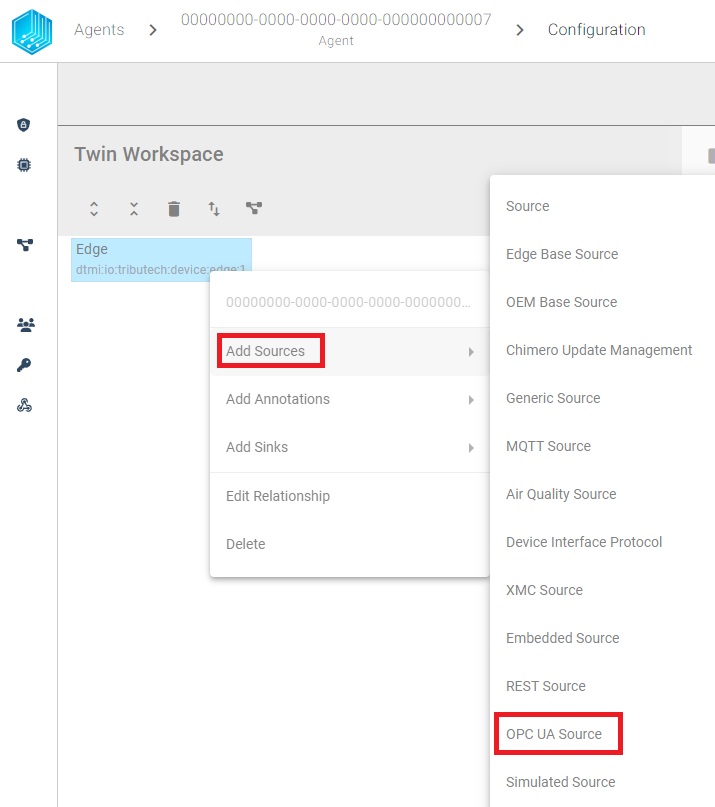
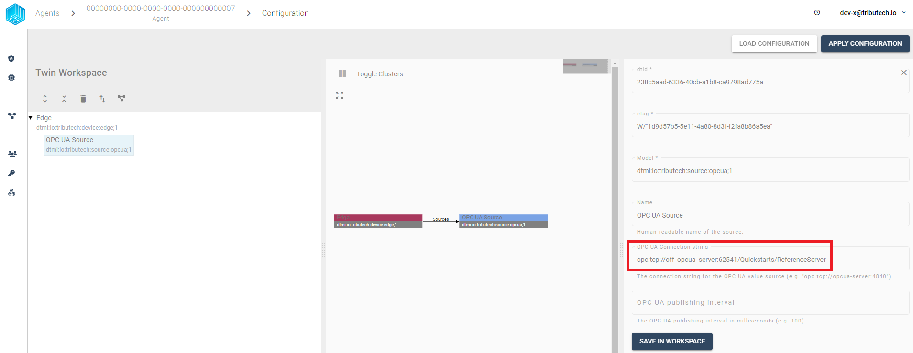
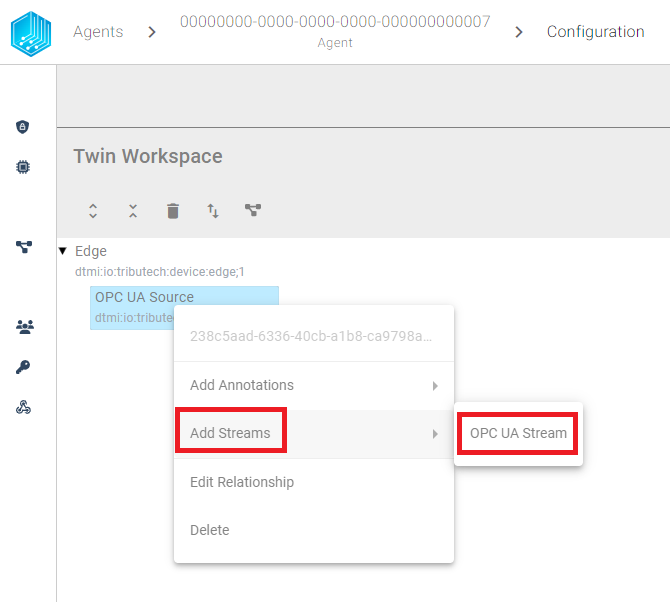
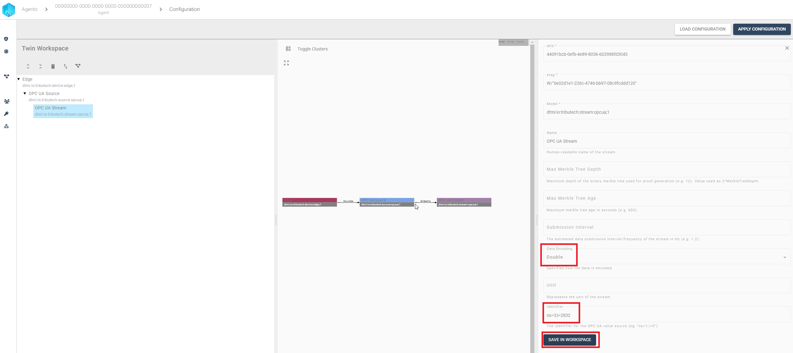
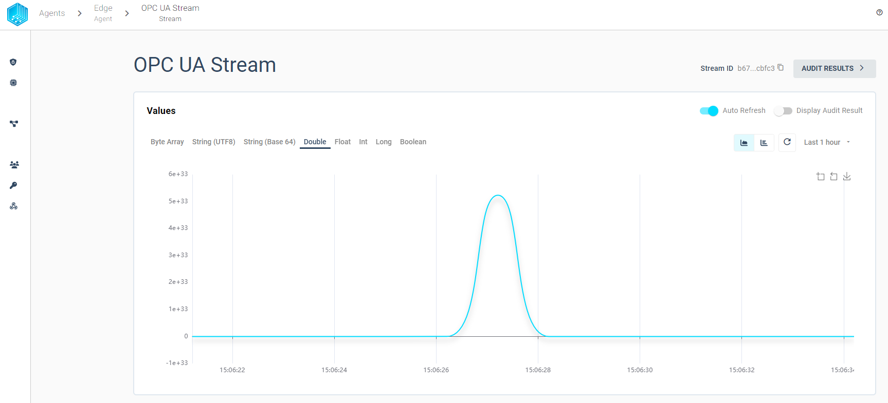

import CodeBlock from '@theme/CodeBlock';
import SourceDockerCompose from '!!raw-loader!../examples/agent-source/opcua/docker-compose.yml';
import SourceEnv from '!!raw-loader!../examples/agent-source/opcua/env';
import SoourceDockerComposeMock from '!!raw-loader!../examples/agent-source/opcua/docker-compose.override.yml';

The Tributech OPC-UA Source allows to connect to an [**OPC Unified Architecture (UA)**](https://opcfoundation.org/about/opc-technologies/opc-ua/) server and receive data.  The Tributech OPC-UA Source acts like a OPC-UA Client in a docker environment and enables the forwarding of the data to a Tributech Agent stream.

## Setup
The Tributech OPC-UA Source image can be started without any dependencies but will not be functional without a valid Twin Configuration or MessageBroker connect to the Tributech Agent. The TwinConfiguration can be provided via the Tributech Node (recommended) or MessageBroker (see [Source Integration](../source_integration#twin-model)). The OPC-UA Source will automatically connect to the Tributech Agent if the Tributech Agent is running and correct MessageBroker settings are set. In the following part we will describe the setup of a Tributech OPC-UA Source:

 - Setup the ***docker environment*** by creating a `.env` file with the following content and replace the placeholder values with your values:

<CodeBlock className="language-plain" title=".env">{SourceEnv}</CodeBlock>

- Setup the ***docker-compose.yml*** file by creating a `docker-compose.yml` file with the following content in the same folder as the  `.env` file:

<CodeBlock className="language-yml" title="docker-compose.yml">{SourceDockerCompose}</CodeBlock>

## Configuration

After setting up the Tributech OPC-UA Source we need to link it to the Tributech Node (see [QuickStart](../quickstart.mdx#link-agent)) and configure the TwinConfiguration.

We can save the settings by clicking on the `SAVE IN WORKSPACE` button in the bottom right corner and add a new OPC-UA Stream by right clicking on the OPC-UA Source entry:

In order to connect to the OPC-UA Server we need to configure the OPC-UA Server settings. The following table contains the description for each setting for our MockClient (later we will describe how to setup a [MockServer](#mock-server) if you don't have a real OPC-UA Server available, i.e. `opc.tcp://off_opcua_server:62541/Quickstarts/ReferenceServer`):

Next we can add a new OPC-UA Stream by clicking on the `Add Streams` and `OPC UA Stream`:

The OPC-UA Stream can be configured with the following settings (the Identifier is specific to the [MockServer](#mock-server)):

We can save the settings by clicking on the `SAVE IN WORKSPACE` button in the bottom right corner and continue adding every Identifier we want to read from the OPC-UA Server.

After all streams have been configured, we can apply the configuration to the Tributech Agent by clicking on the `APPLY CONFIGURATION` button in the top right corner.

### Value Change Options
The basic handling of Value Change Options (VCO) can be found in [Source Integration](../source_integration.md). This section contains the concrete handling of the ***Step (Delta)*** for the simulated source. The following list contains the description for each supported ***Stream Data Encoding*** where ***X*** represents the value for ***Step (Delta)***:

- ***Double***, ***Int32***, ***Long***, ***Float***: defines the minimum difference between values to be submitted, the change is always compared to the last successful submitted value, e.g. if ***X***= 3 if the double values 1, 2, 5, 8, 10, 11, 14 are received by the Tributech Source only 1, 5, 8, 11, 14 will be submitted.
- ***Byte Array***: will only be submitted if the current and last submitted value are not equal
- ***String UTF 8***: will only be submitted if the current and last submitted value are not equal
- ***Boolean***: will only be submitted if the current and last submitted value are not equal

## Providing Data
If a OPC UA Server is used as a source, no specific settings are required, only the settings described in [Configuration](#configuration). If no OPC UA Server is available the Tributech ADS Source can use a [OPC-UA Demo Server](https://www.unified-automation.com/products/development-tools/uaexpert.html) from Unified Automation to provide data to the Tributech ADS Source.

### Mock Server
The following steps describe how to setup a MockServer with the [OPC-UA Demo Server](https://www.unified-automation.com/products/development-tools/uaexpert.html) from Unified Automation. The Mock Server can be started by downloading the `docker-compose.override.yml` file into the same folder as the Tributech ADS source.

<CodeBlock className="language-yml" title="docker-compose.override.yml">{SoourceDockerComposeMock}</CodeBlock>

The Mock Server needs access to the same docker network as the Tributech OPC UA Source. The Mock Server will be started automatically when the Tributech ADS Source is started.

The following table contains the description for each available Identifier path of the Mock Server:

| Identifier | DataType |
| --- | --- |
| `ns=3;i=2822` | Boolean |
| `ns=3;i=2824` | Byte Array |
| `ns=3;i=2832` | Double |
| `ns=3;i=2831` | Float |
| `ns=3;i=2827` | Integer |
| `ns=3;i=2829` | Long |
| `ns=3;i=2833` | UTF8 String |

