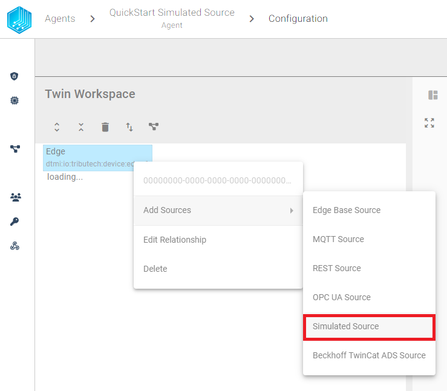
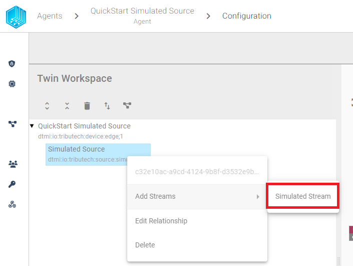
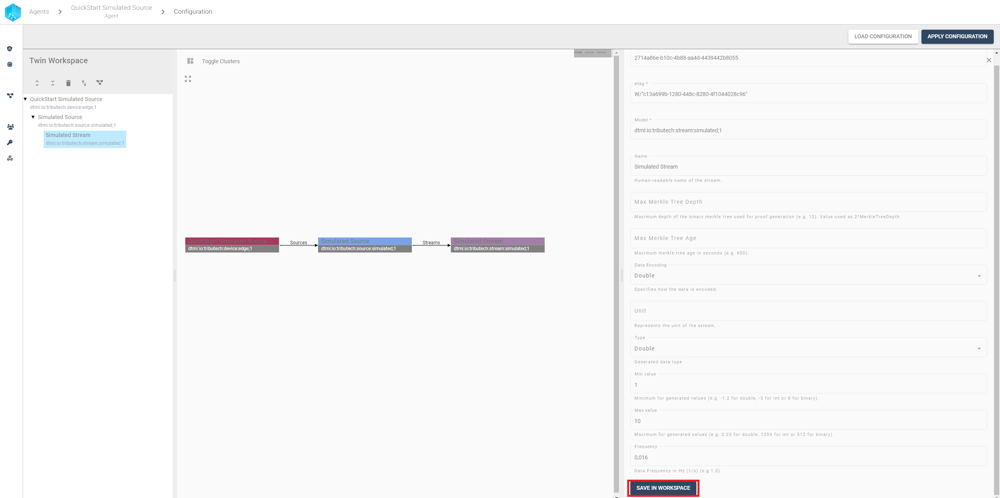
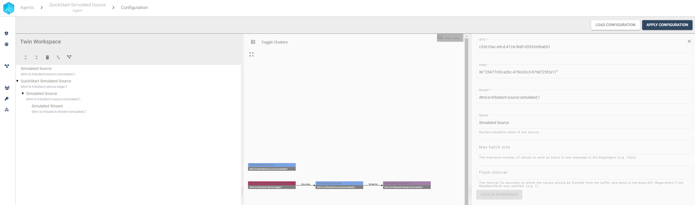

import CodeBlock from '@theme/CodeBlock';
import SourceDockerCompose from '!!raw-loader!../examples/agent-source/simulated/docker-compose.yml';
import SourceEnv from '!!raw-loader!../examples/agent-source/simulated/env';

The Tributech Simulated Source allows us to simulate a data source for testing purposes.

## Setup
The Tributech Simulated Source image can be started without any dependencies but will not be functional without a valid Twin Configuration or MessageBroker connect to the Tributech Agent. The TwinConfiguration can be provided via the Tributech Node (recommended) or MessageBroker (see [Source Integration](../source_integration#twin-model)). The Simulated Source will automatically connect to the Tributech Agent if the Tributech Agent is running and the Simulated Source is configured with the correct MessageBroker settings. In the following section we will describe the setup of a Tributech Simulated Source:

 - Setup the ***docker environment*** by creating a `.env` file with the following content and replace the placeholder values with your values:

<CodeBlock className="language-plain" title=".env">{SourceEnv}</CodeBlock>

- Setup the ***docker-compose.yml*** file by creating a `docker-compose.yml` file with the following content in the same folder as the  `.env` file:

<CodeBlock className="language-yml" title="docker-compose.yml">{SourceDockerCompose}</CodeBlock>

## Configuration

Right click the Edge Device and add a Simulated Source:

Right click the newly added ***Simulated Source*** and add a ***Simulated Stream***:

Adjust the Stream settings to your needs and save the settings by clicking ***Save in workspace***:

Repeat this step for every stream you need.

After saving all streams in the workspace we can send the configuration to the Tributech Agent and update currently running Tributech Source configuration by clicking ***Apply configuration***

### Value Change Options (VCO) Handling
The basic handling of VCO can be found in [Source Integration](../source_integration.md). This section contains the concrete handling of the ***Step (Delta)*** for the simulated source. The following list contains the description for each supported ***Stream Data Encoding*** where ***X*** represents the value for ***Step (Delta)***:

- ***Double***, ***Int32***, ***Long***, ***Float***: defines the minimum difference between values to be submitted, the change is always compared to the last successful submitted value, e.g. if ***X***= 3 if the double values 1, 2, 5, 8, 10, 11, 14 are received by the Tributech Source only 1, 5, 8, 11, 14 will be submitted.
- ***Byte Array***: will only be submitted if the current and last submitted value are not equal 
- ***String UTF 8***: will only be submitted if the current and last submitted value are not equal
- ***Boolean***: will only be submitted if the current and last submitted value are not equal