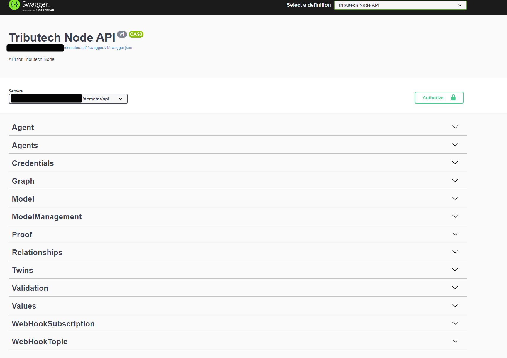
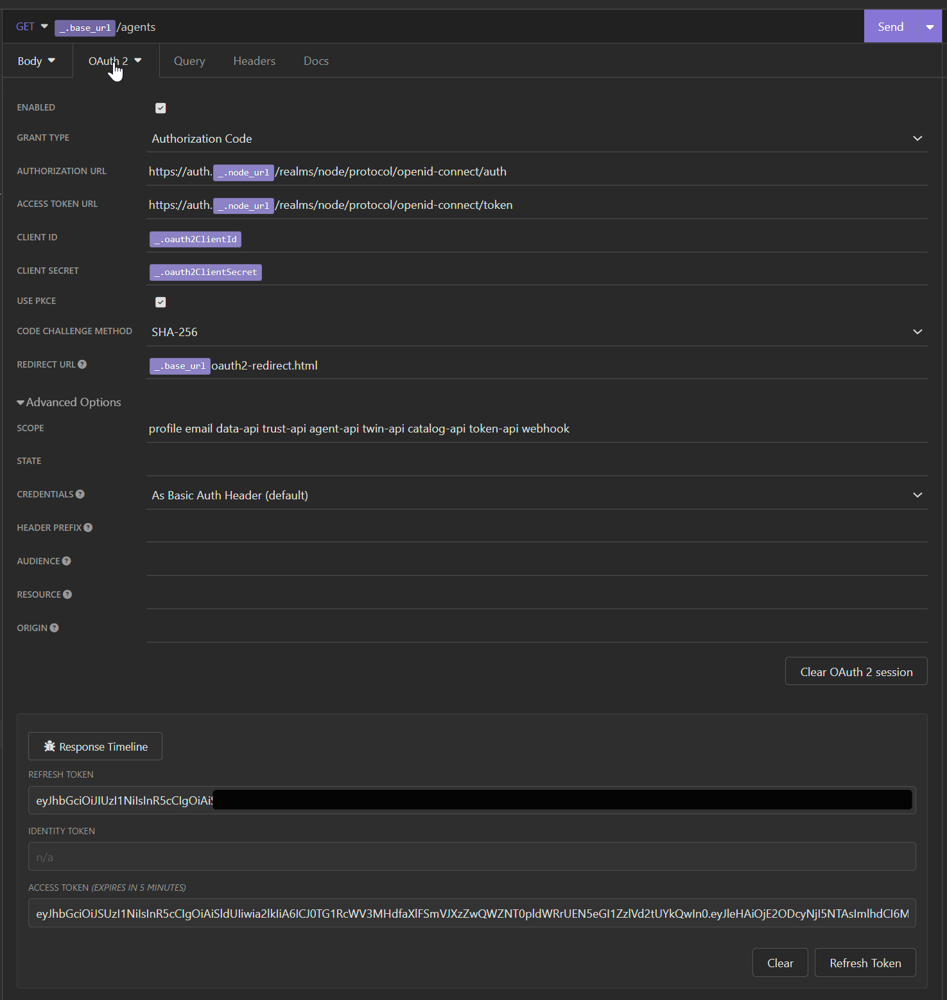
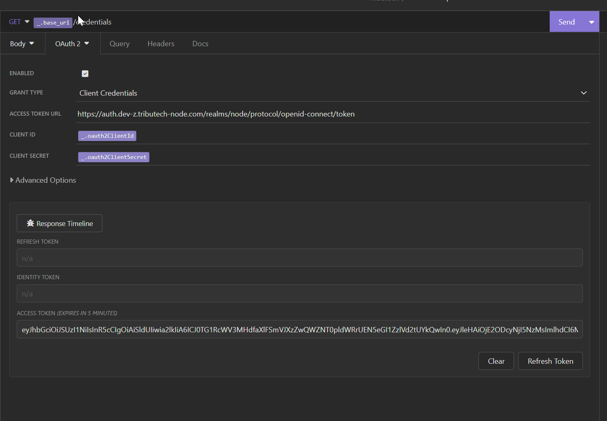

## Rest API
Our REST API provides the interfaces as [OAS V3](https://swagger.io/specification/v3/) which can be used to generate REST API clients for multiple languages. 

The api is generally reachable via the url `<your-node-url>/demeter/api/`  there you can find the json document and a swagger doc website with an general overview of the rest api endpoints. 

The API is structured with following "Topics" :
- ***Agent*** provides all management regarding a single Tributech Agent
- ***Agents*** for query propose of multiple agents 
- ***Credentials*** to fetch the credentials of the api, docker registry etc... 
- ***Graph*** provides the Twin Configuration Instance as graph
- ***Model*** fetching DTDL Model Information
- ***ModelManagement*** CRUD Methods for the DTDL Models
- ***Relationships*** CRUD Methods for the Relationships between DTDL Instances
- ***Twins*** CRUD Methods for DTDL Instances
- ***Validation*** Validation for DTDL Models
- ***WebHookSubscription*** CRUD Methods for Webhook related Subscriptions
- ***WebHookTopic*** Query all available Webhook Events
- ***Values*** Fetch or Insert Values from or to the Node
- ***Proofs*** Validate , insert or fetch proofs from the Node

To do some example request just visit the above url and try it out ! 

## Webhooks

### General 

Our Node provides webhooks to enable external parties to receive node events in a pushed based manner. The body of the payload differs from event to event but will always be an json format. In order to identify the current Webhook payload you will need to look into the http headers of the given event.

Also we provide an ***HMAC SHA256*** signature within the header to prevent spoofing attacks. The secret of the given HMAC will be provided at the creation time of the webhook subscription and will never be exposed by any rest api endpoints. 

We provide you a .net code where you can validate the signature to verify that it is not tempered . 

___
*** NOTE ***  
Additionally in a case of an error delivery we implemented an back-off mechanism which tries to redeliver the events which could not be send successfully. In order to provide a stable redelivery we have divided the Webhook Events in two catagories : 

1. Event QOS = 1 , high frequency events (like data received)
2. Event QOS = 2, standard frequency events 

High frequency events will be retried for **four times** and then will be discarded. Standard Frequency events have **ten retries** till they are discarded.

Back off Formulary is `(Attempt Count + 0,7) ^ 4 + Minimum Retry Interval`
____

### Webhook Headers

Following Headers are present in the Webhook request: 
 
- `x-tributech-correlationid` trace id to track the data through our node
- `x-tributech-eventid` unique identifier through the node (guid) to identify the event 
- `x-tributech-event` event name to identify the type of event 
- `x-tributech-signaturetimestamp` creation timestamp utc of the signature
- `x-tributech-signature` signature of the webhook event
- `x-tributech-timestamp` event timestamp utc

#### Header Example

| Header Identifier | Value |
| ----------------- | ----- |
| x-tributech-correlationid | 00000000-0000-0000-0000-000000000000 |
| x-tributech-eventid | 49acaa7b-fa72-4863-ab4b-7933fedeb59a |
| x-tributech-event | ValueReceivedEvent |
| x-tributech-signaturetimestamp | 06/16/2023 05:08:46 +00:00 |
| x-tributech-signature | sha256=0316443119ED851EE18AA6176E8281E6A28D02A52EAF5DC85D45A6149173F412 |
| x-tributech-timestamp | 06/16/2023 05:08:43 +00:00 |
	

#### Payload Example

~~~ json
{
  "StreamId": "6e89214f-65a1-429c-8569-c0d14126b3da",
  "Timestamp": "2023-06-16T05:08:40.991585+00:00",
  "Value": [
    0,
    0,
    0,
    224,
    127,
    78,
    72,
    184
  ],
  "EventQoS": 1
}
~~~
  
### Signature Code Example

This code example can be used to create the exact same signature which is present in the header (without the `sha256=` prefix).

~~~ csharp
	public string HashHMAC(string secret, string payload, DateTimeOffset signatureTimestamp) {
		var encoding = new System.Text.ASCIIEncoding();
		var messageHash = new HMACSHA256(encoding.GetBytes(secret));
		var payload = encoding.GetBytes(messageJson)
                              .Concat(encoding.GetBytes(signatureTimestamp.ToString(CultureInfo.InvariantCulture)))
                              .ToArray();
		var signature = messageHash.ComputeHash(payload);
		return BitConverter.ToString(signature).Replace("-", "");
	}
~~~

## Authorization

Our API Authorization is handled via a Keycloak instance. We support following authorization flows : 

- [Client Crediential Flow](https://auth0.com/docs/get-started/authentication-and-authorization-flow/client-credentials-flow) (for api access)
- [Authorization Code Flow with PCKE (sha256)](https://auth0.com/docs/get-started/authentication-and-authorization-flow/authorization-code-flow-with-proof-key-for-code-exchange-pkce) (for browser)

Both can be configured within the Keycloak instance hosted on our Tributech Node Instance. 

We provide no user or group permissions for our node. 

In general following urls are used for authorization and token : 

- Authorization: `https://auth.<your-tributech-node-url>/realms/node/protocol/openid-connect/auth`
- Token: `https://auth.<your-tributech-node-url>/realms/node/protocol/openid-connect/token`

Client Id and Client Credentials can be retrieved by our Node website or on request.

Example Request done with [Insomnia](https://insomnia.rest/)

#### Authorization Flow

#### Client Credential Flow

