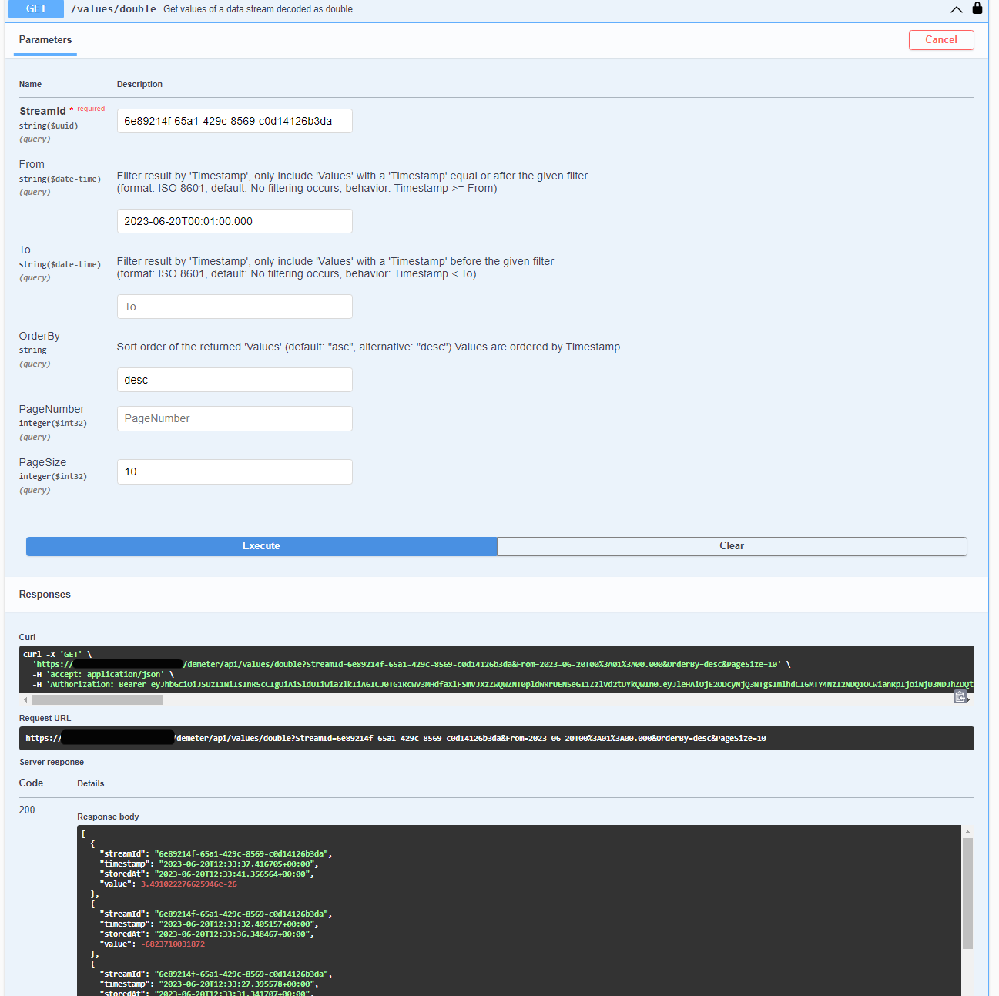
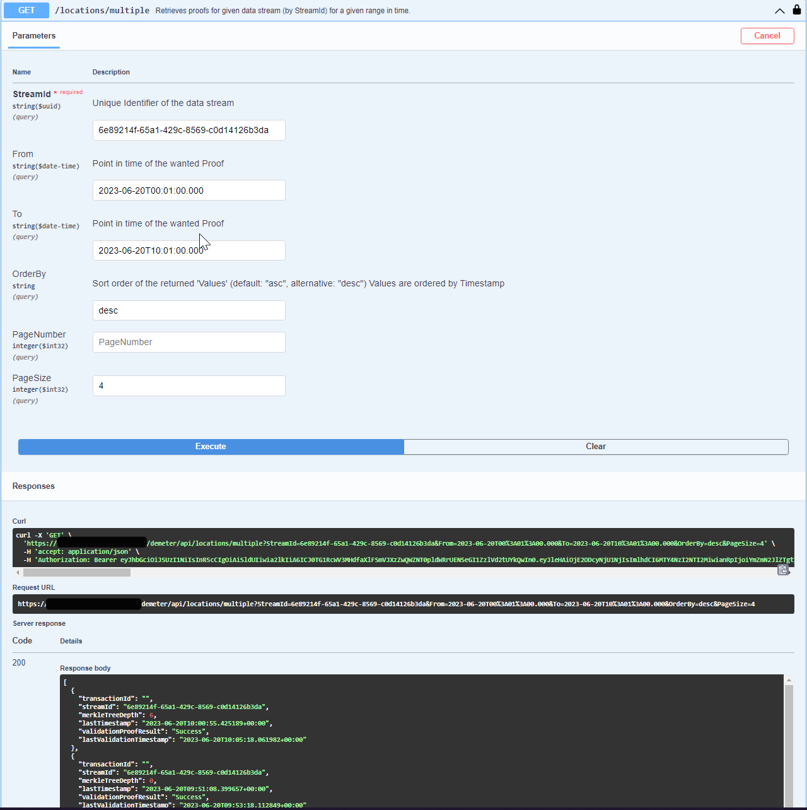
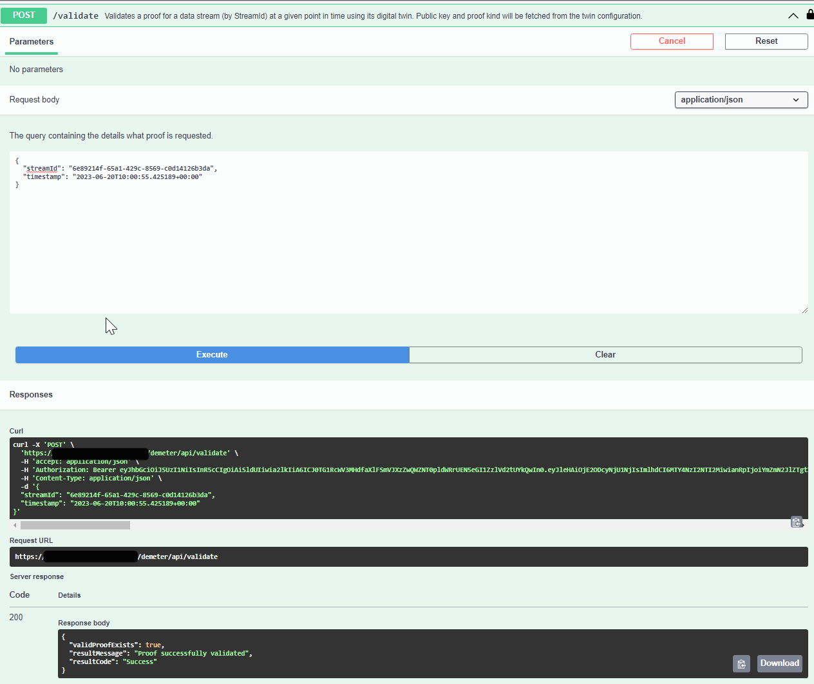
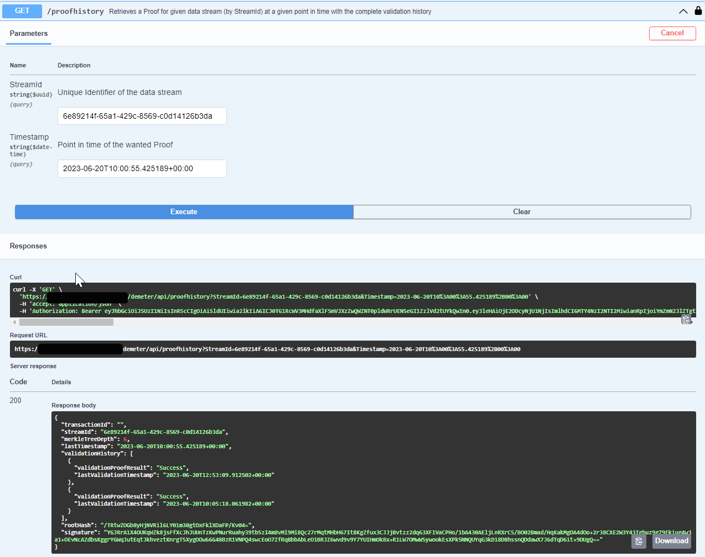

# API usage overview

This page should show some of the most used endpoints from our node. 
We will do all requests via our swagger doc website you can use your own http client or any third party application to do the rest request against our node. 

For this section we will use an example DTDL instance with a Tributech EDGE Agent with an OPC UA source.

Example Data Stream DTDL Instance
~~~ json
{
      "$dtId": "6e89214f-65a1-429c-8569-c0d14126b3da",
      "$etag": "W/\"9f450a2f-1306-46c5-8f8e-ed33592f79bd\"",
      "$metadata": {
        "$model": "dtmi:io:tributech:stream:opcua;1"
      },
      "Name": "Double Stream",
      "Unit": "",
      "Identifier": "ns=3;i=2832",
      "Encoding": "DOUBLE"
}
~~~

Example EDGE Agent DTDL Instance
~~~ json 
{
      "$dtId": "5d7f5a6f-1e90-4bc2-88d4-41a635ab9a89",
      "$etag": "W/\"ef628b11-346e-4790-88fc-ef65804590f0\"",
      "$metadata": {
        "$model": "dtmi:io:tributech:device:edge;1"
      },
      "MaxMerkleTreeDepth": 14,
      "MaxMerkleTreeAge": 600,
      "Name": "Steel Factory Plant Line #24 test",
      "PublicKey": "-----BEGIN PUBLIC KEY-----\nMIIBIjANBgkqhkiG9w0BAQEFAAOCAQ8AMIIBCgKCAQEA2vZ+/prceZnTywahSGFH\nEcnGoZjYzzcCGAYVk5wPP3/n4qDj9HwP9dXNlvCE6NRoQwVZJ8JcO4Gjz50939dx\nvi+CCEh6xKL1SY6eh6lzSaATJdpcUwji4XOkv3zClRO32KIcNG2bWawiWQlZLxzMMhWJVlboKAbl/XIXB6XhWn/Fi5T7ViYblI9FjAaBDhHPizegGqDmRM8YGg5HcLJf\nw6To9bj603+/YIBPA4zEuP441RRCIj9WZi9J22gtF2ekFtq/N13GFa4wYfQeKmYQ\nowIDAQAB\n-----END PUBLIC KEY-----",
      "KeyStorageType": "NONE",
      "ProofKind": "SHA256_RSA2048_PSS",
      "MQTTBroker": ""
}
~~~
## Data Streams
Generally speaking a Data Stream is the metadata of a given source. The metadata contains the information that is used to describe the characteristics and limitations for values that can be imported by a specific endpoint.

Here are some example metadata information:

- Encoding data type of the endpoint
- Protocol specific information about the endpoint 
- User friendly name of the endpoint
- etc ..

But most importantly it contains an unique identifier which we can use to fetch the values from the given endpoint etc. 

The metadata from the data stream is described as DTDL (see above). The id is described in the `$dtId` section of DTDL instance.

We provide `HTTP-GET` and `HTTP-POST` endpoints for every datatype we support . The byte array endpoint can be used to import or export any kind of base 64 encoded data directly. 

If you are fetching the values you are able to query those with following parameters: 

- `From` includes Values with a Timestamp equal or after the given filter, if no value is provided all values from beginning will be included
- `To` includes Values with a Timestamp before given filter, if no value is provided all values till the latest will be included
- `OrderBy` sort order of the values (asc, desc)
- 'PageNumber' paginated result and their respective page number
- `PageSize` value count included into one result (page)

Here is an example query against our double endpoint with the given example model:

## Proof Verification

All data collected by our Tributech Agents will be secured by a Proof which is also generated on the Agent. On the Tributech Node we can check if the given Proof and their associated values are not tempered or changed in anyway.  The first validation will be done when the Proof was received by the Node, every other validation needs to be triggered via our REST API. 

For this example we will also use the example DTDL (see above) and their respective `Stream Identifier`. 

First we want to fetch all Proofs from a given time span, we can query those proofs with following parameters:

- `From` includes Values with a Timestamp equal or after the given filter, **must to be provided**
- `To` includes Values with a Timestamp before given filter, **must to be provided**
- `OrderBy` sort order of the values (asc, desc)
- 'PageNumber' paginated result and their respective page number
- `PageSize` value count included into one result (page)

In the result we can see the latest ValidationResult. If we want to trigger a new Validation we simply use the `lasttimestamp` value of the result and the given `streamId`  to use it for the  trigger of a validation via the rest endpoint:

You will see the result of the validation within the response body. If we want to look into the history of a given proof and their respective validation results we can use the exact same parameters onto the history rest endpoint: 

We will see two Validation Results because we currently triggered one. 

## Agent Configuration

Our Tributech Agents can be configured either via SPA or DTDL. We recommend using the DTDL configuration option only for advanced users that are familiar with this technology. An invalid DTDL Model or Instance may result in an non-responsive Agent. The DTDL Model is required to be fully complete and partial updates are not supported. The node provides the following endpoints for the interacting with the DTDL model:

- `agent/{deviceId}/get-config` to retrieve the current agent configuration which is provided by the agent itself 
- `agent/{deviceId}/set-config` to submit the new configuration which will be presented to the agent

The Request will trigger an command which will be send to the Agent via our MQTT Broker and will be validated by the Agent itself. If some error occurs the existing Configuration will be used and an error will be shown as response for the request. 

## Remote Commands
  
The Tributech Node has the capability to send a command to a given Agent Source. This enables various use cases where an custom Tributech Agent Source can execute some kind of command or write a variable on the given Server which it is connected to. It may also read a specific metadata from the Server and returns it via the `CommandResponse` which will be send at the end of the command execution. Lastly the remote commands provide a way to notify the progress of the command execution via `CommandStateUpdates`. Those capabilities are mainly implementation specific may or may not be send from the Tributech Agent Source.

The command it self will be triggered with following parameters: 

- `AgentId` unique identifier of the agent which is connected to the wanted source
- `SourceId` unique identifier of the wanted source which executes the command
- `CommandName` string identifier of the command name known to the source to identify the wanted operation 
- `CommandBody` Base64 Encoded UTF 8 byte array of a json object which will be fetched by the source command to get additional parameters for the execution of the commands
- `Timeout` time span when the command will be aborted by the node and information for the source when to stop the command

The commands it self various by the capability of the targeted Tributech Agent Source. If the source is developed by a third party it may also execute a given command. It only needs to follow the specification described in the Tributech Agent Page and will receive the trigger from the node.  

### Endpoints

There are two main endpoints for the execution of remote commands : 

- `/agent/{agentId}/command/{sourceId}` will send an request and block the response till the command is executed and a response is received. It will abort if the command execution takes longer than the provided timeout
- `/agent/{agentId}/commandtrigger/{sourceId}` will send the request and return a transaction id. This Transaction Id can be used to match the given state updates and command response via webhook events, those events will contain the returned transaction id so you are able to trigger a command in a non blocking manner. 

For the command trigger following webhook events are required to receive the response and state updates from the command : 

- `SourceCommandResponseEvent` contains the final result of the execution
- `SourceCommandStateUpdateEvent` contains the updates of the execution

Create a Webhook subscription with the given events to receive the necessary information.

### Example Code 

Example Code to create the Request Body for the Command Trigger : 

~~~ csharp
using System;
using System.Text;
using System.Text.Json;
					
public class Program
{
	public static void Main()
	{
		var commandPayload = new { NewBooleanValue = true};
		
		var requestCommandBody = Convert.ToBase64String(JsonSerializer.SerializeToUtf8Bytes(commandPayload));
		
		var requestBody = new { CommandName = "ExampleBoolCommand", CommandBody = requestCommandBody, Timeout = TimeSpan.FromSeconds(30)};
		Console.WriteLine(JsonSerializer.Serialize(requestBody));
	}
}
~~~
