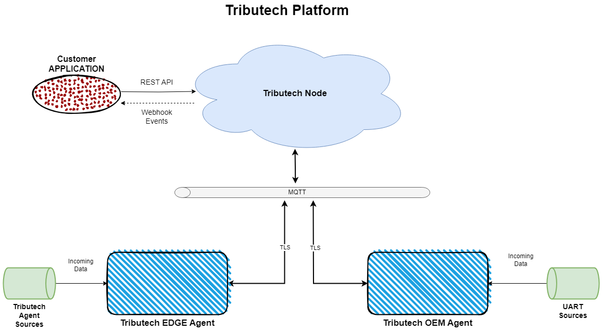

# Tributech Node 
The Tributech Node is the central layer of our Tributech Platform where every data will be collected, secured by our Tributech Agents. Additionally, it will provide functionality to configure and execute commands to the given Tributech Agents.

It also serves as a middleware Layer for external apps which might read the available data to provide customized user experience. 

## Overview 

### Agents

The Agents are connected to our node via an MQTT broker which is secured by TLS to provide a secure communication channel. The protocol provides us the possibility to have a near real time communication to receive data from our agents. Also, it enables us to have a bidirectional communication with our agents which gives us the capability to issue commands, receive data and  Proofs.
___
*** NOTE ***  
This leads to the requirement that the ***Tributech EDGE Agent*** needs an outgoing port **1883**. Further Information can be found in the [Tributech Agent documentation](../tributech_agent/agent_integration.mdx). 
___

### REST API

The Node is built with the ***API-first approach*** in mind so every functionality is available via our REST API. This also enables external parties to act with our functionality like:

- Fetching the data provided by the agents 
- Trigger the validation of their data 
- Fetching the validation results of their data
- Executing commands which will be handled by our agents
- Configure the given Tributech Agent Sources and Tributech Agents
- Manage the available DTDL Models within your Node

[Authorization](./API_usage.md) will be further explained in another page. But it follows the [OAuth 2.0](https://oauth.net/2/) specification and will support the [client credential flow](https://auth0.com/docs/get-started/authentication-and-authorization-flow/client-credentials-flow) and the [authorization code flow](https://auth0.com/docs/get-started/authentication-and-authorization-flow/authorization-code-flow-with-proof-key-for-code-exchange-pkce). Currently we don't support any user/group permissions and will only handle authorization against our REST API.   

### Webhooks
We also provide a push-based notification system via Webhooks. External actors are able to subscribe to given events and add an url where the events should be sent to. Additionally we attach an HMAC signature to our events within the HTTP Headers to prevent spoofing attacks. 

The list of events and subscription can be handled within our rest api. This enables external parties to implement a push-based system within their application to decrease the reaction time to certain events in our node. 

***For further Information visit the [API Integration Page](./API_integration.md)***

### DTDL
To configure our Tributech Agents we currently use the [Digital Twins Definition Language Version 2](https://github.com/Azure/opendigitaltwins-dtdl/blob/master/DTDL/v2/DTDL.v2.md) which is an open standard to describe real world applications or things. This enables us the have a semantic description and configuration of our agents.  

There is also the possibility that customers may upload their own customized models *(via our REST API)* to create a context between the ingested data and their application to unlock analytics or machine learning capabilities.  

To check our current Models visit our [public page on Github](https://github.com/tributech-solutions/data-asset-twin-v2).

___

# Deployment

Our Tributech node is using [Kubernetes](https://kubernetes.io/) as orchestration platform where we provide several components to enable the full functionality of our Tributech Node. 

We provide an [HELM Chart](https://helm.sh/) to ease the setup of our configuration. It is not publicly available so please contact our support team for further Information.  